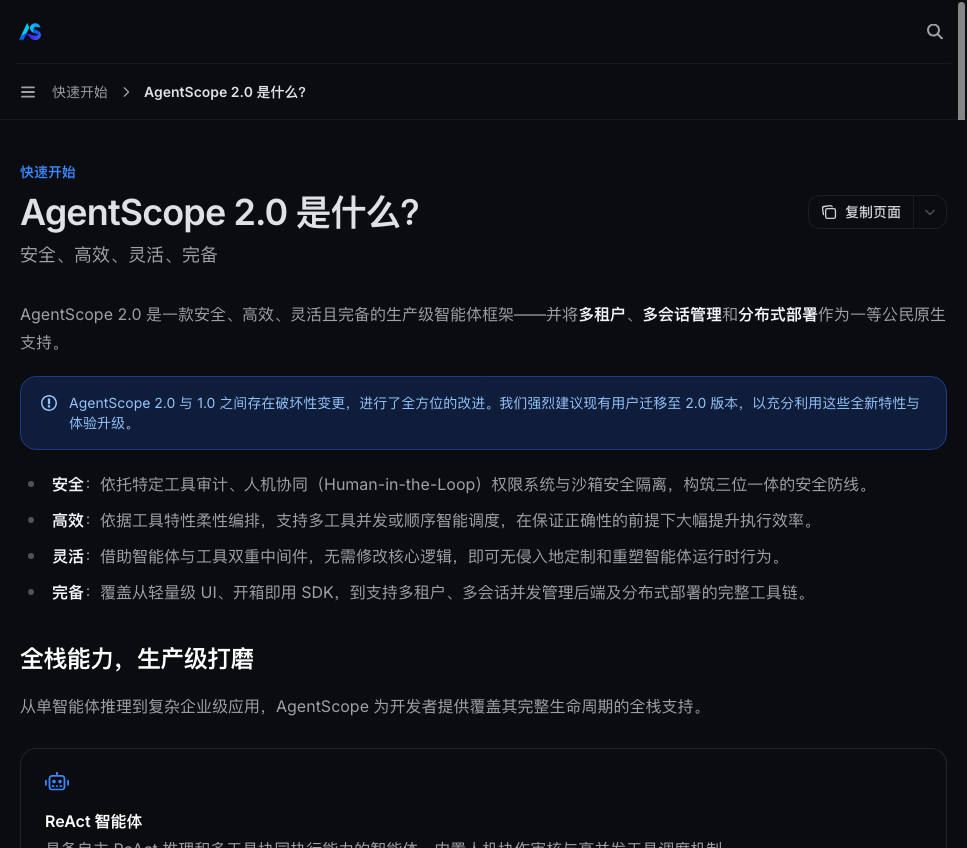

# 1. AgentScope 2.0 是什么？和别的框架有什么不同？能做什么？

### 开篇：先看学完能做出什么

本系列最后一个综合实战（第 11 节）做的是一个跑在浏览器里、带界面的 RAG 问答助手。左侧是会话列表，右侧是聊天区，底部是输入框。

它不是静态页面，后端接好了模型、知识库、记忆和联网能力。功能如下：

- **多会话**：左侧新建、切换、删除对话，每个会话有独立的上下文，互不相干；
- **上传文档建知识库**：支持 Markdown、txt、PDF、Word，上传后自动解析、切块、转向量并存进向量库；
- **RAG 问答**：提问时先检索知识库，再基于检索到的内容回答，并标注来源文档；

- **跨会话长期记忆**：用 ReMe 记住你的身份和偏好，哪怕开一个全新会话，也能把你认出来；

- **联网搜索**：知识库里没有、又需要实时信息时，调用 AnySearch 工具联网查询；
- **流式输出**：回答逐字返回，调用了哪个工具（检索知识库 / 回忆长期记忆 / 联网搜索）会在回答上方实时提示；
- **服务化**：后端用 FastAPI 提供接口，前端是原生 HTML/CSS/JS，不依赖任何前端框架。

这个助手的各部分分别对应 AgentScope 2.0 的一项能力，也是本系列后面要逐个跑通的环节：

| 助手功能 | 实现方式 | 对应章节 |
|---|---|---|
| 接入大模型、流式输出 | 用 OpenAI 协议接入国内模型网关 | 第 3 节 |
| 文档读写、工具调用与权限 | 内置文件工具 + 权限系统 | 第 4 节 |
| 联网搜索 | 把一个 HTTP API 包装成自定义工具 | 第 5 节 |
| 按固定规则产出内容 | 技能（Skill，用 Markdown 写指令集） | 第 6 节 |
| 长对话不撑爆模型窗口 | 上下文压缩中间件 | 第 7 节 |
| 跨会话记住用户 | ReMe 长期记忆中间件 | 第 8 节 |
| 基于上传文档回答 | RAG 中间件 + Qdrant 向量库 | 第 9 节 |
| 多会话、SSE 流式、Web 界面 | FastAPI + 原生前端，把上面这些能力总装起来 | 第 11 节 |

这个助手没有从零实现检索和记忆系统，用的是框架提供的中间件和工具，自己写的主要是 FastAPI 接口和前端页面。检索、记忆、压缩这些逻辑框架已经处理好，不用重复写。

下面先回答最基础的问题：AgentScope 2.0 是什么，它和别的框架有什么不同。

### 1.1 一句话认识它

AgentScope 2.0 是阿里通义实验室开源的一款**生产级（production-ready）多智能体框架**。官方给自己的定位是四个词：

> **安全、高效、灵活、完备** —— 并将**多租户、多会话管理和分布式部署**作为一等公民原生支持。

对比 1.0，2.0 是一次**破坏性升级（Breaking Change）**：

- 1.0 是「构建单个智能体的工具箱」；
- 2.0 升级为「面向生产环境运行智能体」的完整平台。

官方在文档中明确建议：**现有 1.0 用户尽快迁移到 2.0**，以获得全新的特性与体验升级。

这条升级路线可以用一句话概括：

- **1.0 时代**：你写的是「怎么让一个 Agent 走完一段逻辑」；
- **2.0 时代**：你关心的是「怎么让十个 Agent 在十个租户的会话里稳定跑一个月」。

后者需要的权限管控、上下文治理、记忆与检索、部署编排，正是 2.0 补齐的方向。

### 1.2 四大设计支柱

把官方那句「安全、高效、灵活、完备」拆开看，每一词对应到工程上都是一组具体能力：

| 支柱 | 官方表述 | 落到工程上是什么 |
|---|---|---|
| **安全** | 工具审计 + 人机协同（Human-in-the-Loop）权限系统 + 沙箱隔离 | 每个工具调用都要过权限系统，危险操作可交给用户确认；文件读写、Shell 命令有边界管控 |
| **高效** | 依据工具特性柔性编排，支持多工具**并发或顺序智能调度** | 只读工具可并发执行、写操作串行化，在保证正确性的前提下大幅提速 |
| **灵活** | 智能体中间件 + 工具中间件，**无侵入**定制运行时行为 | 不修改核心逻辑，就能给智能体加记忆、加压缩、加检索 |
| **完备** | 从轻量 UI、装好就能用的 SDK，到多租户/多会话后端与分布式部署 | 单机 demo 到企业级部署都覆盖 |

落到本系列的示例里，四个支柱对应到具体章节：

- **安全**：第 4 节用到的 `PermissionMode` 权限系统；
- **灵活**：第 7、8、9 节挂载的上下文压缩、ReMe 记忆、RAG 三个中间件；
- **高效**：只读工具的并发调度，以及技能（Skill）的即插即用；
- **完备**：官方 console UI 与多会话管理后端。

这些在别的框架里往往需要另起炉灶。

### 1.3 全栈能力一览

AgentScope 2.0 的官方文档把能力分成几个模块，这也是后面几节实操的主线：

- **ReAct 智能体**：默认的推理内核，推理 → 行动 → 观察循环；
- **工具（Tool）**：内置 `Bash` / `Read` / `Write` / `Edit` / `Glob` / `Grep` 等文件与系统工具，也支持把任意 Python 函数或第三方 API 包装成工具；
- **技能（Skill）**：用 Markdown 写指令集，不写代码就能给智能体加新能力；
- **模型接入**：统一抽象 `Credential + Model`，支持 OpenAI 协议、DashScope、Anthropic、Gemini 等，**国内网关也能直接接入**（第 3 节实战）；
- **上下文管理**：上下文压缩（第 7 节）+ Offload 卸载，长对话不爆窗；
- **长期记忆**：内置 **Mem0** 与 **ReMe** 两种记忆方案（第 8 节实战 ReMe）；
- **RAG**：PDF / Word / Excel / 图片解析 + 切块 + 向量检索 + 知识库（第 9 节实战）；
- **中间件**：智能体中间件与工具中间件两套扩展点，记忆、压缩、检索都以中间件形式注入；
- **多语言**：Python、TypeScript、Java 三端同构；
- **工程化**：轻量 UI（console）、多租户多会话后端、分布式部署。

如果你有 1.x 的使用经验，会明显感觉到 2.0 把「上下文」「记忆」「检索」从示例代码升级成了**平台能力**——这也是它自称 production-ready 的依据。

### 1.4 和主流 Agent 框架有什么不同？

拿几个常见的对比对象直接对比：

| 对比维度 | **AgentScope 2.0** | LangChain / LangGraph | AutoGen（AG2）/ MetaGPT | CrewAI |
|---|---|---|---|---|
| 定位 | 生产级平台（多租户/多会话/分布式一等公民） | 编排库 + 周边集成 | 多智能体对话研究框架 | 轻量角色协作框架 |
| 多租户与多会话 | ✅ 原生支持 | 需自行设计 | 部分支持 | ❌ 无 |
| 工具体系 | 内置文件/系统工具 + 函数/API 包装 + 技能（Markdown 即插即用） | 大量第三方集成 | 代码定义工具 | 工具类定义 |
| 记忆方案 | **Mem0 + ReMe 装好就能用**，中间件直接挂载 | 需接第三方（mem0 等） | 有限 | 有限 |
| RAG | 内置完整管线（解析/切块/向量库/知识库/中间件） | 需组合 | 需组合 | 需组合 |
| 权限与安全 | 人机协同权限系统 + 沙箱，工具审计 | 需自行接入 | 需自行接入 | 基础 |
| UI / Console | 官方轻量 UI + 多会话管理后端 | 社区方案 | AutoGen Studio | CrewAI Studio |
| 上手门槛 | 低（模型→智能体→工具，三步跑通） | 中（概念多） | 中（研究向） | 低 |

一句话概括两者的差别：**LangChain 系给的是「积木」，AgentScope 2.0 给的是「一套带工地的脚手架」**。

- 从单机原型到企业级部署的每个环节都已覆盖，记忆、RAG、权限这些生产必选项装好就能用，别家往往要自己拼装；
- 另一个直观差异是**多语言同构**：同一套 Agent 定义在 Python / TypeScript / Java 三端保持一致，跨团队协作时认知负担小很多。

### 1.5 它到底能做什么？

- **RAG 知识库问答**：把公司文档、PDF、Excel 喂进去，就能当私有知识助手用（第 9 节）；
- **自动化办公助手**：读写文件、跑 Shell、查资料，多工具编排完成「调研 → 整理 → 写入文件」的完整流程（第 4、5 节）；
- **跨会话长期记忆客服/助手**：记住用户偏好，下次会话直接调用（第 8 节）；
- **多智能体协作**：规划、执行、评审分工协作（官方 ReAct + 多 Agent 示例）；
- **内容创作流水线**：用 Skill 让智能体按平台规则产出爆款内容（第 6 节）；
- **生产部署**：多租户、多会话、分布式，直接对接后端服务。

下面七节用七个能跑的示例把这些能力一一跑起来。先从安装开始。

### 1.6 七个实战示例总览

把七个实战示例的能力地图先列出来，作为后续内容的预览与验收标准：

| 章节 | 你将跑通 | 对应能力 |
|---|---|---|
| 第 3 节 | 国内模型切换 + 流式调用 | 模型接入层 |
| 第 4 节 | Agent 自主读写改文件 | 工具层 + 权限系统 |
| 第 5 节 | AnySearch 联网搜索工具 | 自定义工具层 |
| 第 6 节 | 小红书爆款标题技能 | 技能层 |
| 第 7 节 | 长对话自动压缩 | 上下文治理 |
| 第 8 节 | ReMe 跨会话记忆 | 长期记忆 |
| 第 9 节 | RAG 私有知识问答 | 检索增强 |
| 第 11 节 | 带 Web 界面的完整 RAG 助手（多会话 + 长期记忆 + 联网搜索） | 综合实战，把前面的能力总装成一个产品 |

每个示例都是**完整可运行**的：复制源码包里的文件，填上你自己的密钥，`python xx.py` 就能看到与文中一致的效果。前提只有一个：会 Python、会跑脚本。其中第 11 节是综合实战，开篇展示的就是它的界面。建议先按第 3～9 节跑通单项能力，再看第 11 节怎么把这些能力接到一起。
