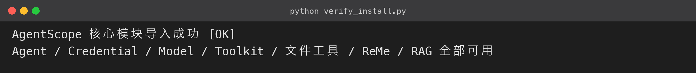
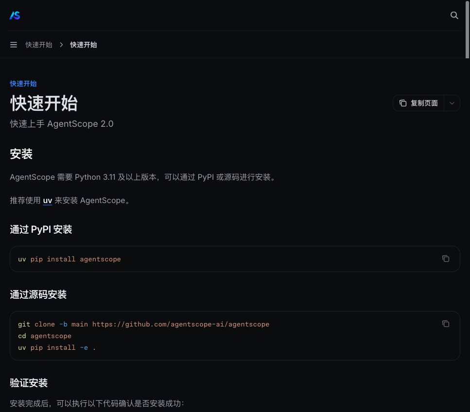
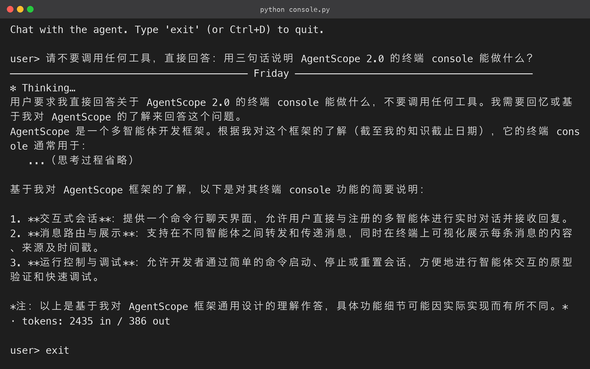

# 2. 安装 AgentScope 2.0

### 2.1 环境要求

动手前先确认三件事：

- **Python 版本**：AgentScope 2.0 要求 **Python ≥ 3.11**（本文实测 3.12.13）。过低版本会直接安装失败；
- **虚拟环境**：强烈建议在独立虚拟环境里安装，避免与系统 Python、其他项目互相污染依赖。国内用户常遇到的「装完 import 报错」问题，九成是环境混乱导致的；
- **网络**：默认走 PyPI，国内可用清华、阿里等镜像加速。

创建虚拟环境的标准步骤：

```bash
# macOS / Linux

python3 -m venv .venv
source .venv/bin/activate

# Windows PowerShell

# python3 -m venv .venv

# .venv\Scripts\Activate.ps1

```

激活后确认 `pip` 指向虚拟环境：`which pip` 应输出项目目录下的 `.venv/bin/pip`。

### 2.2 安装命令

最小安装只需一行：

```bash
pip install agentscope

```

但 AgentScope 的能力按 extra 拆分，按需安装可以避免拖入一堆用不到的依赖：

| extra | 装了什么 | 用到它的章节 |
|---|---|---|
| `[rag]` | PDF / Word / Excel / PPT / 图片解析器等 | 第 9 节 RAG |
| `[reme]` | ReMe 长期记忆（文件型记忆） | 第 8 节 |
| `[mem0]` | Mem0 长期记忆客户端 | 记忆方案对比 |
| `[vdb-qdrant]` | Qdrant 向量库（RAG 存储） | 第 9 节 |
| `[full]` | 以上全部 + 更多 | 图省事直接装 |

**推荐一条命令装齐本文所需**：

```bash
pip install "agentscope[rag,reme,vdb-qdrant]"

```

如果想一次装全，直接 `pip install "agentscope[full]"`。

想让本地环境与最新文档（2.0.9dev）保持同步，可以走源码安装，两种通道：

- 官方 git 通道：`git clone -b main https://github.com/agentscope-ai/agentscope.git && cd agentscope && pip install -e ".[full]"`；
- 国内直连 GitHub 不稳时，改用 codeload 的 tarball 通道：`pip install "agentscope[full] @ https://codeload.github.com/agentscope-ai/agentscope/tar.gz/refs/heads/main"`，这是本机实测可用的方案。

### 2.3 验证安装

装完先做两个检查：版本号是否正常、核心模块能否导入。第一个命令确认安装成功，第二个脚本确认我们后面要用到的每个模块都可用：

```bash
python -c "import agentscope; print(agentscope.__version__)"

```

```python
# verify_install.py

from agentscope.agent import Agent
from agentscope.credential import OpenAICredential
from agentscope.model import OpenAIChatModel
from agentscope.tool import Toolkit, Read, Write, Edit
from agentscope.middleware import ReMeMiddleware, RAGMiddleware
from agentscope.rag import KnowledgeBase, QdrantStore

print("AgentScope 核心模块导入成功 ✅")
print("Agent / Credential / Model / Toolkit / 文件工具 / ReMe / RAG 全部可用")

```

**运行结果（终端实跑输出）：**



运行效果（本文实测，版本 2.0.8，与 2.0.9dev 文档 API 一致）：

```text
AgentScope 核心模块导入成功 ✅
Agent / Credential / Model / Toolkit / 文件工具 / ReMe / RAG 全部可用

```

官方文档的「快速开始」页面长这样，安装完成即可对照开始写第一个 Agent：



### 2.4 常见安装问题

| 问题 | 处理 |
|---|---|
| `pip` 下载慢 / 超时 | 用国内镜像：`pip install agentscope -i https://pypi.tuna.tsinghua.edu.cn/simple` |
| Python 版本 < 3.11 | 升级 Python，或用 `uv`/`conda` 建 3.11+ 环境 |
| 从 GitHub 拉源码失败 | 用上面提到的 codeload tarball 通道或镜像 |
| 装完 `import agentscope` 报错 | 大概率装到了别的 Python 环境：检查 `which python` / `which pip`，重建虚拟环境重装 |
| extra 依赖冲突 | 卸载重装：`pip uninstall agentscope -y && pip install "agentscope[rag,reme,vdb-qdrant]"` |

### 2.5 环境管理：uv / venv / conda 怎么选

安装 AgentScope 不需要纠结工具链，但有个正确的环境管理习惯能少踩很多坑。三种主流方案：

- **`venv`（内置）**：零额外依赖，够用。适合大多数教学与开发场景；
- **`uv`（Rust 实现）**：比 pip 快一个数量级，环境管理一体化。推荐追求效率的开发者：

```bash
uv venv .venv --python 3.12
source .venv/bin/activate
uv pip install "agentscope[rag,reme,vdb-qdrant]"

```

- **conda / mamba**：适合需要同时管理 Python 版本与 CUDA 等系统依赖的场景（如本地跑量化模型）。

无论用哪种：**每个项目一个独立环境，永远不要用系统 Python 直接装**。装坏了大不了删掉环境重来，系统环境装坏了修复成本高得多。

### 2.6 安装失败排查三步法

如果你装完仍然 import 失败，按顺序排查：

1. **确认解释器**：`which python && python -c "import sys; print(sys.executable)"`——确认跑脚本的 Python 与装包的 pip 属于同一环境；
2. **确认安装位置**：`pip show agentscope | grep Location`——看包装到了哪个 site-packages，是否属于当前虚拟环境；
3. **看报错原文**：把完整 traceback 复制到搜索引擎或官方 GitHub Issues 检索，大概率已有答案。**原则：环境问题先隔离，再谈其他。**

**国内网络加速（可选）**：如果 pip 直连官方源很慢，用国内镜像提速：

```bash
pip install -i https://pypi.tuna.tsinghua.edu.cn/simple "agentscope[rag,reme,vdb-qdrant]"

```

GitHub 直连不稳定时（安装过程会从 GitHub 拉取部分包源码），还有两条备选通道：

- 走国内代理；
- 先下载好 wheel 再离线安装。

只要最终 `pip show agentscope` 能看到版本号，过程用什么通道都不影响结果——这也是「环境无关、结果一致」的体现。

安装这一步的产出很明确：**一个能 import 所有核心模块的 Python 环境**。有了它，第 3 节开始我们就能真正「跑」起来。

### 2.7 每个核心模块是干什么的

验证脚本里 import 的每个模块，对应后面某一节的实战对象，先认一下对应关系：

- `Agent`：智能体本体（推理循环的载体）；
- `OpenAICredential` / `OpenAIChatModel`：模型接入层（第 3 节）；
- `Toolkit` / `Read` / `Write` / `Edit`：工具层（第 4 节）；
- `ReMeMiddleware` / `RAGMiddleware`：中间件层（第 8、9 节）；
- `KnowledgeBase` / `QdrantStore`：RAG 存储层（第 9 节）。

把这张「模块 → 章节」对应表记住，后面遇到 import 报错时，你一眼就能判断是哪个能力没装好、该补哪个 extra。

### 2.8 版本兼容性说明

写这篇文章时 PyPI 最新稳定版是 **2.0.8**，官方文档站的最新分支是 **2.0.9dev**——两者属于同一代 API，本文全部示例在 2.0.8 上实测通过，代码与 2.0.9dev 文档一一对应。两个提醒：

- 大版本升级（2.x → 3.x）前先读官方 migration 文档；
- 第 8 节 ReMe 依赖的 `reme` 包存在版本组合问题，源码包里已内置兼容补丁（详见第 8 节说明），官方修复后删除补丁即可。

### 2.9 可选：体验终端 Console

AgentScope 2.0 自带一个终端交互 UI（`agentscope.console` 模块）。

> 注意：它**不是 shell 命令**。pip 包不注册 `agentscope` 可执行文件，直接敲 `agentscope console` 会报 `command not found`。

正确用法是在代码里把构造好的 Agent 交给 `launch_console`：

```python
# console.py（节选）
from agentscope.agent import Agent
from agentscope.console import launch_console

agent = Agent(name="Friday", model=model, toolkit=toolkit)
await launch_console(agent)   # 进入 user> 交互对话
```

**运行结果（终端实跑输出）：**



源码包已给出可直接运行的 `console.py`（复用 `config.py` 的模型配置，并挂了 Bash/Read/Write/Edit 工具）。在 codes 目录下运行 `python console.py` 即可对话：

- 工具调用前逐个询问授权：`y` 允许一次、`a` 记住规则；
- 输入 `exit` / `quit` 或按 Ctrl+D 退出。

浏览器版的多租户、多会话管理界面（Agent Service + Web UI）官方没有做成一条命令直接启动，需要 clone 源码后分别启动两个服务：

- `examples/agent_service`：FastAPI 后端；
- `examples/web_ui`：前端，依赖 pnpm / node。

教学阶段用终端脚本就够，了解有这套东西即可。

### 2.10 小结与自测

安装完成的标准：**装进一个干净的 3.11+ 环境，把核心模块全部 import 成功**。给自己做个三问自测，都能答对再进入下一节：

1. 为什么推荐用虚拟环境装 AgentScope？
2. `agentscope[rag,reme,vdb-qdrant]` 三个 extra 分别解决什么问题？
3. 装完如何快速确认「工具、记忆、RAG」三块能力可用？

答不上来的话回头翻一下 2.2 和 2.7。全部确认 OK，我们进入第 3 节——把模型切到国产服务上，让代码第一次真正「跑」起来。

> 补充：装完 `pip freeze` 会看到一大批依赖（pydantic、httpx、pydantic-ai、qdrant-client 等）。
> 它们各司其职：pydantic 管数据结构校验，httpx 管异步 HTTP，pydantic-ai 是底层 Agent 运行时，qdrant-client 是第 9 节向量库的客户端。
> **依赖多是「集成度深」的体现**——上层能力都替你接好了，写业务代码时不用自己拼装这些零件。
> 换句话说：这些上层集成框架都做好了，你写十几行业务代码就能把它们用起来。
