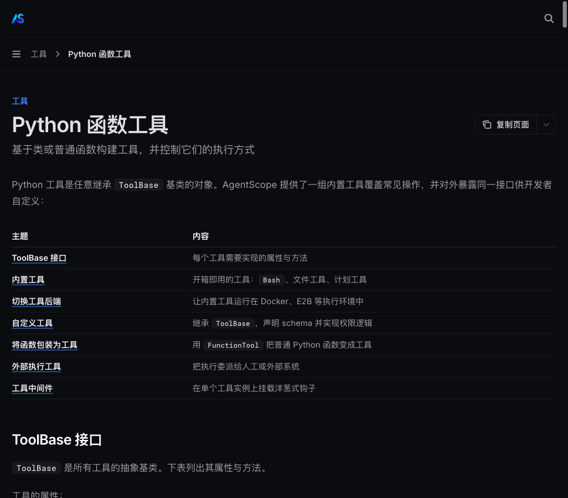
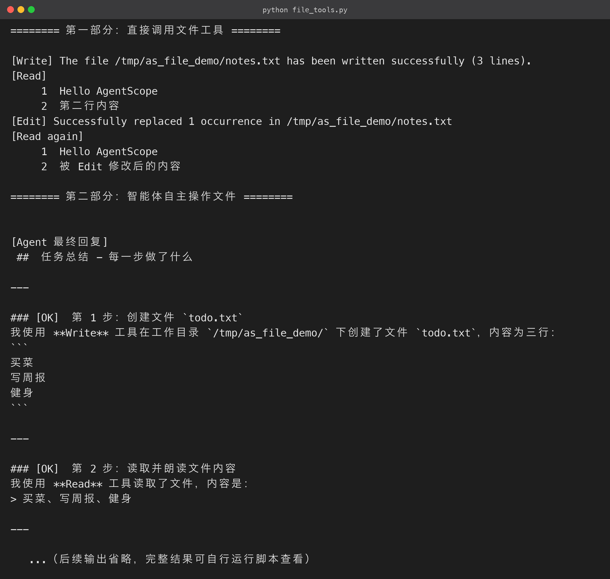

# 4. 使用内置文件工具（Read / Write / Edit）

### 4.1 为什么需要文件工具

一个有用的 Agent，几乎都要读写文件：生成报告、整理数据、修改配置、把调研结果写入文件。

如果这些都要自己写代码实现，每个项目都得重复造轮子，还很容易踩坑：

- 编码、路径、权限；
- 写入的原子性。

AgentScope 把「文件与系统操作」做成了**装好就能用的内置工具**，经过官方安全设计，你只需要把它们装进 Agent。

内置工具一览（官方文档列表）：

| 工具 | 作用 | 安全级别 |
|---|---|---|
| `Bash` | 执行 Shell 命令 | 敏感：可读可写，权限最严格 |
| `PowerShell` | 执行 PowerShell 命令 | 敏感（Windows 环境） |
| `Read` | 读取文件 | **只读**，支持行号、PDF 按页读取 |
| `Write` | 写入文件 | **强制先读后写** |
| `Edit` | 精确替换文件内容 | **强制先读后写** |
| `Glob` | 按模式匹配文件路径 | 只读 |
| `Grep` | 在文件内搜索文本 | 只读 |
| `PlanTool` | 制定/修订任务计划 | 只读 |
| `AskUser` | 向用户提问 | 人机协同 |



> 注意上表的「安全级别」列：**写操作（Write/Edit）强制要求目标文件先被 Read 过**。这是刻意的安全设计——LLM 改文件前必须先看到文件现状，避免模型凭幻觉覆盖掉你不知道的内容。这也是 AgentScope 权限模型的一部分，4.4 节会展开。

### 4.2 直接调用：最简单的用法

工具本身是独立对象，不经过 Agent 也能直接调用。这对「先验证工具行为、再交给 Agent」的调试流程特别有用。结果是一个 `ToolChunk`，文本内容在 `result.content[0].text`：

```python
import asyncio
from agentscope.tool import Read, Write, Edit

async def main() -> None:
    read, write, edit = Read(), Write(), Edit()
    path = "/tmp/notes.txt"

    # 1) 写入

    r = await write(file_path=path, content="Hello AgentScope\n第二行内容\n")
    print("[Write]", r.content[0].text)

    # 2) 读取（带行号）

    r = await read(file_path=path)
    print("[Read]\n", r.content[0].text)

    # 3) 精确替换

    r = await edit(file_path=path, old_string="第二行内容", new_string="被 Edit 修改后的内容")
    print("[Edit]", r.content[0].text)

    # 4) 再次读取验证

    r = await read(file_path=path)
    print("[Read again]\n", r.content[0].text)

asyncio.run(main())

```

实测输出：

```text
[Write] The file /tmp/notes.txt has been written successfully (3 lines).
[Read]
     1	Hello AgentScope
     2	第二行内容
[Edit] Successfully replaced 1 occurrence in /tmp/notes.txt
[Read again]
     1	Hello AgentScope
     2	被 Edit 修改后的内容

```

几个细节：

- **Read 输出带行号**，这让 Edit 的 `old_string` 定位更精准，也方便模型理解文件结构；
- **Edit 是精确字符串替换**：`old_string` 找不到、或匹配多处（未指定 `replace_all=True`）时都会失败——这是刻意的「防呆」设计，宁可失败也不让模型瞎改；
- 三个工具调用都是 `await`，因为它们内部是异步 IO。

### 4.3 让智能体自主操作文件：完整可运行源码

真实场景下我们不会手动调工具，而是让 Agent 在推理循环里自主决定「何时读、何时写、何时改」。完整源码（`file_tools.py`）：

```python
# file_tools.py

"""第 4 节 · 内置文件工具：直接调用 + 智能体自主操作"""
import asyncio
import os

from agentscope.agent import Agent
from agentscope.credential import OpenAICredential
from agentscope.message import UserMsg
from agentscope.model import OpenAIChatModel
from agentscope.permission import AdditionalWorkingDirectory, PermissionMode
from agentscope.tool import Edit, Read, Toolkit, Write

from config import API_KEY, BASE_URL, CHAT_MODEL

WORKDIR = "/tmp/as_file_demo"

async def agent_demo() -> None:
    credential = OpenAICredential(api_key=API_KEY, base_url=BASE_URL)
    model = OpenAIChatModel(credential=credential, model=CHAT_MODEL, stream=True)

    agent = Agent(
        name="file-agent",
        system_prompt="你是文件管理助手，使用 Read/Write/Edit 工具完成用户的要求。",
        model=model,
        toolkit=Toolkit(tools=[Read(), Write(), Edit()]),
    )
    # 让 Write/Edit 在 workdir 内自动放行（教学演示；生产环境按安全策略配置）

    agent.state.permission_context.mode = PermissionMode.ACCEPT_EDITS
    agent.state.permission_context.working_directories[WORKDIR] = (
        AdditionalWorkingDirectory(path=WORKDIR, source="file-tools-demo")
    )

    reply = await agent.reply(
        UserMsg(
            name="user",
            content=(
                f"请在我的工作目录 {WORKDIR} 中完成以下任务：\n"
                "1. 创建文件 todo.txt，内容为三行：买菜、写周报、健身；\n"
                "2. 读取该文件，把内容念给我听；\n"
                "3. 把『写周报』改为『写 AgentScope 教程』；\n"
                "4. 再次读取文件，确认修改结果，并汇报你每一步做了什么。"
            ),
        )
    )
    text = "".join(b.text for b in reply.content if b.type == "text")
    print("\n[Agent 最终回复]\n", text)

asyncio.run(agent_demo())

```

**运行结果（终端实跑输出）：**



这段代码比 4.2 多了三样东西，正是 Agent 化后的关键：

1. **`Agent`**：把 `system_prompt`、`model`、`toolkit` 组装成一个会「推理 → 决定调用工具 → 观察结果 → 再推理」的循环体；
2. **`Toolkit(tools=[Read(), Write(), Edit()])`**：把工具注册进 Agent，模型才能在推理时看到并调用它们；
3. **权限配置**：`PermissionMode.ACCEPT_EDITS` + `working_directories`，声明「只在 WORKDIR 内自动放行文件编辑」。

实测输出（Qwen 3.7 Flash 自主完成四步操作并汇报）：

```text
[Agent 最终回复]
---

## 📋 每一步汇报

| 步骤 | 操作 | 结果 |
|------|------|------|
| 第 1 步 | 创建 /tmp/as_file_demo/todo.txt | ✅ 文件创建成功，内容包含"买菜"、"写周报"、"健身"三行 |
| 第 2 步 | 读取文件并念出内容 | ✅ 读取成功，内容为：买菜、写周报、健身 |
| 第 3 步 | 将"写周报"改为"写 AgentScope 教程" | ✅ 替换成功，共修改了 1 处 |
| 第 4 步 | 再次读取文件确认 | ✅ 确认修改生效，当前内容为：1. 买菜 2. 写 AgentScope 教程 3. 健身 |

所有任务已完成！✅

```

注意模型是**自己规划顺序**的：先写、再读、再改、再读验证——你没有写一行流程代码。怎么做由模型决定，能做什么由工具提供，安全边界由框架把关。

### 4.4 权限模型：安全的第一道门

AgentScope 的权限系统分两层，理解它你才能放心地把工具交给 Agent：

- **权限模式（PermissionMode）**：

| 模式 | 行为 | 适用场景 |
|---|---|---|
| `default` | 每次工具调用需人工确认 | 生产环境默认，最安全 |
| `explore` | 探索模式，只读操作放行 | 调研/调试 |
| `accept_edits` | 自动放行**白名单目录内**的文件编辑 | 文件处理助手（本文示例） |
| `bypass` | 全部放行，不询问 | 仅限完全可信的演示 |
| `dont_ask` | 不询问但记录日志 | 需要审计留痕的场景 |

- **工作目录白名单**：`working_directories` 声明哪些目录允许被自动放行，未声明目录的写入仍会被拦下。这让「自动放行」和「范围可控」同时成立。

> 教学演示用 `ACCEPT_EDITS + working_directories` 最合适：既不会频繁打断智能体，又把范围限定在你明确授权的目录内。生产环境请按「最小授权」原则逐项配置，危险操作（如 `Bash`）保持 `default` 人工确认。

### 4.5 从文件工具到完整自动化

文件工具是 Agent 自动化的地基。有了它，你可以继续组合后面几节的能力：

- 第 5 节搜索工具：查资料 → 写文件；
- 第 7 节上下文压缩：长任务的上下文管理；
- 第 8 节记忆：记住用户偏好。

最终拼出一个能「调研 → 整理 → 存到文件 → 汇报」的完整工作流。

### 4.6 文件检索：Glob 与 Grep

除了 Read/Write/Edit，文件相关的只读工具还有两个：

- **`Glob`**：按通配符找文件路径（`*.py`、`**/*.md`），适合「项目里有哪些文件」类问题；
- **`Grep`**：在文件内容里搜文本，适合「哪段代码提到了某函数」类问题。

```python
import asyncio
from agentscope.tool import Glob, Grep

async def main() -> None:
    glob_tool, grep_tool = Glob(), Grep()
    r = await glob_tool(pattern="**/*.py", path="/tmp/as_file_demo")
    print("[Glob]", r.content[0].text)
    r = await grep_tool(pattern="AgentScope", path="/tmp/as_file_demo")
    print("[Grep]", r.content[0].text)

asyncio.run(main())

```

这两个工具配合 Read/Write/Edit，模型就拥有了完整的「文件探索 → 定位 → 修改」能力——许多代码库重构类任务就是这四个工具的组合。

### 4.7 理解 ReAct 循环：Agent 是怎么决定调工具的

你在 4.3 看到的「模型自主规划四步」背后，是经典的 **ReAct（Reasoning + Acting）循环**。AgentScope 默认的推理内核就是这个模式，每轮循环做四件事：

1. **推理（Reasoning）**：模型根据当前上下文判断「我该做什么」；
2. **行动（Acting）**：如果需要，模型生成一个工具调用（如 `Write(file_path=..., content=...)`）；
3. **观察（Observation）**：框架执行工具，把结果追加进上下文；
4. **回到 1**：模型看到工具结果，继续推理，直到它认为任务完成、直接给出最终回答。

整个过程里你只给了用户指令，**流程编排完全由模型决定**——这也是为什么工具的 `description` 写得越清楚，模型越不容易乱来。

理解这个循环，后面两节的机制就都顺理成章了：

- 第 8 节 ReMe：写回发生在回复结束后；
- 第 9 节 RAG：检索结果注入上下文。

### 4.8 文件工具的边界与注意事项

- **Read 支持 PDF**：`Read(file_path="a.pdf", pages="1-5")` 能按页读取 PDF，配合第 9 节的 PDF 解析器，覆盖「读合同/读论文」场景；
- **大文件**：Read 默认有内容长度上限，超长文件按页/分段读；Write 单次写入也有体积限制，超大文件建议分块写；
- **二进制**：文本类工具面向文本文件，图片等二进制内容请用第 9 节的图片解析器或专门的视觉工具；
- **路径安全**：交给 Agent 的路径尽量限制在 `working_directories` 白名单内，防止模型被提示词诱导去读写系统敏感路径。
