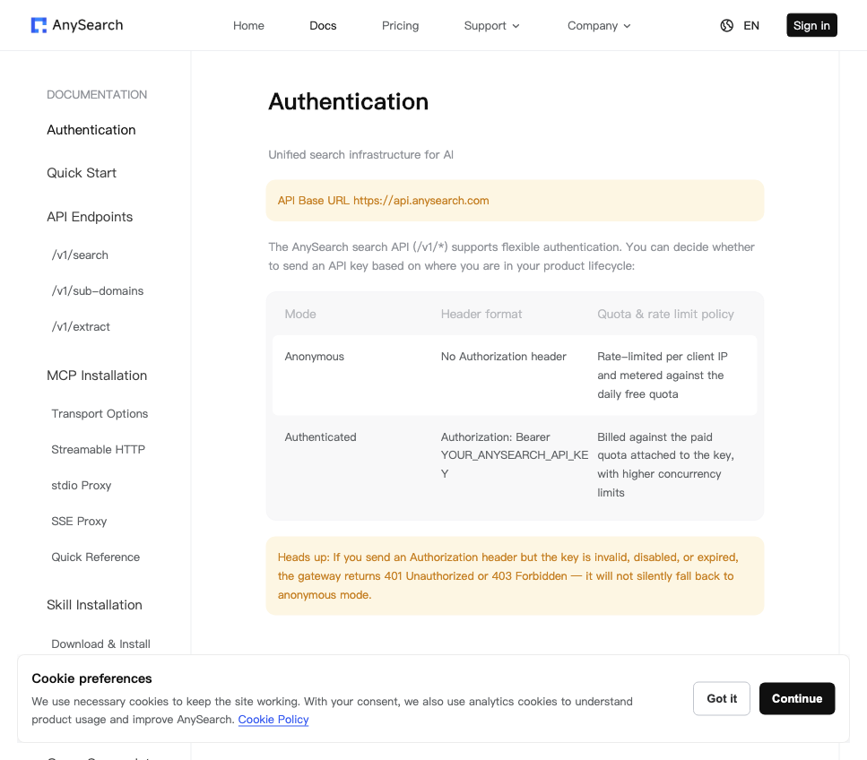
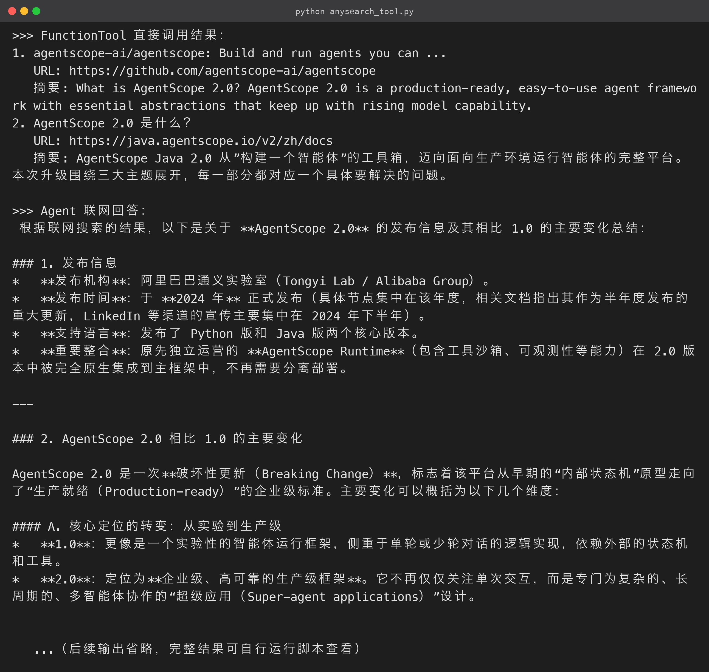

# 《AgentScope 2.0实战指南》05 - 创建 AnySearch 搜索工具

### 5.1 为什么需要联网搜索

模型的知识有截止时间，也覆盖不了实时信息——今日热点、最新文档、竞品动态都在训练数据之外。

给 Agent 接一个搜索工具，它就能「先搜再答」，从离线知识库升级为联网助手。这一步的本质是**把「信息获取」这个动作工具化**：让模型在需要时主动发起搜索，再把结果纳入推理。

本节选用 **AnySearch**（https://www.anysearch.com/）——面向 AI Agent 设计的统一搜索基础设施，返回结构化结果（标题/链接/摘要/正文）而非网页 HTML。

对 Agent 而言，它解决的是**「模型知识截止日期之后的新信息」**问题：训练数据再全也没有时效性，联网搜索让模型能回答「今天发生了什么、价格涨到多少、政策改了没有」这类实时问题。它的主要能力：

- 统一的 `POST /v1/search` 接口，一次接入即可完成网页、垂直领域搜索；
- 支持认证 / 匿名两种模式，认证模式配额更高、并发更稳；
- 返回结构化 JSON（title / url / snippet / content），方便工具解析，也支持 MCP 安装，可以直接对接各种 Agent 框架；
- 支持 `zone`（cn / intl）与 `language` 参数，中文场景适配好。



### 5.2 接口长什么样

**请求**：

```bash
curl -X POST https://api.anysearch.com/v1/search \
  -H "Authorization: Bearer as_sk_你的密钥" \
  -H "Content-Type: application/json" \
  -d '{"query": "AgentScope 2.0", "max_results": 5, "zone": "cn", "language": "zh-CN"}'

```

**响应**（核心字段）：

```json
{
  "code": 0,
  "message": "success",
  "data": {
    "results": [
      {
        "title": "...",
        "url": "...",
        "snippet": "...",
        "content": "..."
      }
    ],
    "metadata": { "total_results": 123, "search_time_ms": 456 }
  }
}

```

关键设计点：

- 请求头用 `Authorization: Bearer <key>` 认证；
- 返回 `code=0` 表示成功，业务错误看 `message`；
- `results` 数组里每条都有标题、链接、摘要与正文。

工具要做的事很简单：**发请求 → 解析 → 格式化成可读文本**。

> 注意 `code` 是「业务成功码」，HTTP 状态码是「传输层状态码」，两者都要检查——工具包装层通常先看 HTTP，再看 `code`。

### 5.3 方式一：FunctionTool —— 把函数包装成工具

AgentScope 提供了 `FunctionTool`，你只需要写一个普通异步函数，加好类型注解，工具名称、描述、入参 schema 全部自动推导：

```python
from agentscope.tool import FunctionTool
import httpx

async def anysearch_search(query: str, max_results: int = 5, zone: str = "cn",
                           language: str = "zh-CN") -> str:
    """调用 AnySearch 搜索并返回可读结果。"""
    async with httpx.AsyncClient(timeout=30) as client:
        resp = await client.post(
            "https://api.anysearch.com/v1/search",
            headers={"Authorization": f"Bearer {ANYSEARCH_KEY}"},
            json={"query": query, "max_results": max_results,
                  "zone": zone, "language": language},
        )
        resp.raise_for_status()
        data = resp.json()
    lines = []
    for i, item in enumerate(data["data"]["results"], 1):
        lines.append(f"{i}. {item['title']}\n   URL: {item['url']}\n   摘要: {item['snippet'][:300]}")
    return "\n".join(lines)

tool = FunctionTool(anysearch_search)   # 一行包装，立即可用

```

`FunctionTool` 的优点是**零样板代码**：

- 函数名自动成为工具名；
- docstring 自动成为工具描述；
- 类型注解自动生成入参 schema。

对「把已有函数暴露给模型」的场景，这是最快路径。

### 5.4 方式二：ToolBase 子类 —— 完全控制权限与行为（推荐用于 Agent）

直接包装虽然快，但 `FunctionTool` 默认每次调用都要过权限询问，会打断智能体的推理节奏。更符合生产场景的做法是继承 `ToolBase`，把搜索声明为**只读 + 自动放行**，并显式声明并发安全：

```python
class AnySearchTool(ToolBase):
    """面向 Agent 的 AnySearch 搜索工具：只读、允许并发、权限直接放行。"""

    name = "AnySearch"
    description = (
        "Search the web for real-time information via AnySearch. "
        "Use it when you need current news, docs, or facts."
    )
    input_schema = {
        "type": "object",
        "properties": {
            "query": {"type": "string", "description": "The search query."},
            "max_results": {"type": "integer", "description": "Number of results, 1-10.", "default": 5},
        },
        "required": ["query"],
    }
    is_concurrency_safe = True
    is_read_only = True

    async def check_permissions(self, tool_input, context) -> PermissionDecision:
        # 搜索是只读操作，直接放行，避免打断智能体的推理节奏

        return PermissionDecision(behavior=PermissionBehavior.ALLOW, message="Web search is read-only.")

    async def call(self, query: str, max_results: int = 5) -> ToolChunk:
        results = await anysearch_search(query, max_results=max_results)
        return ToolChunk(content=[TextBlock(text=results)])

```

几个类属性的含义如下：

- **`name`**：模型看到的工具名，要简短、语义明确（`AnySearch`）；
- **`description`**：工具描述是模型决定「要不要调这个工具」的依据，务必写清楚用途和适用场景——描述写得越准，误调用越少；
- **`input_schema`**：JSON Schema 形式声明参数，模型据此生成合法的调用参数；
- **`is_read_only = True`**：向框架声明该工具无副作用，可参与并发调度；
- **`is_concurrency_safe = True`**：允许框架并发执行多个实例；
- **`check_permissions`**：返回 `PermissionDecision(ALLOW)` 直接放行——因为搜索是只读操作，不值得每次打断模型。

把工具装进 Agent（完整源码 `anysearch_tool.py` 见源码包，核心装配如下）：

```python
agent = Agent(
    name="search-agent",
    system_prompt=(
        "你是一个联网信息助手。需要最新信息时，调用 AnySearch 工具搜索，"
        "然后基于搜索结果回答用户。"
    ),
    model=model,
    toolkit=Toolkit(tools=[AnySearchTool()]),
)

reply = await agent.reply(UserMsg(name="user", content="帮我搜索一下 AgentScope 2.0 的发布信息，并总结它相比 1.0 的主要变化。"))

```

### 5.5 实测输出

`FunctionTool` 直接调用结果（真实返回，已截断）：

```text
> FunctionTool 直接调用结果：
1. agentscope-ai/agentscope: Build and run agents you can ...
   URL: https://github.com/agentscope-ai/agentscope
   摘要: AgentScope 2.0 is a production-ready, easy-to-use agent framework ...
2. AgentScope 2.0 是什么？
   URL: https://java.agentscope.io/v2/zh/docs
   摘要: AgentScope Java 2.0 从"构建一个智能体"的工具箱，迈向面向生产环境运行智能体的完整平台……

```

Agent 联网回答（节选）：基于最新搜索结果，AgentScope 2.0 已被官方定位为 GA 的生产就绪版本，相比 1.0 的主要变化包括：

- 从状态机驱动的开发库，转向带 **Harness 工程层**的企业级平台；
- 新增工具边界与权限管控、Workspace 上下文隔离、运行时系统等企业级能力；
- 内置模型调用重试与降级策略；
- 重构了 Plan 模式……

**运行结果（终端实跑输出）：**



> **小结**：`FunctionTool` 适合「快速把现有函数变成工具」；`ToolBase` 子类适合「工具要进 Agent、要控制权限并发」的生产场景。两种方式可以互相转换，建议先从 FunctionTool 起步，遇到权限/并发需求再升级为 ToolBase。

### 5.6 进阶：搜索工具的工程化

- **垂直搜索**：AnySearch 支持 `tag` 参数指定垂直领域（如 `code.doc`、`finance.quote`），可以按业务定制搜索域；
- **错误处理**：工具函数里要处理 `HTTPError`、超时、`code != 0` 三种异常，把错误信息返回给模型而不是抛异常中断循环；
- **结果裁剪**：搜索摘要动辄上千字，返回给模型前按 token 截断（如 300 字/条），避免污染上下文——这和第 7 节的 `tool_result_limit` 是同一个思路。

### 5.7 AnySearch 关键参数与响应字段

接口参数和响应字段整理如下，方便按需扩展：

| 参数 | 类型 | 含义 | 建议 |
|---|---|---|---|
| `query` | string | 搜索关键词 | 必填；中文场景建议中文表达 |
| `max_results` | int | 返回条数 1-10 | 默认 5，问答场景 3-5 足够 |
| `tag` | string | 垂直领域标签 | 需要定向搜索时使用 |
| `zone` | string | `cn` / `intl` | 中文内容用 `cn` |
| `language` | string | 偏好语言，如 `zh-CN` | 影响结果语种 |

响应里 `data.results[]` 每条包含四个字段：`title`（标题）、`url`（原文链接）、`snippet`（摘要）、`content`（正文片段）。

工具包装时，建议**只把 title + url + snippet 返回给模型**，正文留作后续深入抓取——既省 token 又避免上下文被大量噪音塞满。

### 5.8 工具的错误处理模式

工具代码是「模型世界的边界」，边界上最容易出问题。推荐的模式是把一切异常收敛成可读文本：

```python
async def safe_search(query: str) -> str:
    try:
        return await anysearch_search(query)
    except httpx.TimeoutException:
        return "搜索超时，请稍后重试或换个更短的关键词。"
    except httpx.HTTPStatusError as exc:
        if exc.response.status_code in (401, 403):
            return "搜索密钥无效或已过期，请联系管理员。"
        return f"搜索服务暂时不可用（{exc.response.status_code}）。"
    except Exception as exc:  # noqa: BLE001

        return f"搜索失败：{exc}"

```

这样模型拿到的是「能理解、能转述给用户」的句子，而不是一串原始堆栈——错误也变成了一次正常的对话轮次，Agent 可以据此调整策略（换关键词、放弃、或直接如实告知用户）。

> 补充：AnySearch 同时提供 **MCP（Model Context Protocol）** 安装方式，如果你在其他支持 MCP 的客户端里想复用搜索能力，直接走 MCP 接入即可；本文则用最通用的 HTTP + 工具包装方式，展示的是「任意 API 都能变成 Agent 工具」的思路。

### 5.9 完整案例：搜索 → 总结 → 写文件

把第 4、5 节的能力串一个真实小案例，验证「工具组合」的实际效果。需求：搜索「AgentScope 2.0 新特性」，把总结写入文件，再读出来汇报。Agent 只需要一次对话：

```python
reply = await agent.reply(
    UserMsg(
        name="user",
        content=(
            "1. 用 AnySearch 搜索『AgentScope 2.0 新特性』；\n"
            "2. 基于搜索结果写一份 200 字以内的总结，保存到 /tmp/as_file_demo/summary.md；\n"
            "3. 读取该文件，把内容汇报给我。"
        ),
    )
)

```

这个 Agent 的 Toolkit 同时挂载 `[AnySearchTool(), Read(), Write()]`，模型会自动编排四步：**搜 → 写 → 读 → 汇报**。

单看每个工具都很简单，但交给一个会推理的 Agent 组合起来，就变成了一个能「调研并产出文档」的自动化工位。

源码地址：[https://github.com/LarryLi93/agentscope2](https://github.com/LarryLi93/agentscope2)
