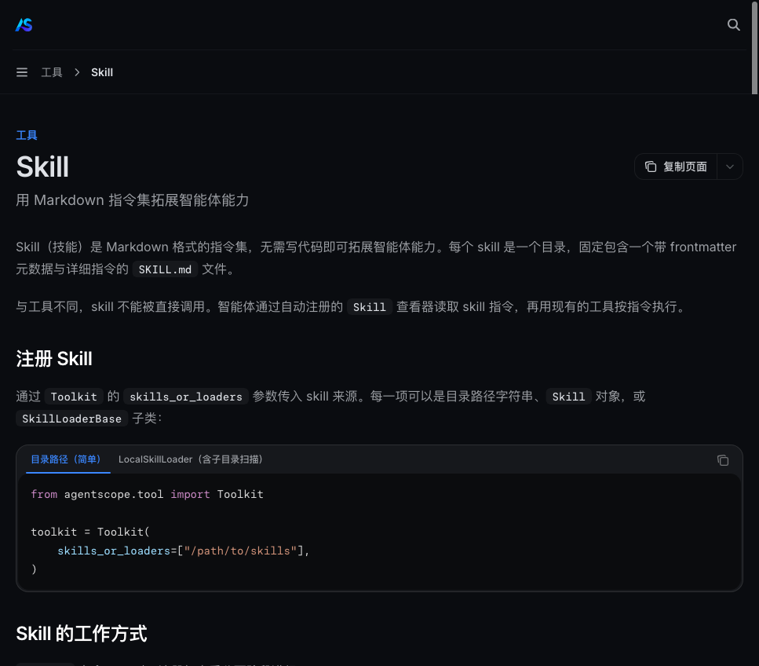
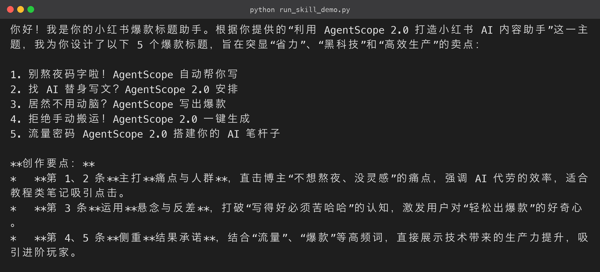

# 《AgentScope 2.0实战指南》06 - 创建「小红书爆款标题生成」技能

### 6.1 技能（Skill）是什么

技能是 AgentScope 2.0 的一层抽象：**用 Markdown 指令集定义能力，不用写任何代码**。一个技能就是一个目录，目录里放一个带 frontmatter 的 `SKILL.md`。

- frontmatter 的 `name` 与 `description` 会被框架索引，决定「什么时候该用这个技能」——这相当于给能力做了一层**可检索的元数据**；
- 正文是给 LLM 看的完整操作手册（公式、规则、示例）；
- 智能体启动时，框架自动注册一个 **Skill 查看器工具**，Agent 会先读技能再按技能执行。



为什么比「把提示词写进 system prompt」更好？三个理由：

1. **可发现**：技能描述让模型自己判断何时调用，而不是把所有提示词塞进上下文硬背；
2. **可复用**：同一个技能可以挂到多个 Agent，多个技能可以组合；
3. **可插拔**：改技能不用改代码，运行时增删技能目录即可，技能作为独立资产存在，不绑定代码与提示词。

### 6.2 编写技能：SKILL.md

下面写一个「小红书爆款标题生成」技能，把平台爆款规律保存为一份可执行的指令手册（源码包 `xhs_skill/skills/xhs-title/SKILL.md`）：

```markdown
---
name: xhs-title
description: 小红书爆款标题生成专家。当用户给出笔记主题/素材时，按小红书爆款规律生成 5 个高点击标题，并给出创作要点。
---

# 小红书爆款标题生成

你是深耕小红书平台的内容操盘手，深谙种草笔记的标题心理学。请严格按以下步骤工作：

## 第一步：理解主题

- 提取用户输入的核心主题、目标人群、产品/内容卖点。
- 若信息不足，先向用户确认 1 个最关键的问题，再继续。

## 第二步：套用爆款公式

从下列公式中至少组合 3 种，为同一主题生成不同风格的标题：

1. **数字量化**：如"3 个技巧""7 天""50 元"
2. **痛点直击**：说出用户最焦虑的点（"踩坑""翻车""别再"）
3. **悬念钩子**：制造信息差（"原来…""居然…""没人告诉你"）
4. **对比反差**："以前…现在…""别人…我…"
5. **人群点名**：@ 具体人群（"打工人""学生党""新手"）
6. **结果承诺**：给出可感知的收益（"一篇笔记涨粉 500""存下这篇就够了"）

## 第三步：输出要求

- 每次输出 **5 个标题**，按序号排列，每个标题不超过 **20 个字**。
- 每个标题必须**口语化、有情绪、可点击**，自然融入 1-2 个 emoji。
- 标题后另起一行给出 100 字以内的"创作要点"，说明钩子类型与适用场景。
- 严禁标题党式虚假承诺；承诺必须有可实现的落地内容支撑。

## 示例

用户主题：新手用 AgentScope 学 AI Agent

输出：

1. 新手 3 天学会 AI Agent，全靠这个开源框架⚡
2. 别再瞎学 LangChain 了，试试 AgentScope 吧！
3. 原来搭建 AI 智能体这么简单？保姆级教程📚
4. 从 0 到 1 搞懂多智能体，看这篇就够了✅
5. 打工人下班 2 小时，用 AI 省下一周时间💡

创作要点：第 1 条用数字+结果承诺，适合新手入门；第 2 条用对比痛点，适合引流……

```

写技能时遵循三个原则：

- **步骤可执行**：模型能照着走；
- **输出可校验**：数量、字数、格式写死；
- **示例有参考**：Few-shot 比纯规则有效得多。

这份文档本身没有一行代码，但它决定了模型输出质量的上限。

### 6.3 装配进 Agent：完整可运行源码

技能目录结构是 `skills/` 下每个子目录一个技能。用 `LocalSkillLoader(directory=..., scan_subdir=True)` 让框架扫描子目录（源码包 `xhs_skill/run_skill_demo.py`）：

```python
# xhs_skill/run_skill_demo.py

"""第 6 节 · 创建「小红书爆款标题生成」技能"""
import asyncio
import os
import sys

sys.path.insert(0, os.path.dirname(os.path.dirname(os.path.abspath(__file__))))

from agentscope.agent import Agent
from agentscope.credential import OpenAICredential
from agentscope.message import UserMsg
from agentscope.model import OpenAIChatModel
from agentscope.skill import LocalSkillLoader
from agentscope.tool import Toolkit

from config import API_KEY, BASE_URL, CHAT_MODEL

SKILLS_DIR = os.path.join(os.path.dirname(__file__), "skills")

async def main() -> None:
    credential = OpenAICredential(api_key=API_KEY, base_url=BASE_URL)
    model = OpenAIChatModel(credential=credential, model=CHAT_MODEL, stream=True)

    agent = Agent(
        name="xhs-assistant",
        system_prompt=(
            "你是小红书内容创作助手。当用户给出笔记主题时，"
            "先读取可用的 xhs-title 技能，再严格按技能要求输出标题。"
        ),
        model=model,
        toolkit=Toolkit(
            skills_or_loaders=[
                LocalSkillLoader(directory=SKILLS_DIR, scan_subdir=True),
            ]
        ),
    )

    reply = await agent.reply(
        UserMsg(
            name="user",
            content="主题：用 AgentScope 2.0 做小红书 AI 内容助手。请为我生成爆款标题。",
        )
    )
    text = "".join(b.text for b in reply.content if b.type == "text")
    print(text)

if __name__ == "__main__":
    asyncio.run(main())

```

**运行结果（终端实跑输出）：**



两个装配细节：

- **`LocalSkillLoader(directory, scan_subdir=True)`**：`directory` 指向技能根目录，`scan_subdir=True` 表示递归扫描子目录（不设的话只找根目录下的 SKILL.md）；
- **`Toolkit(skills_or_loaders=[...])`**：技能与工具可以同时挂在同一个 Toolkit 里——工具负责「动手」，技能负责「按手册办事」，两者互补。

### 6.4 实测输出

Qwen 3.7 Flash 先调用 Skill 查看器读取技能，再按手册生成 5 个标题与创作要点：

```text
【已加载 xhs-title 技能规范】
▶ 核心校验规则：字数/结构/情绪词/禁用极限词……

🎯 严格按要求生成的爆款标题：

1. 🔥别手搓笔记了！AgentScope 2.0 一键生成小红书爆款文案🤖
2. 💡开发党效率×3｜用 AgentScope 2.0 搭建 AI 写作搭子🚀
3. 📈素人起号加速器：AgentScope 2.0 自动产出高赞内容⚡️
4. 🛠️手把手配置｜AgentScope 2.0 小红书 AI 助手上分指南✅
5. 🤯让 AI 替你日更？AgentScope 2.0 打通小红书流量闭环🔑

💡 技能调用建议：
• 侧重技术分享/源码拆解 → 选 2 或 4
• 侧重涨粉/变现/实操案例 → 选 1 或 3
• 侧重泛AI科普/未来趋势 → 选 5

```

注意输出**严格遵循了技能手册的结构**（5 个标题 + 创作要点 + 场景建议），标题风格与示例高度一致。

对比第 3 节的裸模型输出，同一模型加上技能后结构稳定性明显提升，且**不依赖模型恰好“懂小红书”**——把规则写进技能，换任何模型都能复现同款质量。

### 6.5 进阶：技能化思维

- **技能组合**：一个 Agent 可以同时加载「xhs-title」「周报生成」「邮件润色」等多个技能，模型会根据用户请求自主选择调用哪个——这比一个大而全的 system prompt 更容易维护；
- **技能与工具分工**：技能回答「怎么做」（规则），工具负责「做什么」（动作）。比如写周报技能里可以引用 Read/Write 工具把结果写到文件；
- **团队协作**：技能是纯 Markdown，产品、运营同学也能维护，开发者只负责挂载——能力资产不再只存在于代码里。

### 6.6 技能是怎么被发现的：Skill 查看器原理

`LocalSkillLoader` 加载后，模型怎么知道有「xhs-title」这个技能？流程分三步：

1. **启动时扫描**：`Toolkit` 构建时，`LocalSkillLoader` 递归扫描技能目录，读取每个 `SKILL.md` 的 frontmatter，把 `name` 和 `description` 注册成一个工具清单；
2. **系统提示注入**：Agent 的系统提示里会追加一行类似「可用技能：xhs-title（小红书爆款标题生成专家）……」的说明，让模型知道存在这个能力；
3. **按需读取**：模型决定使用该技能时，调用自动注册的 **Skill 查看器工具**，读取 `SKILL.md` 全文，然后严格按手册执行。

所以技能的 `description` 写作质量，直接决定了「模型会不会在正确时机想起它」——描述要写清楚**触发条件**与**产出**，比如「当用户给出笔记主题/素材时，生成 5 个高点击标题」。

### 6.7 技能编写最佳实践清单

1. **frontmatter 字段**：`name` 用短横线命名（如 `xhs-title`），`description` 一句话说清「何时用 + 产出什么」；
2. **正文结构化**：用「第一步 / 第二步 / 第三步」组织流程，模型对编号步骤的执行率远高于散文；
3. **约束要可校验**：把数量、字数、格式写死（如「5 个标题、每个 ≤20 字」），输出质量才有下限；
4. **给 Few-shot 示例**：一条高质量示例胜过十条规则，模型会强烈模仿示例的结构与风格；
5. **逐步验证**：先只写规则跑一次，再迭代补充示例与边界情况——技能是活的，要随使用反馈持续打磨。

### 6.8 组合技能实战思路

把技能思维再往前推一步：你可以为「小红书内容运营」建一个技能族——

```text
skills/
├── xhs-title/        # 标题生成

├── xhs-copywriting/  # 正文文案（含结构公式：痛点→方案→证据→CTA）

└── xhs-hashtag/      # 话题标签（含平台推荐算法规则）

```

三个技能挂进同一个 Toolkit，模型就能完成「出标题 → 写正文 → 配标签」的完整创作流水线，每一环的规则都由运营同学用 Markdown 独立维护。

### 6.9 技能、工具、提示词：三者的边界

经常有人问「这需求该用技能还是工具还是写进提示词」，一张表说清：

| 需求类型 | 首选方案 | 理由 |
|---|---|---|
| 平台规则 / 写作风格 / 流程规范 | **技能** | Markdown 即可维护，可复用可插拔 |
| 调用外部系统 / 读写文件 / 计算 | **工具** | 需要真实执行，必须有代码 |
| 全局性格 / 通用行为约束 | 系统提示词 | 每轮都生效，适合「你是谁」 |
| 某次任务的一次性要求 | 用户消息 | 无需留存，用完即弃 |

**「会执行的」交给工具，「该遵守的规则」写成技能，「身份与性格」留在提示词**。这样分层之后，改动任何一层都不会牵连其他层。

源码地址：[https://github.com/LarryLi93/agentscope2](https://github.com/LarryLi93/agentscope2)
