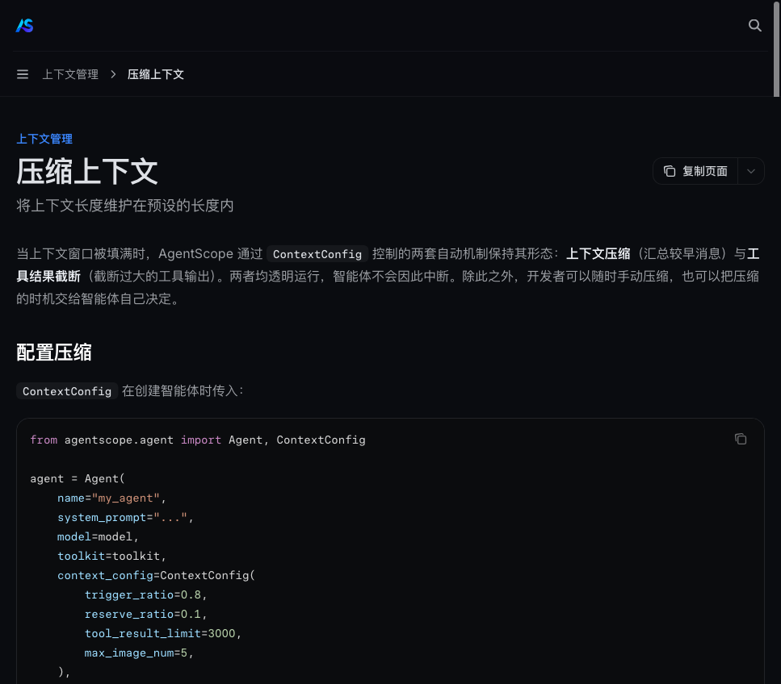
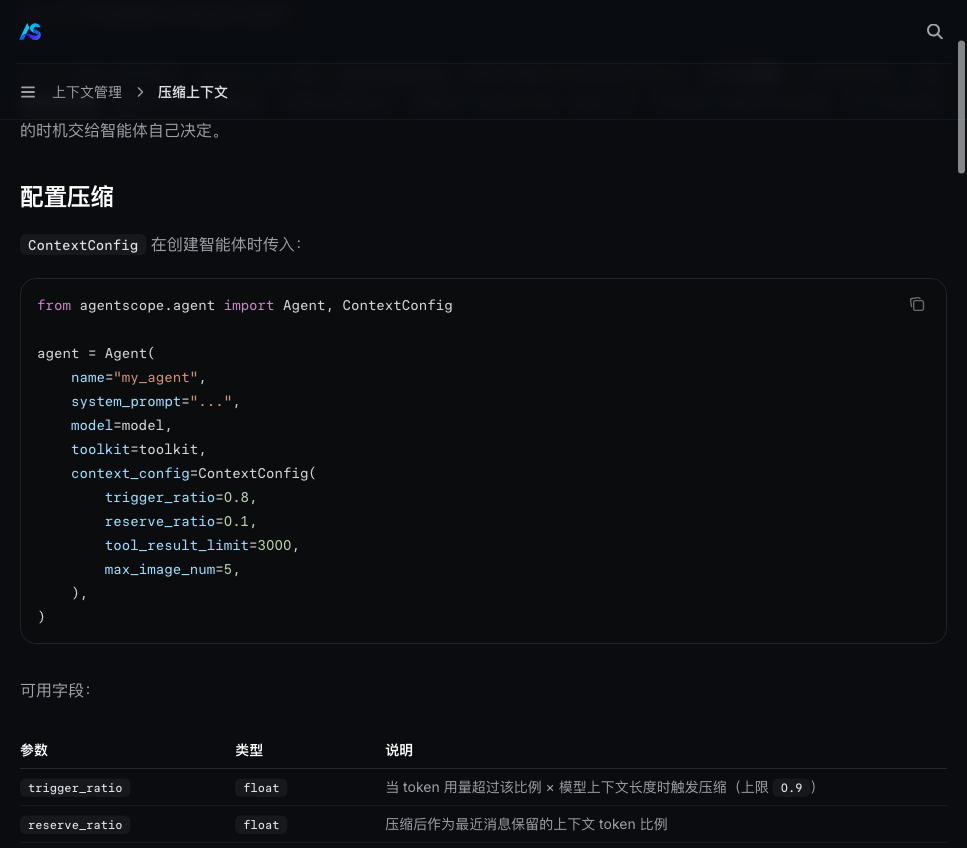
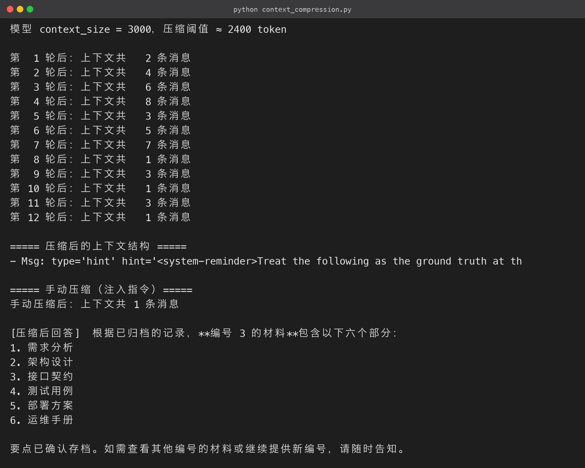

# 《AgentScope 2.0实战指南》07 - 上下文压缩：让长对话始终待在模型窗口内

### 7.1 问题：上下文不是无限的

大模型都有上下文窗口上限（如 128K token）。长对话、多轮工具调用、大段检索结果，都会快速消耗窗口。

一旦超过窗口，轻则报错，重则模型「失忆」。超窗的典型症状：

- 忘记任务目标；
- 重复调用工具；
- 前后矛盾。

AgentScope 2.0 提供两套解决方案：

- **上下文压缩**：把较早的消息**汇总成结构化摘要**，保留最近的重要消息——相当于给上下文「瘦身」；
- **上下文卸载（Offload）**：把暂时用不到的上下文移到外部存储，需要时再取回——相当于给上下文「外接硬盘」。

两者可以配合使用。本节实战**压缩**，因为它是绝大多数长对话场景的第一道防线。

官方对压缩流程的描述如下（五步）：

1. 判断当前 token 用量是否超过阈值；
2. 超过则从上下文中拆分出「可压缩的历史部分」与「保留的最近部分」；
3. 调用 LLM 将历史部分压缩为结构化摘要；
4. 用摘要消息替换掉历史消息；
5. 继续正常推理。



理解这套流程的关键是第 3 步：**压缩不是简单截断，而是让模型「读一遍旧消息，写一份结构化摘要」**。摘要会保留关键事实与决策，所以压缩后的模型依然「记得」旧信息——这一点稍后用实测验证。

### 7.2 参数：ContextConfig

所有开关都在 `ContextConfig` 里，四个参数决定了压缩的「何时、留多少、多细」：

| 参数 | 含义 | 本文演示值 |
|---|---|---|
| `trigger_ratio` | token 用量超过 `trigger_ratio × context_size` 时触发压缩 | `0.8` |
| `reserve_ratio` | 压缩后保留最近 `reserve_ratio × context_size` 的消息 | `0.1` |
| `tool_result_limit` | 单条工具结果超过该 token 数时截断 | `800` |
| `compression_fallback_to_truncation` | 压缩失败时是否退回「删除最旧消息」 | `True` |



调参直觉：

- `trigger_ratio`：太小会频繁压缩（费 token 且打断节奏），太大则容易撞窗；
- `reserve_ratio`：太小会把最近对话也压掉（丢失关键细节），太大则腾不出空间。

生产环境常用组合是 `trigger_ratio=0.7~0.8`、`reserve_ratio=0.1~0.3`。

### 7.3 完整可运行源码

为了让压缩效果**几轮对话内肉眼可见**，示例把模型 `context_size` 故意调小到 3000（生产环境请用真实窗口，如 128000），然后连续投喂长消息，观察上下文长度「涨 → 触发 → 回落」：

```python
# context_compression.py

"""第 7 节 · 上下文压缩：让长对话始终待在模型窗口内"""
import asyncio

from agentscope.agent import Agent, ContextConfig
from agentscope.credential import OpenAICredential
from agentscope.message import UserMsg
from agentscope.model import OpenAIChatModel
from agentscope.tool import Toolkit

from config import API_KEY, BASE_URL, CHAT_MODEL

SMALL_CONTEXT = 3000  # 故意调小窗口，几轮即可触发压缩（生产用真实窗口）

def long_message(index: int) -> str:
    """生成一段较长、带编号的话题内容，便于观察摘要保留了哪些信息。"""
    return (
        "正在讨论的项目材料清单：编号 {i} 包含需求分析、架构设计、接口契约、"
        "测试用例、部署方案与运维手册六个部分，其中接口契约需要团队评审，"
        "部署方案依赖测试环境完成验收。请记住这条材料的要点。"
    ).format(i=index)

async def main() -> None:
    credential = OpenAICredential(api_key=API_KEY, base_url=BASE_URL)
    model = OpenAIChatModel(
        credential=credential,
        model=CHAT_MODEL,
        stream=True,
        context_size=SMALL_CONTEXT,  # 压缩阈值以此为基数

    )

    agent = Agent(
        name="compress-demo",
        system_prompt="你是一个耐心的助手，请逐条记住用户给出的材料要点并简单回应。",
        model=model,
        toolkit=Toolkit(),
        context_config=ContextConfig(
            trigger_ratio=0.8,       # 用量 > 80% × 3000 = 2400 token 时触发

            reserve_ratio=0.1,       # 压缩后保留最近 10% 的消息

            tool_result_limit=800,
            compression_fallback_to_truncation=True,
        ),
    )

    print(f"模型 context_size = {SMALL_CONTEXT}，压缩阈值 ≈ {int(SMALL_CONTEXT * 0.8)} token\n")
    for i in range(1, 13):
        await agent.reply(UserMsg(name="user", content=long_message(i)))
        print(f"第 {i:>2} 轮后：上下文共 {len(agent.state.context):>3} 条消息")

    # 手动压缩：注入指令引导摘要重点（例如要求保留编号与材料名）

    from agentscope.message import HintBlock
    await agent.compress_context(
        instructions=HintBlock(hint="压缩时务必保留每条材料的编号与名称，便于后续按编号检索。"),
    )
    print(f"手动压缩后：上下文共 {len(agent.state.context)} 条消息")

    # 压缩后继续对话，验证摘要是否承载了旧信息

    reply = await agent.reply(
        UserMsg(name="user", content="请根据你记住的内容，说出编号 3 的材料有哪些部分。")
    )
    text = "".join(b.text for b in reply.content if b.type == "text")
    print("\n[压缩后回答] ", text)

if __name__ == "__main__":
    asyncio.run(main())

```

**运行结果（终端实跑输出）：**



代码里有两点要注意：

- **`context_size` 放在模型上**：压缩阈值 = `trigger_ratio × context_size`，所以 context_size 必须设对；
- **`compress_context(instructions=HintBlock(...))`**：手动压缩可以注入指令，引导摘要保留哪些信息——「压缩时务必保留编号与名称」这种指令，能让摘要更贴合你的后续查询需求。这是自动压缩没有的精细控制。

### 7.4 实测输出

自动压缩全程（节选关键行）：

```text
模型 context_size = 3000，压缩阈值 ≈ 2400 token

第  1 轮后：上下文共   2 条消息
第  2 轮后：上下文共   4 条消息
第  3 轮后：上下文共   6 条消息
[INFO] Current token count 2717 exceeds the threshold 2400, activating compression.
[INFO] The context compression finished.
第  4 轮后：上下文共   3 条消息   ← 6 → 3，历史被压缩成摘要
第  5 轮后：上下文共   5 条消息
...
第 12 轮后：上下文共   1 条消息

手动压缩后：上下文共 1 条消息

[压缩后回答]  编号 3 的材料包含以下 6 个标准部分：
需求分析、架构设计、接口契约、测试用例、部署计划、运维手册。

```

三个观察点：

1. **触发是自动的**：第 3 轮 token 用量 2717 > 阈值 2400，框架自动启动压缩，无需任何人工干预；
2. **长度确实回落**：6 条 → 3 条，多次压缩后甚至压到 1 条——窗口被持续释放；
3. **信息没丢**：最后一问「编号 3 的材料有哪些部分」，Agent 准确答出六个部分——**这条信息早在第 3 轮就被压缩进摘要了**，但模型依然能回答。

> **WARNING 说明**：当消息增长过快、预留上下文不足时，框架会打印「maybe failed due to insufficient reserved context」并**自动退回截断策略**（删除最旧消息）。生产环境调参思路：`context_size` 设真实值，`trigger_ratio` 0.6~0.8，`reserve_ratio` 0.1~0.3，优先保证最近对话完整。

### 7.5 什么时候用 Offload

如果任务特别长、还需要随时翻旧账（比如几万行的数据清洗任务），压缩可能不够——摘要会丢细节。这时配 **Offload**：把完整旧消息卸载到外部存储，按需检索取回。

选型规则：

- **普通长对话**：用压缩；
- **超长且高频翻旧账**：用 Offload；
- 两者不冲突，可以叠加。

### 7.6 压缩的成本与收益

压缩是否费 token，要算两笔账：

- **压缩本身的成本**：每次压缩要调用一次 LLM 读历史、写摘要，大约消耗「历史消息 token 数」的一次输出级开销；
- **压缩省下的成本**：之后每一轮推理都少携带那批历史消息，省下的 token 是**线性持续**的。

- **20 轮以上的长对话**：压缩几乎总是划算；
- **3~5 轮的短对话**：不需要压缩。

所以 `trigger_ratio` 设 0.8（只用满 80% 才压缩）正好兼顾两头：大部分短任务根本不会触发，只有真正的长对话才付出压缩成本。

### 7.7 调参速查表

| 场景 | context_size | trigger_ratio | reserve_ratio |
|---|---|---|---|
| 教学/演示（本文） | 3000 | 0.8 | 0.1 |
| 通用问答助手 | 128000 | 0.8 | 0.2 |
| 长文档处理 | 128000 | 0.6 | 0.3 |
| 工具密集任务 | 128000 | 0.7 | 0.25 |

原则：工具结果多、任务碎，就多留 `reserve_ratio`；纯对话场景可以压得狠一点。

### 7.8 压缩对工具调用链的影响

还有一点：**压缩的对象包括工具调用的历史**。

一个跑了 30 轮工具调用的任务，前 20 轮的「调用参数 + 返回结果」都会在压缩时被摘要化。这通常是好事（省 token），但如果业务需要「模型精确回忆起第 5 轮某个工具的完整输出」，摘要可能丢细节。

应对方案：

- 关键中间结果**主动写文件**，不依赖上下文保存；
- 对「必须保留完整执行记录」的任务，用第 7.5 节提到的 Offload 而非压缩；
- 用 `tool_result_limit` 从源头控制单条工具结果体积，降低压缩时的压力。

**上下文是易失的，存成文件才是持久的**。把「必须记住的东西」尽早变成文件或记忆。

第 8 节 ReMe 的「记忆持久化」与第 9 节 RAG 的「资料入库」都是这一点的工程化实现——压缩管窗口，记忆管跨会话，检索管私有知识，三层各司其职、互不冲突。

源码地址：[https://github.com/LarryLi93/agentscope2](https://github.com/LarryLi93/agentscope2)
