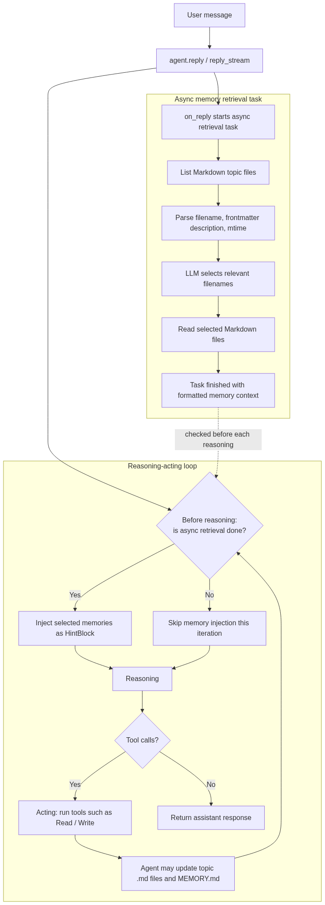
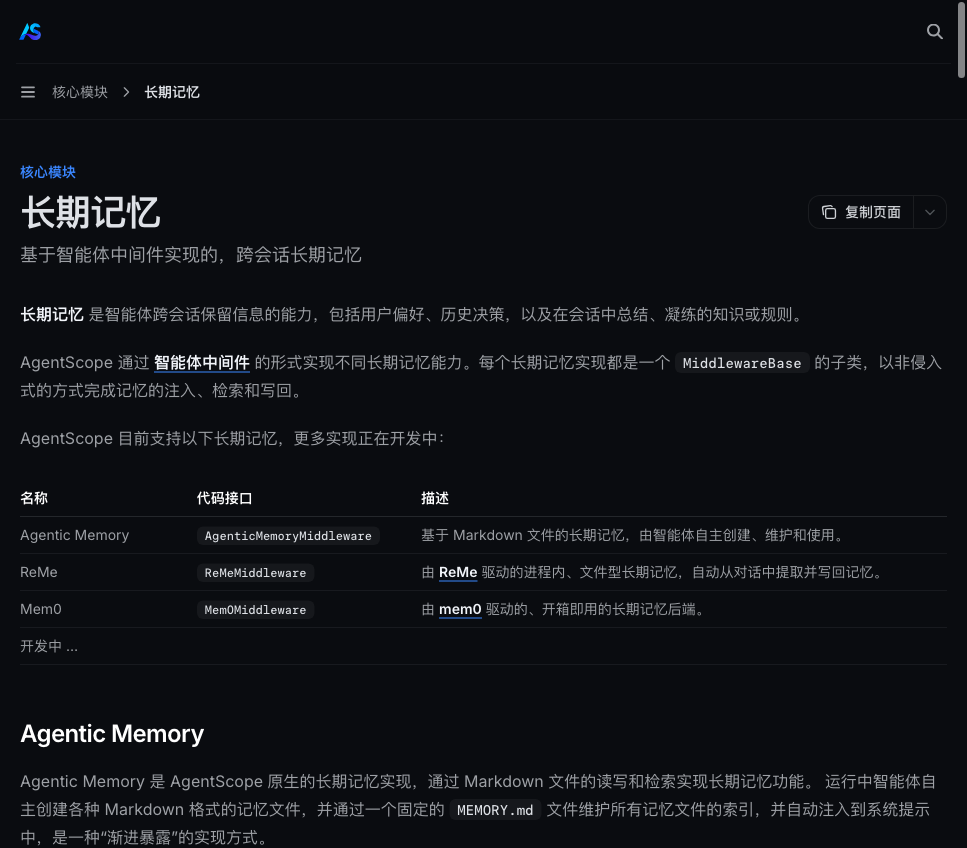
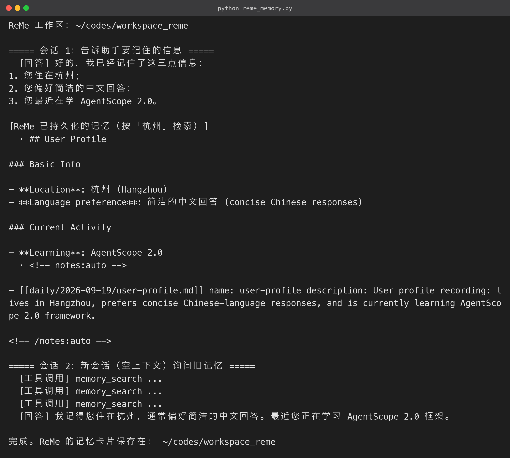

# 8. 长期记忆（ReMe 实现）：跨会话记住用户

### 8.1 问题：会话一关，记忆清零

普通 Agent 的上下文只存在于当前会话。换一个会话，下面这些信息全部归零：

- 用户说过的偏好；
- 之前查过的资料；
- 上一次的决策。

对客服、助手类产品这是致命的——用户每次都像在面对一个陌生人。长期记忆要解决的就是：**把重要信息持久化，让新会话能召回**。

AgentScope 2.0 内置两套记忆方案：

| 方案 | 形态 | 特点 |
|---|---|---|
| **Mem0** | 独立服务 / SaaS | 功能全、适合生产，但需要部署或付费服务 |
| **ReMe** | **进程内嵌入（embedded）** | 纯文件型记忆，无需额外服务，`pip install "agentscope[reme]"` 即用 |

本节实战 **ReMe**——它的关键特性是「**嵌入进程、零运维**」：记忆卡片以 Markdown 文件形式存在本地目录，没有独立的数据库或服务要管。官方对 ReMe 中间件工作流的描述（下图取自官方文档）：



核心机制拆成三步：

1. **写回（自动）**：每次回复结束后，中间件自动调用 ReMe 的 `auto_memory` 任务，从**整个对话增量**（用户输入 + 助手回复 + 工具调用）中抽取记忆卡片，写入 `workspace_dir` 下的 Markdown 文件——模型不需要也不能手动写记忆，写回全自动；
2. **检索（三种模式）**：`static_control`（回复前自动检索并注入）、`agent_control`（暴露 `memory_search` 工具让模型自己查）、`both`（两者都要）；
3. **跨会话**：只要复用同一个 `workspace_dir`，不同 `session_id` 的会话就能共享检索，实现「新会话记得旧会话」。



记忆卡片写到文件后的样子也值得看一眼：`workspace_dir` 下会生成按日期组织的 Markdown 文件（如 `daily/2026-09-18/user-preferences.md`），并带 frontmatter 元数据。

两个直接好处：

- **人类可读**：不用专用工具就能翻看记忆内容；
- **可审计**：记忆是纯文本，便于排查和版本管理。

这是 ReMe 相比二进制存储的明显优势。

### 8.2 完整可运行源码

演示流程：**会话 1 让助手记住三件事 → 手动 reindex 让新记忆立即可检索 → 会话 2（全新空上下文）询问旧记忆**（源码包 `reme_memory.py`）：

```python
# reme_memory.py

"""第 8 节 · 长期记忆（ReMe 实现）：跨会话记住用户的偏好"""
import asyncio
import logging
import os
import shutil

from agentscope.agent import Agent
from agentscope.credential import OpenAICredential
from agentscope.embedding import OpenAIEmbeddingModel
from agentscope.event import TextBlockDeltaEvent, ToolCallStartEvent
from agentscope.message import UserMsg
from agentscope.middleware import ReMeMiddleware
from agentscope.model import OpenAIChatModel
from agentscope.state import AgentState
from agentscope.tool import Toolkit

from config import API_KEY, BASE_URL, CHAT_MODEL, EMBED_DIM, EMBED_MODEL

WORKSPACE_DIR = os.path.join(os.path.dirname(__file__), "workspace_reme")
logging.getLogger("reme").setLevel(logging.ERROR)

def _build_models():
    credential = OpenAICredential(api_key=API_KEY, base_url=BASE_URL)
    chat_model = OpenAIChatModel(credential=credential, model=CHAT_MODEL, stream=True)
    embedding_model = OpenAIEmbeddingModel(
        credential=credential, model=EMBED_MODEL, dimensions=EMBED_DIM,
    )
    return chat_model, embedding_model

def _build_agent(chat_model, mw: ReMeMiddleware, session_id: str) -> Agent:
    """构造一个绑定 session_id 的智能体。"""
    return Agent(
        name="assistant",
        system_prompt=(
            "你是一个贴心的助手。当问题可能依赖过去的持久信息"
            "（用户偏好、姓名、历史决定）时，请调用 memory_search 查询；"
            "记忆保存是自动的，你不需要手动写入。"
        ),
        model=chat_model,
        toolkit=Toolkit(tools=[]),  # 下方覆盖为 mw.list_tools()

        middlewares=[mw],
        state=AgentState(session_id=session_id),
    )

async def _run_turn(agent: Agent, content: str) -> None:
    text_parts = []
    async for ev in agent.reply_stream(inputs=UserMsg(name="user", content=content)):
        if isinstance(ev, ToolCallStartEvent):
            print(f"  [工具调用] {ev.tool_call_name} ...")
        elif isinstance(ev, TextBlockDeltaEvent):
            text_parts.append(ev.delta)
    print("  [回答]", "".join(text_parts))

async def main() -> None:
    # 每次运行从干净工作区开始（该目录由本示例创建，可安全重置）

    shutil.rmtree(WORKSPACE_DIR, ignore_errors=True)
    os.makedirs(WORKSPACE_DIR, exist_ok=True)
    print(f"ReMe 工作区：{WORKSPACE_DIR}\n")

    chat_model, embedding_model = _build_models()
    mw = ReMeMiddleware(
        workspace_dir=WORKSPACE_DIR,
        parameters=ReMeMiddleware.Parameters(
            chat_model=chat_model,          # auto_memory 抽取用

            embedding_model=embedding_model,  # 开启向量检索

            mode="both",                    # 自动检索 + memory_search 工具

            top_k=5,
        ),
    )

    # ---------- 会话 1：写入记忆 ----------

    print("===== 会话 1：告诉助手要记住的信息 =====")
    agent1 = _build_agent(chat_model, mw, session_id="alice-main")
    agent1.toolkit = Toolkit(tools=await mw.list_tools())
    await _run_turn(
        agent1,
        "请记住三件事：1）我住在杭州；2）我偏好简洁的中文回答；3）我最近在学 AgentScope 2.0。",
    )

    # auto_memory 写回后，记忆卡片还要经过索引任务才可检索。

    # 生产环境由 ReMe 后台 watch 循环自动完成；这里手动触发一次

    # reindex 保证下一步立刻能搜到（与官方示例做法一致）。

    await mw._run_job("reindex")  # noqa: SLF001  演示用，仅同步索引

    print("\n[ReMe 已持久化的记忆（按「杭州」检索）]")
    for memory in await mw._search("杭州", limit=5):  # noqa: SLF001

        print(f"  · {memory}")

    # ---------- 会话 2：全新上下文，召回记忆 ----------

    print("\n===== 会话 2：新会话（空上下文）询问旧记忆 =====")
    agent2 = _build_agent(chat_model, mw, session_id="bob-new")
    agent2.toolkit = Toolkit(tools=await mw.list_tools())
    await _run_turn(
        agent2,
        "你还记得我住在哪个城市、有什么回答偏好吗？最近在学什么？",
    )

    await mw.close()
    print("\n完成。ReMe 的记忆卡片保存在：", WORKSPACE_DIR)

if __name__ == "__main__":
    asyncio.run(main())

```

**运行结果（终端实跑输出）：**



> **⚠️ 兼容性补丁（重要）**
>
> 截至本文实测，PyPI 的 `reme` 包与 AgentScope 的 `ReMeMiddleware` 存在一处版本错位：
>
> - **问题**：`reme` 包尚未提供 `dream_topics_step` 这一步骤组件；
> - **现象**：`ReMeMiddleware` 默认装配的「每日摘要」流水线引用了它，中间件启动报 `Unregistered backend 'dream_topics_step'`；
> - **解决**：在导入中间件后、构造 `ReMeMiddleware` 前，运行时移除该步骤，不影响 `auto_memory` 写回与 `memory_search` 检索。
>
> 源码包 `reme_memory.py` 已内置此补丁并有详细注释，官方修复后可直接删除该段。

### 8.3 实测输出

```text
ReMe 工作区：.../codes/workspace_reme

===== 会话 1：告诉助手要记住的信息 =====
  [回答] 已收到并记住以下信息：
1. 住址：杭州
2. 风格偏好：简洁中文
3. 近期动态：正在学习 AgentScope 2.0

[ReMe 已持久化的记忆（按「杭州」检索）]
  · ## 个人档案与偏好

    - 居住地：杭州
    - 沟通风格：偏好简洁的中文回答
    - 近期动态：最近在学 AgentScope 2.0
  · [[daily/2026-09-18/user-preferences.md]] name: user-preferences
    description: 记录用户的个人基础信息与沟通偏好……

===== 会话 2：新会话（空上下文）询问旧记忆 =====
  [工具调用] memory_search ...
  [工具调用] memory_search ...
  [回答] 记得。你住在杭州，偏好简洁的中文回答，最近正在学习 AgentScope 2.0。

完成。ReMe 的记忆卡片保存在：.../codes/workspace_reme

```

三个关键证据：

1. **写回自动完成**：会话 1 的回复结束后，`auto_memory` 已经把对话抽取成结构化记忆卡片（「个人档案与偏好」）；
2. **索引后立即可搜**：按「杭州」检索返回了两条相关记忆，包括记忆正文与卡片元数据；
3. **跨会话召回成功**：会话 2 的 Agent 上下文完全为空，但通过 `memory_search` 自主召回了会话 1 的全部信息——**跨会话长期记忆跑通了**。

> **生产建议**：
>
> - 把 `workspace_dir` 指向持久化存储（如云盘 / 对象存储挂载目录）；
> - `mode="both"` 适合通用助手，`agent_control` 适合检索低频场景以省 token；
> - 记忆卡片定期人工抽检，保证抽取质量。

### 8.4 三种检索模式怎么选

ReMe 的 `mode` 参数决定「记忆怎么被想起来」，三档各有取舍：

| mode | 机制 | 优点 | 缺点 | 适用 |
|---|---|---|---|---|
| `static_control` | 每轮回复前自动检索并注入 | 无需模型配合，召回稳定 | 每轮都耗检索+注入 token | 客服、必须稳定记忆的场景 |
| `agent_control` | 暴露 `memory_search` 工具，模型自己查 | 省 token，模型按需触发 | 模型可能漏查 | 检索低频、token 敏感 |
| `both` | 自动注入 + 工具双通道 | 稳定且灵活 | token 开销最大 | 通用助手（本文） |

另外要说清 **`session_id` 的语义**——写回与检索的作用域不一样：

- **写回按 `session_id` 隔离**：每个会话的记忆卡片分别写入文件；
- **检索是工作区级别的**：跨会话共享同一个 `workspace_dir`。

由此推出两条用法：

- 「A 用户与 B 用户」要隔离 → 给每个用户独立的 `workspace_dir`；
- 「同一用户的不同会话」要互认记忆 → 共用一个 `workspace_dir`，本文示例正是后者。

### 8.5 打开 ReMe 工作区看看

跑完示例，`workspace_reme/` 目录下的结构大致是这样：

```text
workspace_reme/
└── daily/
    └── 2026-09-18/
        └── user-preferences.md   # 自动抽取的记忆卡片

```

卡片内容是人类可读的 Markdown，带 frontmatter 元数据：

```markdown
<!-- notes:auto -->
- [[daily/2026-09-18/user-preferences.md]] name: user-preferences
  description: 记录用户的个人基础信息与沟通偏好……
<!-- /notes:auto -->

```

这意味着**记忆可审计、可手工修正**：抽错了直接改 Markdown 文件，下一轮检索就会生效。相比黑盒向量存储，这是「文件即记忆」方案在生产上的优势。

### 8.6 记忆质量与隐私注意

- **抽取质量取决于对话模型**：`auto_memory` 是 LLM 驱动的，对话信息密度高、指令明确时抽取质量更好；可以在提示词里引导用户「说清楚重要信息」；
- **敏感信息策略**：工作区里就是明文 Markdown，涉及 PII 时务必加密后写入文件，或做脱敏；
- **记忆也要「忘」**：ReMe 支持对过期卡片清理，定期巡检删除过时记忆，避免记忆库越来越脏。

### 8.7 ReMe 与 Mem0 怎么选

AgentScope 同时内置两套记忆，选型并不冲突，看约束即可：

| 维度 | ReMe | Mem0 |
|---|---|---|
| 部署 | 进程内嵌入，零额外服务 | 独立服务 / SaaS，需部署或订阅 |
| 数据形态 | 明文 Markdown 文件 | 托管存储 |
| 上手成本 | 极低（pip + 一个目录） | 中（要先起服务） |
| 扩展能力 | 文件可审计可手改 | 更丰富的检索与平台能力 |
| 适用 | 教学、私有化、轻量部署 | 大规模生产、多端同步 |

**建议路线**：先 ReMe 跑通记忆流程（本文示例就是），验证产品形态；需要规模化、多端同步时再迁移 Mem0——两者切换只改中间件，业务代码几乎不动。

**最后给一个记忆调参方向**，按症状对症下药：

- 「该记住的没记住」：提高对话里信息的显式度（在用户输入里引导），并检查 `auto_memory` 的抽取质量；
- 「记住了不该记的」：调低抽取频率，或增加记忆清理；
- **`top_k` 影响召回量**：太大容易注入噪音、太小容易漏，通常 **3~5** 是平衡点，按实测效果微调。
