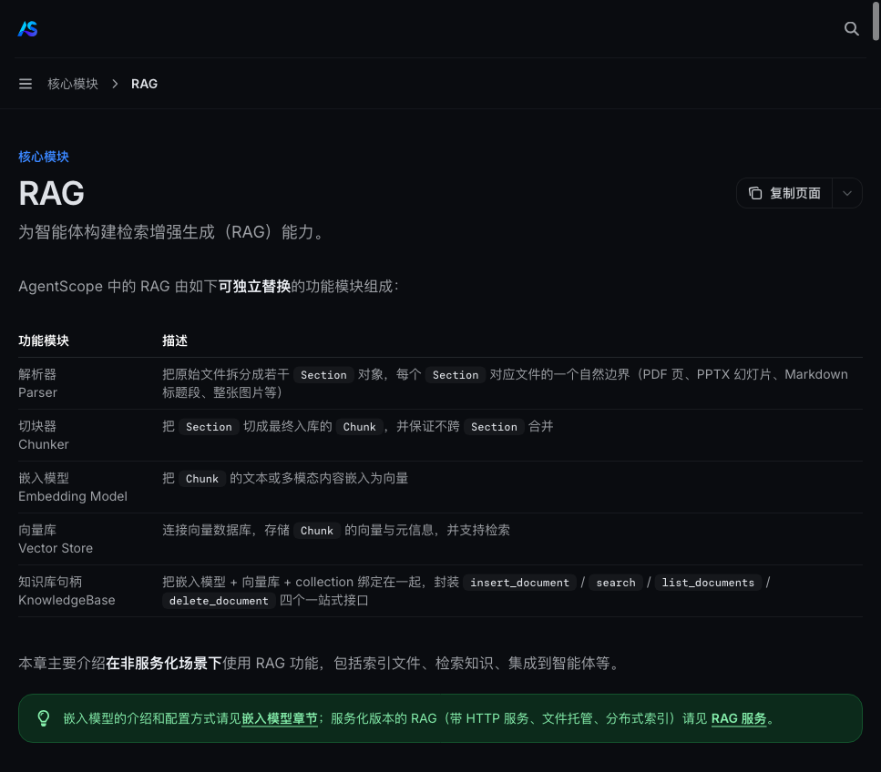
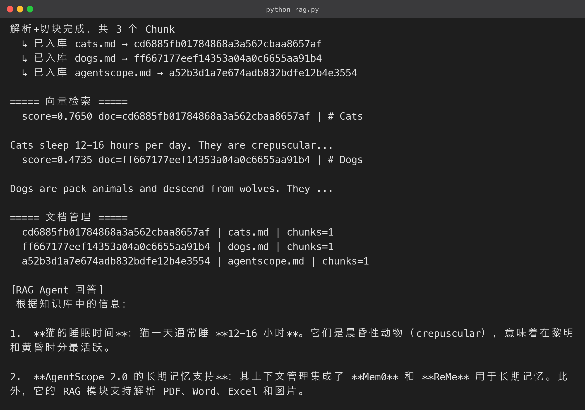

# 9. RAG 检索增强生成：让 Agent 读你的私有资料

### 9.1 什么是 RAG，为什么需要它

**RAG（Retrieval-Augmented Generation）** 解决的是「模型不知道你的私有资料」的问题：先把文档切块、向量化存入向量库，回答问题时先检索出最相关的片段，再让模型基于这些片段回答。相比微调，RAG 有三点优势：

- **不需要训练**：资料即插即用，今天传文档今天就能问答；
- **可随时更新**：换一版合同、加一份财报，增量入库即可，不用重新训练；
- **答案可溯源**：模型回答基于检索到的片段，可以回指「我根据哪份文档的第几段回答你」。

AgentScope 2.0 的 RAG 由**可独立替换**的模块组成：

```text
文档 → 解析器(Parser) → 切块器(Chunker) → 嵌入模型(Embedding) → 向量库(VectorStore) → KnowledgeBase

```

各环节都可以按资料类型和规模替换：

- **解析器**：支持 PDF / Word / Excel / PPT / 图片等；
- **向量库**：支持 Qdrant、Chroma、Elasticsearch 等（官方模块表见下图）；
- **按需选型**：有 PDF 用 PDFParser，代码库用 SeparatorChunker，超大规模用远程 Qdrant。



### 9.2 完整可运行源码

三步建库 + 智能体问答（源码包 `rag.py`，语料在 `codes/corpus/`）：

```python
# rag.py

"""第 9 节 · RAG：三步建库 + 智能体问答"""
import asyncio
import os

from agentscope.agent import Agent
from agentscope.credential import OpenAICredential
from agentscope.embedding import OpenAIEmbeddingModel
from agentscope.message import UserMsg
from agentscope.middleware import RAGMiddleware
from agentscope.model import OpenAIChatModel
from agentscope.rag import ApproxTokenChunker, KnowledgeBase, QdrantStore, TextParser
from agentscope.tool import Toolkit

from config import API_KEY, BASE_URL, CHAT_MODEL, EMBED_DIM, EMBED_MODEL

CORPUS_DIR = os.path.join(os.path.dirname(__file__), "corpus")

async def build_knowledge_base() -> tuple[KnowledgeBase, QdrantStore]:
    """① 解析 → ② 切块 → ③ 嵌入入库。"""
    credential = OpenAICredential(api_key=API_KEY, base_url=BASE_URL)
    embedding_model = OpenAIEmbeddingModel(
        credential=credential, model=EMBED_MODEL, dimensions=EMBED_DIM,
    )

    parser = TextParser()
    chunker = ApproxTokenChunker(
        parameters=ApproxTokenChunker.Parameters(chunk_size=256, overlap=32),
    )

    os.makedirs(CORPUS_DIR, exist_ok=True)
    docs = {
        "cats.md": "# Cats\n\nCats sleep 12-16 hours per day. They are crepuscular...",

        "dogs.md": "# Dogs\n\nDogs are pack animals and descend from wolves...",

        "agentscope.md": "# AgentScope 2.0\n\nAgentScope 2.0 is a production-ready agent framework...",

    }
    for filename, content in docs.items():
        path = os.path.join(CORPUS_DIR, filename)
        if not os.path.exists(path):
            with open(path, "w", encoding="utf-8") as f:
                f.write(content)

    all_chunks = []
    for filename in docs:
        sections = await parser.parse(file=os.path.join(CORPUS_DIR, filename), filename=filename)
        all_chunks.extend(await chunker.chunk(sections))
    print(f"解析+切块完成，共 {len(all_chunks)} 个 Chunk")

    # ③ 内存版 Qdrant + KnowledgeBase 句柄（生产可用 path= 持久化）

    store = QdrantStore(location=":memory:")
    await store.__aenter__()
    knowledge = KnowledgeBase(
        name="demo-kb",
        description="猫、狗与 AgentScope 的微型知识库。",
        embedding_model=embedding_model,
        vector_store=store,
        collection="demo-kb",
    )
    for filename in docs:
        sections = await parser.parse(file=os.path.join(CORPUS_DIR, filename), filename=filename)
        chunks = await chunker.chunk(sections)
        doc_id = await knowledge.insert_document(
            chunks, document_metadata={"filename": filename},
        )
        print(f"  ↳ 已入库 {filename} → {doc_id}")
    return knowledge, store

async def demo_search(knowledge: KnowledgeBase) -> None:
    print("\n===== 向量检索 =====")
    results = await knowledge.search(queries=["How long do cats sleep?"], top_k=2)
    for r in results:
        print(f"  score={r.score:.4f} doc={r.document_id} | {r.chunk.content.text[:60]}...")

    print("\n===== 文档管理 =====")
    for s in await knowledge.list_documents():
        print(f"  {s.document_id} | {s.source} | chunks={s.chunk_count}")

async def demo_rag_agent(knowledge: KnowledgeBase) -> None:
    """用 RAGMiddleware 把知识库接入 Agent（agentic 模式）。"""
    credential = OpenAICredential(api_key=API_KEY, base_url=BASE_URL)
    chat_model = OpenAIChatModel(credential=credential, model=CHAT_MODEL, stream=True)

    rag_mw = RAGMiddleware(
        knowledge_bases=[knowledge],
        parameters=RAGMiddleware.Parameters(mode="agentic", top_k=3),
    )
    agent = Agent(
        name="rag-agent",
        system_prompt=(
            "你是知识库问答助手。回答前先调用 search_knowledge 工具检索资料，"
            "然后只依据检索到的资料回答。"
        ),
        model=chat_model,
        toolkit=Toolkit(tools=await rag_mw.list_tools()),  # 暴露 search_knowledge

        middlewares=[rag_mw],
    )
    reply = await agent.reply(
        UserMsg(name="user", content="猫一天睡多久？AgentScope 2.0 支持哪些长期记忆？")
    )
    text = "".join(b.text for b in reply.content if b.type == "text")
    print("\n[RAG Agent 回答]\n", text)

async def main() -> None:
    knowledge, store = await build_knowledge_base()
    await demo_search(knowledge)
    await demo_rag_agent(knowledge)
    await store.__aexit__(None, None, None)

if __name__ == "__main__":
    asyncio.run(main())

```

**运行结果（终端实跑输出）：**



对照管线拆解这段代码：

- **① 解析**：`TextParser().parse(file, filename)` 把 Markdown 读成结构化 Section；
- **② 切块**：`ApproxTokenChunker(chunk_size=256, overlap=32)` 按 token 切块、相邻块重叠 32 token——重叠是为了避免「一句话被从中间切开」导致语义断裂；
- **③ 入库**：`insert_document(chunks, document_metadata={"filename": ...})` 把每篇文档作为独立 document_id 写入，元数据可用于多租户隔离与溯源；
- **检索**：`search(queries, top_k)` 返回按相似度排序的结果，带 score；
- **接入 Agent**：`RAGMiddleware` 暴露 `search_knowledge` 工具，模型按需检索后再回答。

### 9.3 实测输出

```text
解析+切块完成，共 3 个 Chunk
  ↳ 已入库 cats.md → 473d1578003242088473062cef1da02e
  ↳ 已入库 dogs.md → b716615cbda541d48809cebb2f5b7f9b
  ↳ 已入库 agentscope.md → 3d86b1ea5ef64c8b9e35e457398799f2

===== 向量检索 =====
  score=0.7654 doc=473d1578003242088473062cef1da02e | # Cats

Cats sleep 12-16 hours per day. They are crepuscular...
  score=0.4737 doc=b716615cbda541d48809cebb2f5b7f9b | # Dogs

Dogs are pack animals and descend from wolves. They ...

===== 文档管理 =====
  b716615cbda541d48809cebb2f5b7f9b | dogs.md | chunks=1
  473d1578003242088473062cef1da02e | cats.md | chunks=1
  3d86b1ea5ef64c8b9e35e457398799f2 | agentscope.md | chunks=1

[RAG Agent 回答]
根据知识库中的信息：
* 猫一天睡多久？ → 猫每天睡眠时间为 12-16 小时，它们是晨昏性动物……
* AgentScope 2.0 支持哪些长期记忆？ → AgentScope 2.0 的上下文管理集成了 Mem0 和 ReMe 来支持长期记忆。

```

注意检索分数：`cats.md` 的 0.7654 明显高于 `dogs.md` 的 0.4737——语义检索正确命中了「猫的睡眠时长」对应的文档；Agent 也严格依据知识库回答，没有编造。

**接 RAG 前后对比**：

- 没有 RAG：模型只能凭训练记忆回答；
- 有了 RAG：它回答的是「你的资料」。

### 9.4 生产化要点

- **解析器**：除了 `TextParser`，官方还提供 PDF、Word、Excel、PPT、图片解析器，装 `agentscope[rag]` 后按文件类型选择；
- **切块策略**：`ApproxTokenChunker`（按 token 数）适合通用文档，`SeparatorChunker`（按分隔符）适合有结构的 Markdown / 代码；块太小丢语义、块太大拖慢检索，256~512 token 是常见起点；
- **向量库持久化**：用 `QdrantStore(path="./qdrant_data")` 把数据写到磁盘，或 `url=` 连远程 Qdrant；多租户用 `metadata_filter` 隔离；
- **中间件模式**：`mode="agentic"` 让模型自主决定何时检索（节省 token），`mode="static"` 每轮强制注入检索结果（保证稳定，代价是 token 开销）；
- **文档管理**：`list_documents` / `delete_document` / `insert_document` 支持增量更新，配合定时任务即可实现资料库自动同步；
- **评估**：上线前用一组带标准答案的问题集测召回率，调整 `top_k` 与 `score_threshold`，避免「检索到的没用、有用的没检索到」。

### 9.5 切块策略怎么选

切块是 RAG 最容易调、也最影响效果的一环。两种内置策略对比：

| 策略 | 原理 | 适合 | 参数直觉 |
|---|---|---|---|
| `ApproxTokenChunker` | 按 token 数量均分，带重叠 | 通用文档、无结构文本 | `chunk_size` 256~512，`overlap` 16~64 |
| `SeparatorChunker` | 按分隔符（标题/段落/代码块）切分 | 结构化 Markdown、代码、合同条款 | 分隔符按文档类型配置 |

块大小的直觉：

- **块太小**：语义断裂、检索噪音大；
- **块太大**：混入无关信息、检索精度下降。

中文场景用 `ApproxTokenChunker`、256 token + 32 overlap 是个稳妥起点，实测对短文档效果良好。

### 9.6 向量库选型与持久化

AgentScope 的 `VectorStoreBase` 抽象下可插拔多种实现：

- **QdrantStore**：`location=":memory:"` 内存模式适合演示/测试；`path="./qdrant_data"` 持久化到磁盘；`url="http://..."` 连远程服务。生产环境常用，支持过滤、多租户；
- **ChromaStore**：轻量、Python 友好，中小规模知识库够用；
- **ElasticsearchStore**：与已有 ES 基础设施整合时使用，支持混合检索。

选型：**演示用内存 Qdrant，单机生产把 Qdrant 数据写到磁盘，分布式/已有 ES 基建用远程 Qdrant 或 ES**。本文用内存模式保证「下载即跑」。

### 9.7 如何评估你的 RAG

RAG 上线前请做一次「召回 + 生成」双评估：

1. **准备评估集**：30~50 条「问题 + 标准答案 + 答案所在文档」的三元组；
2. **测召回**：每条问题跑 `knowledge.search`，检查正确答案的文档是否出现在 top-k 里，统计召回率（如 ≥80% 算及格）；
3. **测生成**：把检索结果交给模型作答，人工打分（完整/准确/无幻觉三档）；
4. **对症调参**：召回率低 → 调小 `chunk_size`、加大 `top_k`、换更好的 embedding；生成差 → 收紧 `score_threshold`、优化系统提示、要求模型标注引用来源。

RAG 的效果问题多数出在切块与召回上，优先排查这两处。

### 9.8 多知识库与权限隔离

真实产品往往是「多团队、多知识库」的形态。AgentScope 支持一个 Agent 挂多个 `KnowledgeBase`：

```python
rag_mw = RAGMiddleware(
    knowledge_bases=[kb_product, kb_legal, kb_faq],  # 多个知识库

    parameters=RAGMiddleware.Parameters(mode="agentic", top_k=3),
)

```

配合 `metadata_filter`（按文档元数据过滤），可以做到「不同租户只检索自己的文档」。完整的多租户隔离由三处机制共同构成：

- **RAG**：`metadata_filter` 按文档元数据过滤；
- **工具**：第 4 节的权限白名单；
- **记忆**：第 8 节的 `session_id` 隔离。

这也体现了 AgentScope 把多租户当作一等公民。

### 9.9 RAG 常见坑清单

| 坑 | 症状 | 排查方向 |
|---|---|---|
| 切块太碎 | 检索结果碎片化、答非所问 | 调大 `chunk_size`，检查 `overlap` |
| 切块太大 | 检索命中但答不出要点 | 调小 `chunk_size`，按语义结构切 |
| embedding 维度不匹配 | 入库/检索报维度错误 | `dimensions` 与模型输出一致 |
| 中文检索效果差 | 相关文档排不到前面 | 换中文友好的 embedding，检查 `language` |
| 检索到但答案胡编 | 模型没「只看资料」 | 收紧系统提示、加 `score_threshold`、要求标注引用 |
| 多文档串味 | 答了别的文档的内容 | 用 `metadata_filter` 按文档/租户隔离 |
| 只记得第一版 | 资料更新后答案不变 | 确认 `delete_document` 后再 `insert_document`，或做版本化 |

**再补一条 embedding 选型建议**：

- 中文为主的私有知识库，优先选中文 / 多语种优化过的模型（本文的 Bge-m3 即多语种模型）；
- 纯英文库用 OpenAI 系 embedding 也完全没问题，接入方式与第 3 节一致；
- **维度数**影响存储与检索成本，**1024 维**在效果与体积之间较均衡。

> 同时提醒：**切块参数、检索参数、评估集三者是配套调整的**——改一个就要重跑一遍评估，避免「调了好像没调」。
