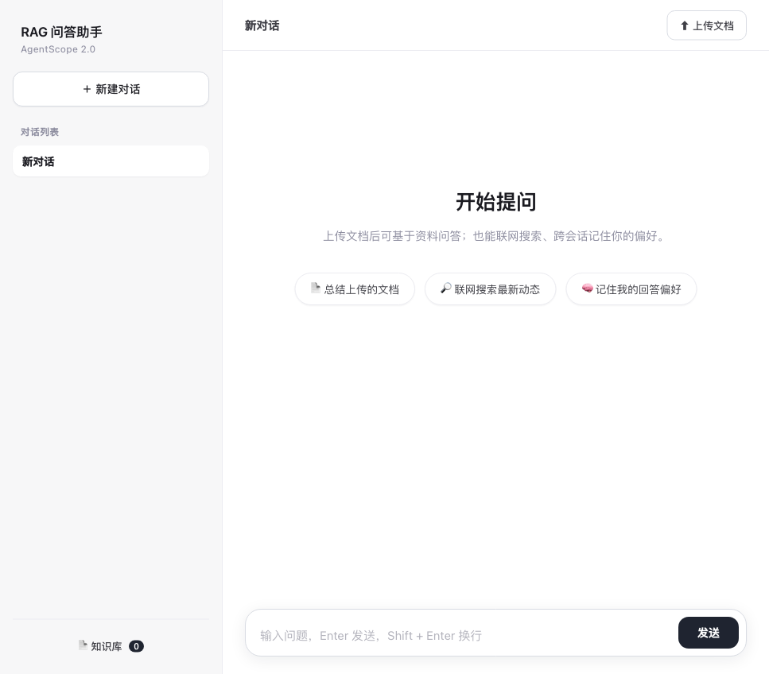
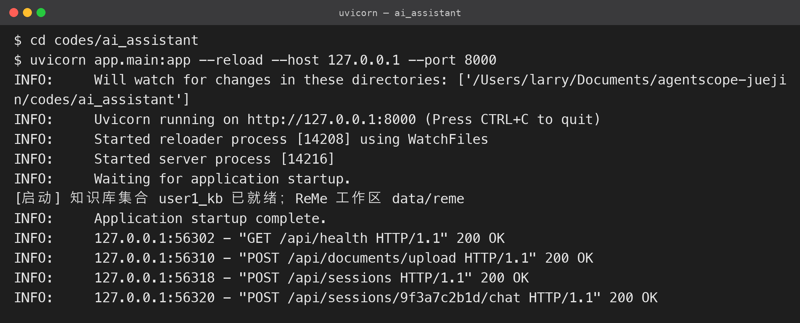
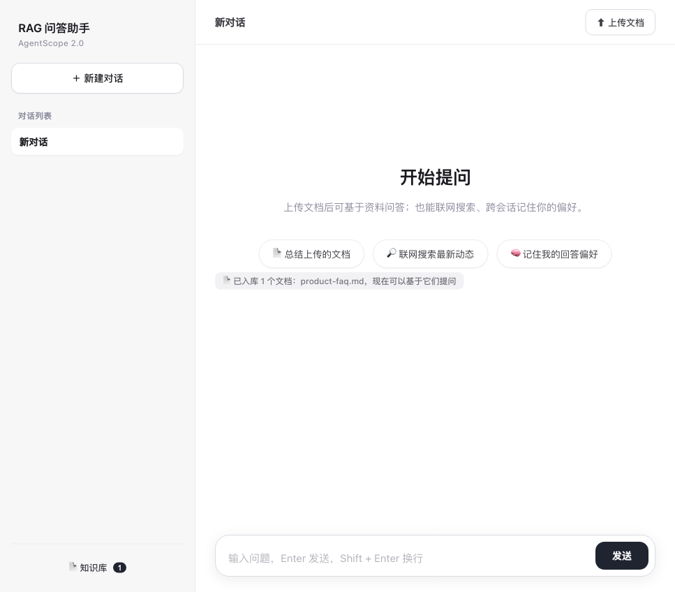
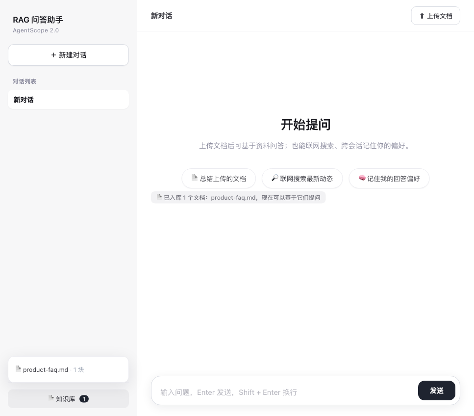
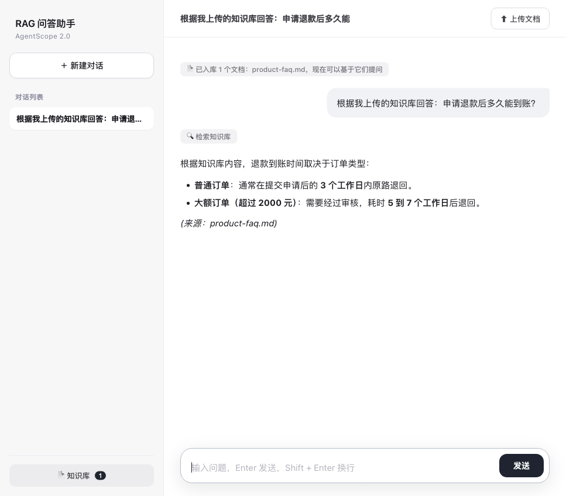
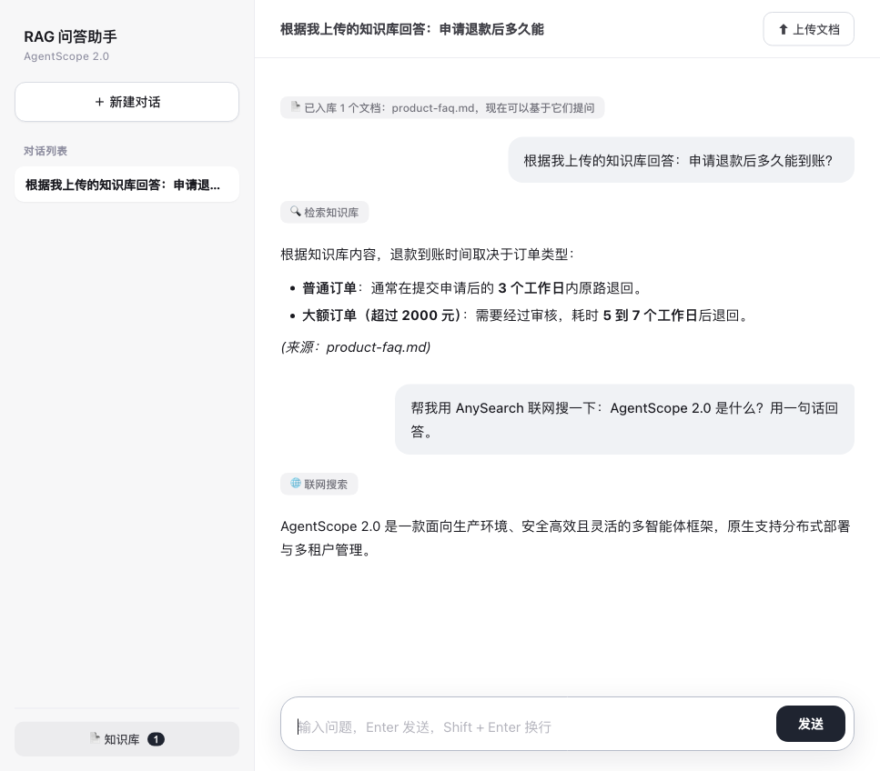
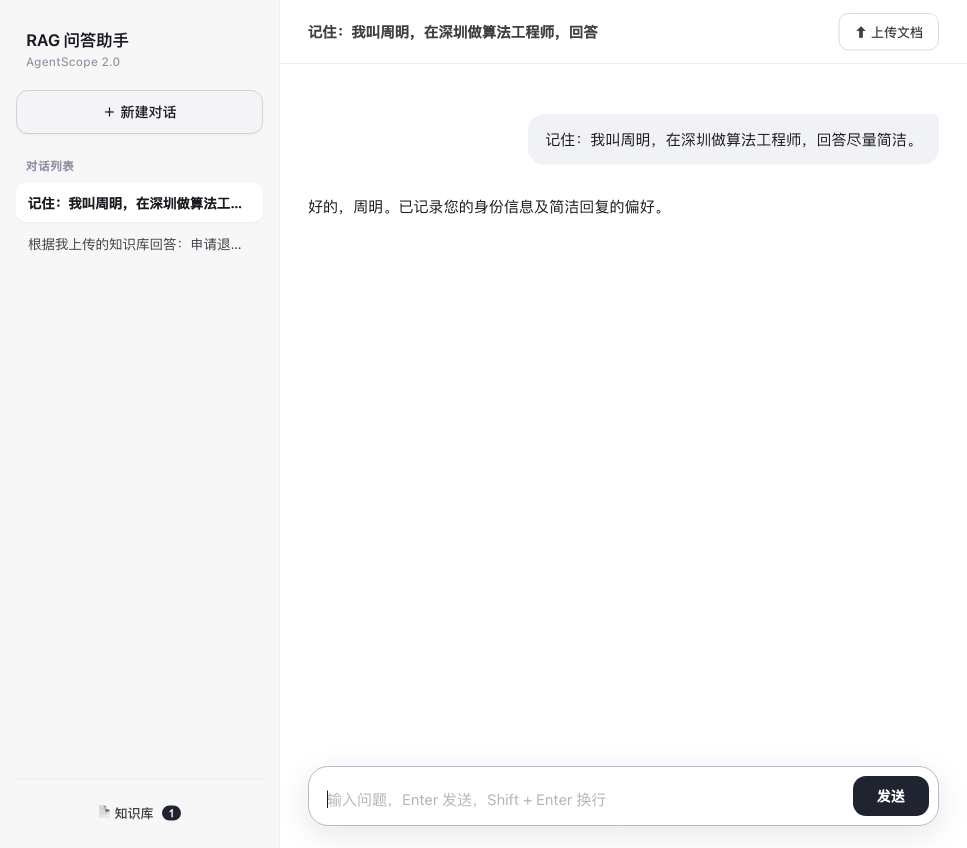
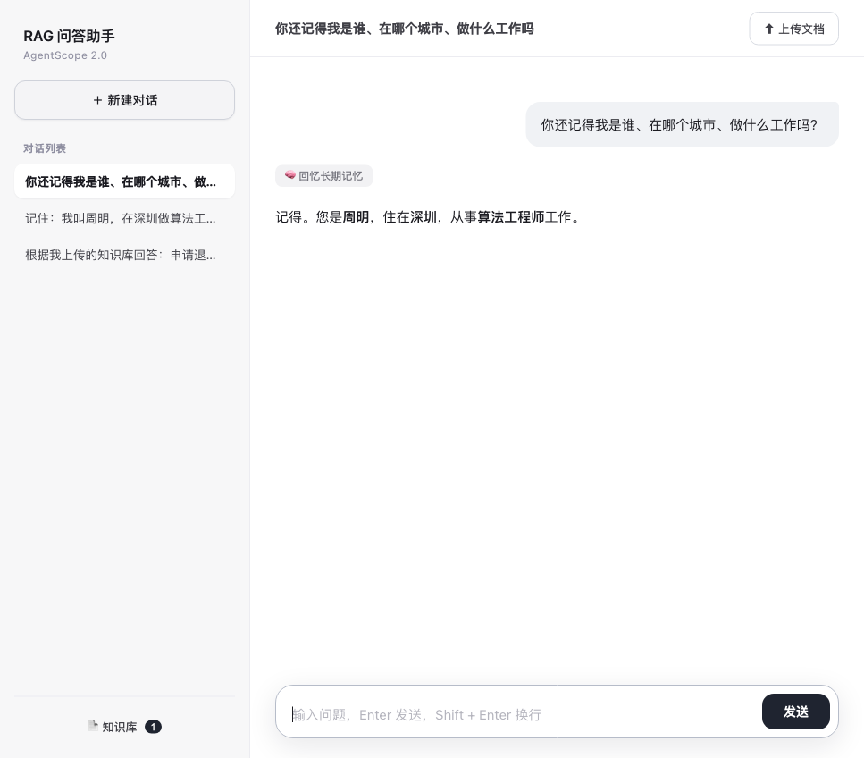

# 《AgentScope 2.0实战指南》11 - 完整实战：RAG 问答助手（带 UI 界面）

前面十节都是在命令行里跑脚本。这一节把前面学过的东西组装成一个能在浏览器里用的 Web 应用：FastAPI 做后端，原生 HTML/CSS/JS 做前端，Agent 负责问答，挂上 RAG 知识库、ReMe 长期记忆和 AnySearch 联网搜索三个工具。

先说清楚一件事：这是一个**结构完整、可以实际运行**的全栈案例，但还不是可以直接上线的商业产品。它和生产环境之间还差什么，放在最后一节讲，不回避。

最终代码在 `codes/ai_assistant/`。

### 11.1 功能清单与最终效果

要实现的功能：


* FastAPI 封装接口，回答用 SSE（Server-Sent Events）流式返回，前端一个字一个字往外蹦；

* 左侧栏：新建对话、对话列表、知识库入口；右侧：聊天区加底部输入框；

* 多会话：每个会话一个独立 Agent，会话之间互不串上下文；

* 上传文档（Markdown / TXT / PDF / Word），自动解析、切块、向量化入库；

* RAG 问答：回答前先检索上传的文档，答案标注来源；

* 跨会话长期记忆（ReMe）：在 A 会话告诉它的信息，开一个全新的 B 会话也能回忆起来；

* AnySearch 联网搜索：知识库里没有的实时信息，模型自己决定去搜；

* 用户 ID 写死为 `1`（单用户演示，接入登录后替换）。

打开后的界面：




### 11.2 整体架构

请求从浏览器到模型经过的环节：


```
浏览器 (static/ 三件套)

&#x20;  │  fetch + ReadableStream 解析 SSE

&#x20;  ▼

FastAPI (app/main.py)

&#x20;  │  会话 CRUD / 文档上传 / SSE 流式问答 / 托管静态文件

&#x20;  ▼

AssistantEngine 单例 (app/engine.py，lifespan 启动时装配一次)

&#x20;  │

&#x20;  ├── Agent × N（每个会话一个，session\_id = user1-<会话id>）

&#x20;  │      └── Toolkit = RAG 工具 + ReMe 工具 + AnySearch 工具

&#x20;  │

&#x20;  ├── RAGMiddleware ── KnowledgeBase ── QdrantStore(data/qdrant，持久化)

&#x20;  │

&#x20;  ├── ReMeMiddleware ── 工作区 data/reme（记忆卡片 + 索引，持久化）

&#x20;  │

&#x20;  └── AnySearchTool ── 联网搜索 API
```

有一个关键设计：**会话是多个，知识库和记忆是共享的单例**。


* 每个会话 new 一个 `Agent`，带自己的 `session_id`，对话上下文互相隔离；

* 所有会话共用同一个 `KnowledgeBase`（所以任何会话都能检索到你上传的文档）；

* 所有会话共用同一个 ReMe 工作区，而 ReMe 的 `session_id` 都以 `user1-` 开头、属于同一个用户，所以 A 会话写入的记忆，B 会话能检索到 —— 这就是跨会话记忆的实现方式。

目录结构：


```
codes/ai\_assistant/

├── app/

│   ├── \_\_init\_\_.py

│   ├── main.py          # FastAPI 入口、路由、SSE

│   ├── engine.py        # 核心引擎：装配 / 会话 / 上传 / 流式

│   └── search\_tool.py   # AnySearch 工具（第 5 节同款）

├── static/

│   ├── index.html       # 页面结构

│   ├── style.css        # 样式

│   ├── app.js           # 会话、SSE、上传、渲染

│   └── vendor/          # marked、DOMPurify 本地化，不依赖外网 CDN

│       ├── marked.min.js

│       └── purify.min.js

├── sample\_docs/

│   └── product-faq.md   # 演示用文档

├── data/                # 运行时自动生成：uploads / qdrant / reme

├── requirements.txt

└── README.md
```

模型名称、接口地址和密钥复用上级目录的 `codes/config.py`，不在这里重复配置。

### 11.3 依赖

`requirements.txt`：


```
agentscope\[rag,vdb-qdrant,reme]==2.0.8

fastapi>=0.115

uvicorn\[standard]>=0.30

python-multipart>=0.0.9

httpx>=0.27
```


* `python-multipart` 是 FastAPI 处理文件上传表单必须的；

* `vdb-qdrant`、`rag`、`reme` 三个 extras 分别提供向量库、RAG 和长期记忆能力。

前端的 Markdown 渲染用 marked，HTML 清洗用 DOMPurify。这两个库我下载到了 `static/vendor/` 本地引用，而不是在页面里写 jsdelivr 的 CDN 地址 —— 后端服务部署到内网或客户网络不通外网时，CDN 会直接挂掉，本地引用没有这个问题。

### 11.4 联网搜索工具

`app/search_tool.py` 就是第 5 节实现的 AnySearch 工具，原样搬过来，只读、免授权、允许并发：


```
\# app/search\_tool.py

\# -\*- coding: utf-8 -\*-

"""AnySearch 联网搜索工具（与第 5 节实现一致，只读、免授权、可并发）。

这里单独抽出，供 Web 助手的 Agent 挂载。接口密钥统一从 codes/config.py 读取。

"""

import sys

import pathlib

import httpx

from agentscope.message import TextBlock

from agentscope.permission import (

&#x20;   PermissionBehavior,

&#x20;   PermissionContext,

&#x20;   PermissionDecision,

)

from agentscope.tool import ToolBase, ToolChunk

\# codes/ 目录加入 import 路径，复用同一份 config.py

\_CODES\_DIR = pathlib.Path(\_\_file\_\_).resolve().parents\[2]

if str(\_CODES\_DIR) not in sys.path:

&#x20;   sys.path.insert(0, str(\_CODES\_DIR))

from config import ANYSEARCH\_KEY, ANYSEARCH\_URL  # noqa: E402

async def anysearch\_search(

&#x20;   query: str,

&#x20;   max\_results: int = 5,

&#x20;   zone: str = "cn",

&#x20;   language: str = "zh-CN",

) -> str:

&#x20;   """调用 AnySearch 统一搜索接口，返回可读的标题/链接/摘要文本。"""

&#x20;   payload = {

&#x20;       "query": query,

&#x20;       "max\_results": max\_results,

&#x20;       "zone": zone,

&#x20;       "language": language,

&#x20;   }

&#x20;   async with httpx.AsyncClient(timeout=30) as client:

&#x20;       resp = await client.post(

&#x20;           ANYSEARCH\_URL,

&#x20;           headers={

&#x20;               "Authorization": f"Bearer {ANYSEARCH\_KEY}",

&#x20;               "Content-Type": "application/json",

&#x20;           },

&#x20;           json=payload,

&#x20;       )

&#x20;       resp.raise\_for\_status()

&#x20;       data = resp.json()

&#x20;   if data.get("code") != 0:

&#x20;       return f"搜索失败：{data.get('message')}"

&#x20;   lines = \[]

&#x20;   for i, item in enumerate(data\["data"]\["results"], 1):

&#x20;       lines.append(

&#x20;           f"{i}. {item.get('title', '')}\n"

&#x20;           f"   URL: {item.get('url', '')}\n"

&#x20;           f"   摘要: {item.get('snippet', item.get('content', ''))\[:300]}"

&#x20;       )

&#x20;   return "\n".join(lines)

class AnySearchTool(ToolBase):

&#x20;   """面向 Agent 的网页搜索工具：只读、允许并发、权限直接放行。"""

&#x20;   name = "AnySearch"

&#x20;   description = (

&#x20;       "Search the web for real-time information via AnySearch. "

&#x20;       "Use it when the user asks about latest news, current events, "

&#x20;       "or facts not covered by the uploaded knowledge base."

&#x20;   )

&#x20;   input\_schema = {

&#x20;       "type": "object",

&#x20;       "properties": {

&#x20;           "query": {"type": "string", "description": "The search query."},

&#x20;           "max\_results": {

&#x20;               "type": "integer",

&#x20;               "description": "Number of results, 1-10.",

&#x20;               "default": 5,

&#x20;           },

&#x20;       },

&#x20;       "required": \["query"],

&#x20;   }

&#x20;   is\_concurrency\_safe = True

&#x20;   is\_read\_only = True

&#x20;   async def check\_permissions(

&#x20;       self,

&#x20;       tool\_input: dict,

&#x20;       context: PermissionContext,

&#x20;   ) -> PermissionDecision:

&#x20;       return PermissionDecision(

&#x20;           behavior=PermissionBehavior.ALLOW,

&#x20;           message="Web search is read-only.",

&#x20;       )

&#x20;   async def call(self, query: str, max\_results: int = 5) -> ToolChunk:

&#x20;       results = await anysearch\_search(query, max\_results=max\_results)

&#x20;       return ToolChunk(content=\[TextBlock(text=results)])
```

### 11.5 核心引擎

`app/engine.py` 负责装配所有组件、管理会话、处理上传、把 Agent 的事件流转成统一格式。

完整代码如下，后面分段解释。


```
\# app/engine.py

\# -\*- coding: utf-8 -\*-

"""RAG 问答助手的核心引擎。

职责：

\- 全局装配：聊天/嵌入模型、持久化 Qdrant 向量库、KnowledgeBase、

&#x20; RAGMiddleware（知识库问答）、ReMeMiddleware（跨会话长期记忆）、AnySearch 工具；

\- 多会话：每个会话一个绑定 session\_id 的 Agent，共享同一份知识库与记忆工作区；

\- 文档上传：按扩展名选解析器，切块后增量写入知识库；

\- 流式对话：把 Agent 的 reply\_stream 事件转成前端可消费的结构。

设计上 user\_id 固定为 "1"（单用户演示）：

\- 知识库按用户共享，所有会话都能检索到上传的文档；

\- ReMe 工作区按用户共享，不同 session\_id 之间可以互相召回记忆。

"""

from \_\_future\_\_ import annotations

import asyncio

import inspect

import logging

import sys

import time

import uuid

import pathlib

from dataclasses import dataclass, field

from agentscope.agent import Agent

from agentscope.credential import OpenAICredential

from agentscope.embedding import OpenAIEmbeddingModel

from agentscope.event import TextBlockDeltaEvent, ToolCallStartEvent

from agentscope.message import UserMsg

from agentscope.middleware import RAGMiddleware, ReMeMiddleware

from agentscope.model import OpenAIChatModel

from agentscope.rag import (

&#x20;   ApproxTokenChunker,

&#x20;   KnowledgeBase,

&#x20;   PDFParser,

&#x20;   QdrantStore,

&#x20;   TextParser,

&#x20;   WordParser,

)

from agentscope.state import AgentState

from agentscope.tool import Toolkit

\# 复用 codes/config.py

\_CODES\_DIR = pathlib.Path(\_\_file\_\_).resolve().parents\[2]

if str(\_CODES\_DIR) not in sys.path:

&#x20;   sys.path.insert(0, str(\_CODES\_DIR))

from config import (  # noqa: E402

&#x20;   API\_KEY,

&#x20;   BASE\_URL,

&#x20;   CHAT\_MODEL,

&#x20;   EMBED\_DIM,

&#x20;   EMBED\_MODEL,

)

from app.search\_tool import AnySearchTool  # noqa: E402

USER\_ID = "1"

BASE\_DIR = pathlib.Path(\_\_file\_\_).resolve().parents\[1]

DATA\_DIR = BASE\_DIR / "data"

UPLOAD\_DIR = DATA\_DIR / "uploads"

QDRANT\_DIR = DATA\_DIR / "qdrant"

REME\_DIR = DATA\_DIR / "reme"

COLLECTION = "user1\_kb"

logging.getLogger("reme").setLevel(logging.ERROR)

\# ----------------------------------------------------------------------

\# ReMe 兼容补丁：当前 PyPI 的 reme 包缺少 dream\_topics\_step 组件，而

\# ReMeMiddleware 默认的「每日摘要」流水线引用了它，会导致中间件启动失败。

\# 运行时把该步骤移除，不影响 auto\_memory 写回与 memory\_search 检索。

\# ----------------------------------------------------------------------

from agentscope.middleware.\_longterm\_memory.\_reme import \_config as \_reme\_cfg  # noqa: E402

\_orig\_dream\_steps = \_reme\_cfg.\_dream\_steps

def \_patched\_dream\_steps() -> list\[dict]:

&#x20;   return \[s for s in \_orig\_dream\_steps() if s\["backend"] != "dream\_topics\_step"]

\_reme\_cfg.\_dream\_steps = \_patched\_dream\_steps

SYSTEM\_PROMPT = (

&#x20;   "你是用户的 RAG 问答助手，按以下规则工作：\n"

&#x20;   "1. 回答与上传资料相关的问题前，先调用 search\_knowledge 检索知识库，"

&#x20;   "并严格依据检索到的内容回答，可在结尾注明来源文档；\n"

&#x20;   "2. 需要最新资讯、实时信息而知识库没有时，调用 AnySearch 联网搜索；\n"

&#x20;   "3. 涉及用户的偏好、历史决定或过去对话时，调用 memory\_search 回忆；\n"

&#x20;   "4. 用简洁中文回答，列表、对比与代码用 Markdown 组织，不要编造资料里没有的内容。"

)

@dataclass

class Session:

&#x20;   sid: str

&#x20;   agent: Agent

&#x20;   title: str = "新对话"

&#x20;   created\_at: float = field(default\_factory=time.time)

&#x20;   messages: list\[dict] = field(default\_factory=list)

&#x20;   lock: asyncio.Lock = field(default\_factory=asyncio.Lock)

class AssistantEngine:

&#x20;   """全局单例引擎，FastAPI lifespan 中 startup/shutdown。"""

&#x20;   def \_\_init\_\_(self) -> None:

&#x20;       self.credential: OpenAICredential | None = None

&#x20;       self.chat\_model: OpenAIChatModel | None = None

&#x20;       self.embedding\_model: OpenAIEmbeddingModel | None = None

&#x20;       self.store: QdrantStore | None = None

&#x20;       self.knowledge: KnowledgeBase | None = None

&#x20;       self.rag\_mw: RAGMiddleware | None = None

&#x20;       self.reme\_mw: ReMeMiddleware | None = None

&#x20;       self.tools: list = \[]

&#x20;       self.chunker = ApproxTokenChunker(

&#x20;           parameters=ApproxTokenChunker.Parameters(chunk\_size=256, overlap=32),

&#x20;       )

&#x20;       self.sessions: dict\[str, Session] = {}

&#x20;   # ---------------- 启动 / 关闭 ----------------

&#x20;   async def startup(self) -> None:

&#x20;       for d in (UPLOAD\_DIR, QDRANT\_DIR, REME\_DIR):

&#x20;           d.mkdir(parents=True, exist\_ok=True)

&#x20;       self.credential = OpenAICredential(api\_key=API\_KEY, base\_url=BASE\_URL)

&#x20;       self.chat\_model = OpenAIChatModel(

&#x20;           credential=self.credential,

&#x20;           model=CHAT\_MODEL,

&#x20;           stream=True,

&#x20;           context\_size=128000,

&#x20;       )

&#x20;       self.embedding\_model = OpenAIEmbeddingModel(

&#x20;           credential=self.credential,

&#x20;           model=EMBED\_MODEL,

&#x20;           dimensions=EMBED\_DIM,

&#x20;       )

&#x20;       # 持久化向量库：重启后已上传文档仍在

&#x20;       self.store = QdrantStore(path=str(QDRANT\_DIR))

&#x20;       await self.store.\_\_aenter\_\_()

&#x20;       self.knowledge = KnowledgeBase(

&#x20;           name="assistant-kb",

&#x20;           description="用户通过网页上传的文档知识库。",

&#x20;           embedding\_model=self.embedding\_model,

&#x20;           vector\_store=self.store,

&#x20;           collection=COLLECTION,

&#x20;       )

&#x20;       ensured = self.knowledge.ensure\_collection()

&#x20;       if inspect.isawaitable(ensured):

&#x20;           await ensured

&#x20;       self.rag\_mw = RAGMiddleware(

&#x20;           knowledge\_bases=\[self.knowledge],

&#x20;           parameters=RAGMiddleware.Parameters(mode="agentic", top\_k=3),

&#x20;       )

&#x20;       self.reme\_mw = ReMeMiddleware(

&#x20;           workspace\_dir=str(REME\_DIR),

&#x20;           parameters=ReMeMiddleware.Parameters(

&#x20;               chat\_model=self.chat\_model,

&#x20;               embedding\_model=self.embedding\_model,

&#x20;               mode="both",

&#x20;               top\_k=5,

&#x20;           ),

&#x20;       )

&#x20;       # 三类工具：知识库检索 + 长期记忆检索 + 联网搜索

&#x20;       self.tools = \[

&#x20;           \*(await self.rag\_mw.list\_tools()),

&#x20;           \*(await self.reme\_mw.list\_tools()),

&#x20;           AnySearchTool(),

&#x20;       ]

&#x20;       print(

&#x20;           f"\[启动] 知识库集合 {COLLECTION} 已就绪；"

&#x20;           f"ReMe 工作区 {REME\_DIR.relative\_to(BASE\_DIR)}",

&#x20;           flush=True,

&#x20;       )

&#x20;   async def shutdown(self) -> None:

&#x20;       try:

&#x20;           await self.reme\_mw.close()

&#x20;       except Exception:

&#x20;           pass

&#x20;       try:

&#x20;           await self.store.\_\_aexit\_\_(None, None, None)

&#x20;       except Exception:

&#x20;           pass

&#x20;   # ---------------- 会话管理 ----------------

&#x20;   def create\_session(self) -> Session:

&#x20;       sid = uuid.uuid4().hex\[:12]

&#x20;       agent = Agent(

&#x20;           name="assistant",

&#x20;           system\_prompt=SYSTEM\_PROMPT,

&#x20;           model=self.chat\_model,

&#x20;           toolkit=Toolkit(tools=list(self.tools)),

&#x20;           middlewares=\[self.rag\_mw, self.reme\_mw],

&#x20;           state=AgentState(session\_id=f"user{USER\_ID}-{sid}"),

&#x20;       )

&#x20;       sess = Session(sid=sid, agent=agent)

&#x20;       self.sessions\[sid] = sess

&#x20;       return sess

&#x20;   def get\_session(self, sid: str) -> Session | None:

&#x20;       return self.sessions.get(sid)

&#x20;   def list\_sessions(self) -> list\[dict]:

&#x20;       items = \[

&#x20;           {

&#x20;               "sid": s.sid,

&#x20;               "title": s.title,

&#x20;               "created\_at": s.created\_at,

&#x20;               "message\_count": len(s.messages),

&#x20;           }

&#x20;           for s in self.sessions.values()

&#x20;       ]

&#x20;       return sorted(items, key=lambda x: x\["created\_at"], reverse=True)

&#x20;   def delete\_session(self, sid: str) -> bool:

&#x20;       return self.sessions.pop(sid, None) is not None

&#x20;   # ---------------- 知识库 / 上传 ----------------

&#x20;   @staticmethod

&#x20;   def \_pick\_parser(filename: str):

&#x20;       name = filename.lower()

&#x20;       if name.endswith(".pdf"):

&#x20;           return PDFParser()

&#x20;       if name.endswith(".docx"):

&#x20;           return WordParser()

&#x20;       if name.endswith((".md", ".markdown", ".txt", ".text")):

&#x20;           return TextParser()

&#x20;       raise ValueError("仅支持 .md / .txt / .pdf / .docx 文件")

&#x20;   async def add\_document(self, filename: str, raw: bytes) -> dict:

&#x20;       safe = filename.replace("/", "\_").replace("\\\\", "\_")

&#x20;       path = UPLOAD\_DIR / safe

&#x20;       path.write\_bytes(raw)

&#x20;       parser = self.\_pick\_parser(safe)

&#x20;       sections = await parser.parse(file=str(path), filename=safe)

&#x20;       chunks = await self.chunker.chunk(sections)

&#x20;       doc\_id = await self.knowledge.insert\_document(

&#x20;           chunks,

&#x20;           document\_metadata={"filename": safe},

&#x20;       )

&#x20;       return {"filename": safe, "doc\_id": doc\_id, "chunks": len(chunks)}

&#x20;   async def list\_documents(self) -> list\[dict]:

&#x20;       out = \[]

&#x20;       for s in await self.knowledge.list\_documents():

&#x20;           out.append(

&#x20;               {

&#x20;                   "doc\_id": s.document\_id,

&#x20;                   "filename": (s.source or {}).get("filename")

&#x20;                   if isinstance(s.source, dict)

&#x20;                   else getattr(s, "source", None),

&#x20;                   "chunks": s.chunk\_count,

&#x20;               }

&#x20;           )

&#x20;       return out

&#x20;   # ---------------- 流式对话 ----------------

&#x20;   async def chat\_stream(self, sess: Session, text: str):

&#x20;       """产出 (event, data) 元组：tool / token / done / error。"""

&#x20;       async with sess.lock:

&#x20;           sess.messages.append({"role": "user", "content": text})

&#x20;           if sess.title == "新对话":

&#x20;               sess.title = text.strip()\[:20] or "新对话"

&#x20;           full = ""

&#x20;           try:

&#x20;               async for ev in sess.agent.reply\_stream(

&#x20;                   inputs=UserMsg(name="user", content=text),

&#x20;               ):

&#x20;                   if isinstance(ev, ToolCallStartEvent):

&#x20;                       yield ("tool", {"name": ev.tool\_call\_name})

&#x20;                   elif isinstance(ev, TextBlockDeltaEvent):

&#x20;                       full += ev.delta

&#x20;                       yield ("token", {"delta": ev.delta})

&#x20;           except Exception as exc:  # 把异常转成一帧错误，避免前端挂起

&#x20;               yield ("error", {"message": f"模型调用失败：{exc}"})

&#x20;               return

&#x20;           sess.messages.append({"role": "assistant", "content": full})

&#x20;           # 让本轮新写入的 ReMe 记忆立即可被检索（生产环境由后台任务完成）

&#x20;           try:

&#x20;               # pylint: disable=protected-access

&#x20;               await self.reme\_mw.\_run\_job("reindex")

&#x20;           except Exception:

&#x20;               pass

&#x20;           yield ("done", {"title": sess.title})

\# 模块级单例

engine = AssistantEngine()
```

几个需要单独说明的点：

**1）向量库要用持久化路径，不能用内存模式。**

`QdrantStore(path=str(QDRANT_DIR))` 把数据写到本地磁盘，服务重启后之前上传的文档还在。如果写成 `QdrantStore(location=":memory:")`，每次重启知识库都是空的。注意本地文件模式的 Qdrant 有单进程文件锁，不允许两个进程同时打开同一个目录，所以不要在服务运行时另开脚本去访问同一个 `data/qdrant`。

**2）重启后要&#x20;**`ensure_collection()`**。**

知识库集合在第一次上传时创建，服务重启后集合已存在于磁盘，需要调用一次 `ensure_collection()` 让客户端和已有集合对齐。这个方法可能返回协程也可能直接返回，所以用 `inspect.isawaitable` 判断后再 await。

**3）只挂中间件还不够，要把工具加进 Toolkit。**

ReMe 和 RAG 在 `agentic` / `both` 模式下，除了在 `middlewares=[...]` 里挂上，还必须把 `mw.list_tools()` 返回的工具放进 `Toolkit`，模型才看得到 `search_knowledge`、`memory_search` 这两个可调用的工具。这一步漏掉的现象是：中间件加载了，但模型从不调用工具。

**4）ReMe 的 dream\_topics 补丁。**

当前 PyPI 上的 `reme` 包缺一个叫 `dream_topics_step` 的组件，而 ReMeMiddleware 默认的每日摘要流水线引用了它，不打补丁会在启动时报错。补丁的做法是运行时把这个步骤从流水线里剔除，只影响每日主题摘要，不影响记忆写入和检索。这是个版本兼容问题，后续 reme 包补齐后这段可以删掉。

**5）每轮结束后手动 reindex。**

ReMe 写入记忆卡片后，要重建索引才能被 `memory_search` 检到。常驻服务里这轮写完、下一轮立刻就要能搜到，所以在每轮对话结束后显式跑一次 `reindex`。生产部署里这通常交给后台定时任务，不必让请求等它。

**6）会话加锁。**

每个 `Session` 带一把 `asyncio.Lock`，同一时刻只处理该会话的一轮问答，避免一个会话还在流式输出时又进来一条消息把上下文搅乱。不同会话用不同的锁，互不阻塞。

### 11.6 FastAPI 入口与 SSE

`app/main.py` 负责路由和静态文件托管。流式问答是重点：用 `StreamingResponse` 把引擎产出的事件按 SSE 格式（`event: xxx\ndata: xxx\n\n`）推给前端。


```
\# app/main.py

\# -\*- coding: utf-8 -\*-

"""FastAPI 入口：会话管理、文档上传、RAG 流式问答、静态前端托管。

启动（在 codes/ai\_assistant 目录下）：

&#x20;   uvicorn app.main:app --reload --host 127.0.0.1 --port 8000

然后浏览器打开 http://127.0.0.1:8000

"""

import json

from contextlib import asynccontextmanager

from pathlib import Path

from fastapi import FastAPI, File, HTTPException, UploadFile

from fastapi.middleware.cors import CORSMiddleware

from fastapi.responses import StreamingResponse

from fastapi.staticfiles import StaticFiles

from pydantic import BaseModel

from app.engine import engine

STATIC\_DIR = Path(\_\_file\_\_).resolve().parents\[1] / "static"

@asynccontextmanager

async def lifespan(app: FastAPI):

&#x20;   await engine.startup()

&#x20;   yield

&#x20;   await engine.shutdown()

app = FastAPI(title="AgentScope RAG 问答助手", lifespan=lifespan)

app.add\_middleware(

&#x20;   CORSMiddleware,

&#x20;   allow\_origins=\["\*"],

&#x20;   allow\_methods=\["\*"],

&#x20;   allow\_headers=\["\*"],

)

class ChatIn(BaseModel):

&#x20;   message: str

def sse(event: str, data: dict) -> bytes:

&#x20;   payload = json.dumps(data, ensure\_ascii=False)

&#x20;   return f"event: {event}\ndata: {payload}\n\n".encode("utf-8")

\# ---------------- 会话 ----------------

@app.post("/api/sessions")

async def create\_session():

&#x20;   sess = engine.create\_session()

&#x20;   return {"sid": sess.sid, "title": sess.title, "created\_at": sess.created\_at}

@app.get("/api/sessions")

async def list\_sessions():

&#x20;   return {"sessions": engine.list\_sessions()}

@app.get("/api/sessions/{sid}/messages")

async def get\_messages(sid: str):

&#x20;   sess = engine.get\_session(sid)

&#x20;   if sess is None:

&#x20;       raise HTTPException(404, "会话不存在")

&#x20;   return {"sid": sid, "title": sess.title, "messages": sess.messages}

@app.delete("/api/sessions/{sid}")

async def delete\_session(sid: str):

&#x20;   ok = engine.delete\_session(sid)

&#x20;   if not ok:

&#x20;       raise HTTPException(404, "会话不存在")

&#x20;   return {"ok": True}

\# ---------------- 流式问答（SSE） ----------------

@app.post("/api/sessions/{sid}/chat")

async def chat(sid: str, body: ChatIn):

&#x20;   sess = engine.get\_session(sid)

&#x20;   if sess is None:

&#x20;       raise HTTPException(404, "会话不存在")

&#x20;   message = body.message.strip()

&#x20;   if not message:

&#x20;       raise HTTPException(400, "消息为空")

&#x20;   async def gen():

&#x20;       try:

&#x20;           async for event, data in engine.chat\_stream(sess, message):

&#x20;               yield sse(event, data)

&#x20;       except Exception as exc:  # 兜底：任何异常都以一帧 error 结束

&#x20;           yield sse("error", {"message": str(exc)})

&#x20;   return StreamingResponse(

&#x20;       gen(),

&#x20;       media\_type="text/event-stream",

&#x20;       headers={"Cache-Control": "no-cache", "X-Accel-Buffering": "no"},

&#x20;   )

\# ---------------- 知识库 / 上传 ----------------

@app.post("/api/documents/upload")

async def upload\_documents(files: list\[UploadFile] = File(...)):

&#x20;   results = \[]

&#x20;   for f in files:

&#x20;       raw = await f.read()

&#x20;       try:

&#x20;           info = await engine.add\_document(f.filename, raw)

&#x20;       except ValueError as exc:

&#x20;           raise HTTPException(415, str(exc)) from exc

&#x20;       results.append(info)

&#x20;   return {"documents": results}

@app.get("/api/documents")

async def list\_documents():

&#x20;   return {"documents": await engine.list\_documents()}

@app.get("/api/health")

async def health():

&#x20;   return {"ok": True}

\# 静态前端放最后，避免吞掉 /api 路由

app.mount("/", StaticFiles(directory=str(STATIC\_DIR), html=True), name="static")
```

接口一览：


| 方法     | 路径                             | 作用                      |
| ------ | ------------------------------ | ----------------------- |
| POST   | `/api/sessions`                | 新建会话                    |
| GET    | `/api/sessions`                | 会话列表                    |
| GET    | `/api/sessions/{sid}/messages` | 取历史消息                   |
| DELETE | `/api/sessions/{sid}`          | 删除会话                    |
| POST   | `/api/sessions/{sid}/chat`     | 提问，SSE 流式返回             |
| POST   | `/api/documents/upload`        | 上传文档，表单字段 `files`，支持多文件 |
| GET    | `/api/documents`               | 知识库文档列表                 |
| GET    | `/api/health`                  | 健康检查                    |

两个细节：


* SSE 响应要带 `X-Accel-Buffering: no`，否则放在 Nginx 反代后面时，Nginx 会缓冲响应，前端看到的就不是逐字流式，而是憋到最后一次性出现。

* `app.mount("/", StaticFiles(...))` 必须放在所有 `/api` 路由**之后**注册，否则根路径的通配挂载会把 `/api` 请求也吞掉。

### 11.7 前端界面

前端不引入框架，就三个文件。

**页面结构&#x20;**`static/index.html`：左侧栏和右侧聊天区，Markdown 渲染库从本地 `vendor/` 加载。


```
\<!-- static/index.html -->

\<!DOCTYPE html>

\<html lang="zh-CN">

\<head>

&#x20; \<meta charset="UTF-8" />

&#x20; \<meta name="viewport" content="width=device-width, initial-scale=1.0" />

&#x20; \<title>RAG 问答助手 · AgentScope 2.0\</title>

&#x20; \<link rel="icon" type="image/svg+xml" href="/favicon.svg" />

&#x20; \<link rel="stylesheet" href="/style.css?v=4" />

&#x20; \<script src="/vendor/marked.min.js">\</script>

&#x20; \<script src="/vendor/purify.min.js">\</script>

\</head>

\<body>

\<div class="app">

&#x20; \<!-- 左侧：新对话 + 会话列表 -->

&#x20; \<aside class="sidebar">

&#x20;   \<div class="brand">

&#x20;     \<div class="brand-title">RAG 问答助手\</div>

&#x20;     \<div class="brand-sub">AgentScope 2.0\</div>

&#x20;   \</div>

&#x20;   \<button id="btn-new" class="btn-new">＋ 新建对话\</button>

&#x20;   \<div class="side-label">对话列表\</div>

&#x20;   \<nav id="session-list" class="session-list">\</nav>

&#x20;   \<div class="side-foot">

&#x20;     \<button id="btn-docs" class="btn-ghost">

&#x20;       📄 知识库 \<span id="doc-count" class="badge">0\</span>

&#x20;     \</button>

&#x20;     \<div id="doc-panel" class="doc-panel hidden">\</div>

&#x20;   \</div>

&#x20; \</aside>

&#x20; \<!-- 右侧：聊天区 -->

&#x20; \<main class="main">

&#x20;   \<header class="topbar">

&#x20;     \<div id="chat-title" class="chat-title">新对话\</div>

&#x20;     \<div class="top-actions">

&#x20;       \<input id="file-input" type="file" multiple

&#x20;              accept=".md,.markdown,.txt,.pdf,.docx" hidden />

&#x20;       \<button id="btn-upload" class="btn-outline">⬆ 上传文档\</button>

&#x20;     \</div>

&#x20;   \</header>

&#x20;   \<section id="messages" class="messages">

&#x20;     \<div class="empty-tip" id="empty-tip">

&#x20;       \<div class="empty-title">开始提问\</div>

&#x20;       \<div class="empty-desc">上传文档后可基于资料问答；也能联网搜索、跨会话记住你的偏好。\</div>

&#x20;       \<div class="empty-examples">

&#x20;         \<button class="example" data-q="根据我上传的文档，总结一下主要内容">📄 总结上传的文档\</button>

&#x20;         \<button class="example" data-q="帮我搜索一下 AgentScope 2.0 的最新动态">🔎 联网搜索最新动态\</button>

&#x20;         \<button class="example" data-q="记住我偏好简洁的中文回答">🧠 记住我的回答偏好\</button>

&#x20;       \</div>

&#x20;     \</div>

&#x20;   \</section>

&#x20;   \<footer class="composer">

&#x20;     \<div id="tool-status" class="tool-status hidden">\</div>

&#x20;     \<div class="input-row">

&#x20;       \<textarea id="input" rows="1"

&#x20;         placeholder="输入问题，Enter 发送，Shift + Enter 换行">\</textarea>

&#x20;       \<button id="btn-send" class="btn-send">发送\</button>

&#x20;     \</div>

&#x20;   \</footer>

&#x20; \</main>

\</div>

\<script src="/app.js?v=4">\</script>

\</body>

\</html>
```

**样式&#x20;**`static/style.css`：参考 Linear、Claude 这类海外产品的浅色风格 —— 浅灰侧栏配白色聊天区，用户消息靠右显示成浅灰气泡，助手消息去掉卡片边框、直接以纯文本铺在留白里，工具调用是浅灰小标签并放在回答上方（先调用工具、再给回答），底部输入框做成浮起的圆角卡片，整体留白和字号都更松。链接里的 `?v=4` 是资源版本号，改了静态文件后把它加一，可强制浏览器加载新版本，避免被缓存卡住。


```
/\* static/style.css \*/

:root {

&#x20; /\* 海外 SaaS 浅色风：克制、低饱和、大留白 \*/

&#x20; \--bg: #ffffff;

&#x20; \--bg-soft: #fafafa;

&#x20; \--sidebar-bg: #f7f7f8;

&#x20; \--sidebar-hover: #ececee;

&#x20; \--sidebar-active: #ffffff;

&#x20; \--panel: #ffffff;

&#x20; \--border: #ececf1;

&#x20; \--border-strong: #d9dce3;

&#x20; \--text: #1a1a20;

&#x20; \--text-soft: #3f3f46;

&#x20; \--muted: #8e8ea0;

&#x20; \--muted-2: #b4b4bd;

&#x20; \--accent: #2563eb;

&#x20; \--ink: #1f2430;          /\* 主按钮深色，比高饱和蓝更克制 \*/

&#x20; \--user-bubble: #f0f2f5;  /\* 用户消息：浅灰气泡，深色文字 \*/

&#x20; \--tool-bg: #f2f2f4;

&#x20; \--tool-text: #71717a;

&#x20; \--shadow-sm: 0 1px 2px rgba(16, 24, 40, 0.05);

&#x20; \--shadow-md: 0 4px 20px rgba(16, 24, 40, 0.08);

&#x20; \--shadow-lg: 0 8px 32px rgba(16, 24, 40, 0.10);

&#x20; \--radius: 16px;

}

\* { box-sizing: border-box; }

html, body { height: 100%; margin: 0; }

body {

&#x20; font-family: -apple-system, BlinkMacSystemFont, "Inter", "SF Pro Text",

&#x20;   "Segoe UI", "PingFang SC", "Hiragino Sans GB", "Microsoft YaHei", sans-serif;

&#x20; color: var(--text);

&#x20; background: var(--bg);

&#x20; -webkit-font-smoothing: antialiased;

&#x20; text-rendering: optimizeLegibility;

}

.app { display: flex; height: 100vh; overflow: hidden; }

/\* 细滚动条 \*/

::-webkit-scrollbar { width: 8px; height: 8px; }

::-webkit-scrollbar-thumb { background: rgba(0, 0, 0, 0.12); border-radius: 8px; }

::-webkit-scrollbar-thumb:hover { background: rgba(0, 0, 0, 0.22); }

::-webkit-scrollbar-track { background: transparent; }

/\* ---------- 左侧栏 ---------- \*/

.sidebar {

&#x20; width: 280px;

&#x20; flex-shrink: 0;

&#x20; background: var(--sidebar-bg);

&#x20; color: var(--text-soft);

&#x20; display: flex;

&#x20; flex-direction: column;

&#x20; padding: 22px 16px 16px;

&#x20; border-right: 1px solid var(--border);

}

.brand { padding: 6px 10px 22px; }

.brand-title {

&#x20; font-size: 16.5px;

&#x20; font-weight: 650;

&#x20; color: var(--text);

&#x20; letter-spacing: -0.01em;

}

.brand-sub {

&#x20; font-size: 12px;

&#x20; color: var(--muted);

&#x20; margin-top: 3px;

&#x20; font-weight: 450;

&#x20; letter-spacing: 0.02em;

}

.btn-new {

&#x20; width: 100%;

&#x20; padding: 11px 14px;

&#x20; border: 1px solid var(--border-strong);

&#x20; background: var(--panel);

&#x20; color: var(--text);

&#x20; border-radius: 12px;

&#x20; font-size: 14px;

&#x20; font-weight: 500;

&#x20; cursor: pointer;

&#x20; box-shadow: var(--shadow-sm);

&#x20; transition: background 0.15s ease, border-color 0.15s ease, transform 0.05s ease;

}

.btn-new:hover { background: #f4f4f6; border-color: #cfd2da; }

.btn-new:active { transform: translateY(0.5px); }

.side-label {

&#x20; font-size: 11.5px;

&#x20; color: var(--muted);

&#x20; margin: 24px 10px 9px;

&#x20; font-weight: 550;

&#x20; letter-spacing: 0.06em;

&#x20; text-transform: uppercase;

}

.session-list { flex: 1; overflow-y: auto; margin: 0 -6px; padding: 0 6px; }

.session-item {

&#x20; padding: 10px 12px;

&#x20; border-radius: 10px;

&#x20; font-size: 13.5px;

&#x20; font-weight: 450;

&#x20; color: var(--text-soft);

&#x20; cursor: pointer;

&#x20; margin-bottom: 2px;

&#x20; white-space: nowrap;

&#x20; overflow: hidden;

&#x20; text-overflow: ellipsis;

&#x20; position: relative;

&#x20; transition: background 0.12s ease;

}

.session-item:hover { background: var(--sidebar-hover); }

.session-item.active {

&#x20; background: var(--sidebar-active);

&#x20; color: var(--text);

&#x20; font-weight: 520;

&#x20; box-shadow: var(--shadow-sm);

}

.session-item .del {

&#x20; position: absolute; right: 8px; top: 50%; transform: translateY(-50%);

&#x20; opacity: 0; color: var(--muted); font-size: 12px;

&#x20; width: 22px; height: 22px; line-height: 22px; text-align: center;

&#x20; border-radius: 6px; transition: opacity 0.12s, background 0.12s, color 0.12s;

}

.session-item:hover .del { opacity: 1; }

.session-item .del:hover { background: #e4e4e8; color: #ef4444; }

.side-foot { position: relative; border-top: 1px solid var(--border); padding-top: 14px; }

.btn-ghost {

&#x20; width: 100%;

&#x20; background: transparent;

&#x20; border: 1px solid transparent;

&#x20; color: var(--text-soft);

&#x20; padding: 9px 12px;

&#x20; border-radius: 10px;

&#x20; font-size: 13px;

&#x20; font-weight: 480;

&#x20; cursor: pointer;

&#x20; transition: background 0.12s ease;

}

.btn-ghost:hover { background: var(--sidebar-hover); }

.badge {

&#x20; display: inline-block;

&#x20; min-width: 19px;

&#x20; padding: 1px 6px;

&#x20; margin-left: 5px;

&#x20; background: var(--ink);

&#x20; color: #fff;

&#x20; border-radius: 10px;

&#x20; font-size: 11px;

&#x20; font-weight: 550;

&#x20; vertical-align: 1px;

}

.doc-panel {

&#x20; position: absolute;

&#x20; bottom: 52px; left: 0; right: 0;

&#x20; background: var(--panel);

&#x20; border: 1px solid var(--border);

&#x20; border-radius: 12px;

&#x20; padding: 10px 12px;

&#x20; max-height: 240px;

&#x20; overflow-y: auto;

&#x20; font-size: 12.5px;

&#x20; box-shadow: var(--shadow-lg);

}

.doc-panel .doc-line {

&#x20; padding: 7px 2px;

&#x20; border-bottom: 1px solid var(--border);

&#x20; color: var(--text-soft);

}

.doc-panel .doc-line:last-child { border-bottom: none; }

.doc-panel .doc-empty { color: var(--muted); padding: 4px 2px; }

.hidden { display: none !important; }

/\* ---------- 右侧主区 ---------- \*/

.main { flex: 1; display: flex; flex-direction: column; min-width: 0; background: var(--bg); }

.topbar {

&#x20; height: 64px;

&#x20; flex-shrink: 0;

&#x20; background: rgba(255, 255, 255, 0.85);

&#x20; backdrop-filter: saturate(180%) blur(10px);

&#x20; border-bottom: 1px solid var(--border);

&#x20; display: flex;

&#x20; align-items: center;

&#x20; justify-content: space-between;

&#x20; padding: 0 28px;

}

.chat-title {

&#x20; font-size: 14.5px;

&#x20; font-weight: 550;

&#x20; color: var(--text-soft);

&#x20; max-width: 60%;

&#x20; white-space: nowrap; overflow: hidden; text-overflow: ellipsis;

}

.btn-outline {

&#x20; border: 1px solid var(--border-strong);

&#x20; background: var(--panel);

&#x20; padding: 8px 15px;

&#x20; border-radius: 10px;

&#x20; font-size: 13px;

&#x20; font-weight: 480;

&#x20; cursor: pointer;

&#x20; color: var(--text-soft);

&#x20; transition: background 0.12s ease, border-color 0.12s ease, color 0.12s ease;

}

.btn-outline:hover { border-color: #b9bdc8; color: var(--text); background: var(--bg-soft); }

.btn-outline:disabled { opacity: 0.55; cursor: default; }

.messages {

&#x20; flex: 1;

&#x20; overflow-y: auto;

&#x20; padding: 36px 0 20px;

}

.msg {

&#x20; max-width: 780px;

&#x20; margin: 0 auto;

&#x20; padding: 14px 28px;

&#x20; display: flex;

}

.msg.user { flex-direction: row-reverse; }

.bubble {

&#x20; max-width: 80%;

&#x20; padding: 12px 17px;

&#x20; border-radius: var(--radius);

&#x20; font-size: 15px;

&#x20; line-height: 1.78;

&#x20; letter-spacing: 0.005em;

&#x20; white-space: normal;

&#x20; word-break: break-word;

}

/\* 用户：浅灰气泡靠右 \*/

.msg.user .bubble {

&#x20; background: var(--user-bubble);

&#x20; color: var(--text);

&#x20; border-top-right-radius: 5px;

&#x20; font-weight: 450;

}

/\* 助手：去卡片化，纯文本铺在留白里 \*/

.msg.assistant .bubble {

&#x20; background: transparent;

&#x20; border: none;

&#x20; padding: 0;

&#x20; max-width: 100%;

&#x20; color: var(--text);

&#x20; border-top-left-radius: 0;

}

.bubble p { margin: 0 0 10px; }

.bubble p:last-child { margin-bottom: 0; }

.bubble pre {

&#x20; background: #0f172a; color: #e2e8f0;

&#x20; padding: 15px 17px; border-radius: 12px; overflow-x: auto;

&#x20; font-size: 13px; line-height: 1.6;

&#x20; margin: 12px 0;

}

.bubble code { font-family: "SF Mono", "JetBrains Mono", Menlo, Consolas, monospace; }

.bubble :not(pre) > code {

&#x20; background: #f1f2f5; padding: 2px 6px; border-radius: 6px;

&#x20; font-size: 13px; color: #b91c1c;

}

.msg.user :not(pre) > code { background: #e3e6eb; color: #b91c1c; }

.bubble ul, .bubble ol { margin: 8px 0; padding-left: 24px; }

.bubble li { margin: 4px 0; }

.bubble table { border-collapse: collapse; margin: 12px 0; font-size: 14px; }

.bubble th, .bubble td {

&#x20; border: 1px solid var(--border-strong);

&#x20; padding: 8px 13px;

&#x20; text-align: left;

}

.bubble th { background: var(--bg-soft); font-weight: 600; }

.bubble a { color: var(--accent); text-decoration: none; }

.bubble a:hover { text-decoration: underline; }

.bubble.thin { white-space: pre-wrap; }

/\* 工具调用：克制的浅灰小标签 \*/

.tool-chip { max-width: 780px; margin: 0 auto; padding: 2px 28px; }

.tool-chip span {

&#x20; display: inline-block;

&#x20; background: var(--tool-bg);

&#x20; color: var(--tool-text);

&#x20; font-size: 12px;

&#x20; font-weight: 480;

&#x20; padding: 4px 11px;

&#x20; border-radius: 8px;

&#x20; margin: 4px 0;

}

.cursor {

&#x20; display: inline-block; width: 7px; height: 16px;

&#x20; background: var(--text); margin-left: 2px;

&#x20; animation: blink 1.1s steps(2) infinite;

&#x20; vertical-align: -2px;

&#x20; border-radius: 1px;

}

@keyframes blink { 50% { opacity: 0; } }

/\* 空状态：居中、放大、呼吸感 \*/

.empty-tip { text-align: center; margin-top: 16vh; padding: 0 32px; }

.empty-title {

&#x20; font-size: 26px;

&#x20; font-weight: 650;

&#x20; color: var(--text);

&#x20; letter-spacing: -0.02em;

}

.empty-desc {

&#x20; color: var(--muted);

&#x20; font-size: 14.5px;

&#x20; margin-top: 12px;

&#x20; line-height: 1.7;

}

.empty-examples {

&#x20; margin-top: 34px;

&#x20; display: flex;

&#x20; gap: 12px;

&#x20; justify-content: center;

&#x20; flex-wrap: wrap;

}

.example {

&#x20; border: 1px solid var(--border);

&#x20; background: var(--panel);

&#x20; border-radius: 22px;

&#x20; padding: 10px 19px;

&#x20; font-size: 13.5px;

&#x20; font-weight: 450;

&#x20; color: var(--text-soft);

&#x20; cursor: pointer;

&#x20; box-shadow: var(--shadow-sm);

&#x20; transition: border-color 0.15s ease, box-shadow 0.15s ease, transform 0.05s ease;

}

.example:hover {

&#x20; border-color: var(--border-strong);

&#x20; box-shadow: var(--shadow-md);

&#x20; color: var(--text);

}

.example:active { transform: translateY(0.5px); }

/\* ---------- 底部输入区 ---------- \*/

.composer {

&#x20; flex-shrink: 0;

&#x20; background: linear-gradient(to top, var(--bg) 70%, rgba(255, 255, 255, 0));

&#x20; padding: 8px 28px 22px;

}

.tool-status { max-width: 780px; margin: 0 auto 8px; min-height: 0; }

.tool-status span {

&#x20; display: inline-block; background: var(--tool-bg); color: var(--tool-text);

&#x20; font-size: 12px; padding: 4px 11px; border-radius: 8px; margin-right: 6px;

}

.input-row {

&#x20; max-width: 780px;

&#x20; margin: 0 auto;

&#x20; display: flex;

&#x20; gap: 12px;

&#x20; align-items: flex-end;

&#x20; background: var(--panel);

&#x20; border: 1px solid var(--border-strong);

&#x20; border-radius: 20px;

&#x20; padding: 9px 9px 9px 18px;

&#x20; box-shadow: var(--shadow-md);

&#x20; transition: border-color 0.15s ease, box-shadow 0.15s ease;

}

.input-row:focus-within {

&#x20; border-color: #b6bcc9;

&#x20; box-shadow: var(--shadow-lg);

}

\#input {

&#x20; flex: 1;

&#x20; resize: none;

&#x20; border: none;

&#x20; padding: 5px 0;

&#x20; font-size: 15px;

&#x20; line-height: 1.6;

&#x20; font-family: inherit;

&#x20; max-height: 180px;

&#x20; outline: none;

&#x20; background: transparent;

&#x20; color: var(--text);

}

\#input::placeholder { color: var(--muted-2); }

.btn-send {

&#x20; background: var(--ink);

&#x20; color: #fff;

&#x20; border: none;

&#x20; border-radius: 13px;

&#x20; padding: 10px 24px;

&#x20; font-size: 14px;

&#x20; font-weight: 550;

&#x20; cursor: pointer;

&#x20; transition: background 0.15s ease, transform 0.05s ease;

&#x20; flex-shrink: 0;

}

.btn-send:hover:not(:disabled) { background: #343b4c; }

.btn-send:active:not(:disabled) { transform: translateY(0.5px); }

.btn-send:disabled { background: #c9ccd4; cursor: not-allowed; }
```

**交互逻辑&#x20;**`static/app.js`：会话的增删切换、用 `fetch` + `ReadableStream` 逐帧解析 SSE、流式过程中显示纯文本、结束后再渲染成 Markdown、FormData 上传。


```
// static/app.js

// ============== 状态 ==============

let sessions = \[];

let currentSid = null;

let streaming = false;

const TOOL\_LABELS = {

&#x20; search\_knowledge: "🔍 检索知识库",

&#x20; memory\_search: "🧠 回忆长期记忆",

&#x20; AnySearch: "🌐 联网搜索",

};

const \$ = (id) => document.getElementById(id);

const messagesEl = \$("messages");

const inputEl = \$("input");

// ============== API ==============

async function api(path, options = {}) {

&#x20; const res = await fetch(path, options);

&#x20; if (!res.ok) {

&#x20;   let msg = res.statusText;

&#x20;   try { msg = (await res.json()).detail || msg; } catch (e) {}

&#x20;   throw new Error(msg);

&#x20; }

&#x20; return res.json();

}

// ============== 会话 ==============

async function loadSessions(selectSid = null) {

&#x20; const data = await api("/api/sessions");

&#x20; sessions = data.sessions;

&#x20; renderSessionList();

&#x20; if (selectSid) {

&#x20;   switchSession(selectSid);

&#x20; }

}

function renderSessionList() {

&#x20; const el = \$("session-list");

&#x20; el.innerHTML = "";

&#x20; sessions.forEach((s) => {

&#x20;   const div = document.createElement("div");

&#x20;   div.className = "session-item" + (s.sid === currentSid ? " active" : "");

&#x20;   const title = document.createElement("span");

&#x20;   title.textContent = s.title;

&#x20;   const del = document.createElement("span");

&#x20;   del.className = "del";

&#x20;   del.textContent = "✕";

&#x20;   del.onclick = async (e) => {

&#x20;     e.stopPropagation();

&#x20;     await api(\`/api/sessions/\${s.sid}\`, { method: "DELETE" });

&#x20;     if (s.sid === currentSid) currentSid = null;

&#x20;     const rest = sessions.filter((x) => x.sid !== s.sid);

&#x20;     if (rest.length) await loadSessions(rest\[0].sid);

&#x20;     else await newSession();

&#x20;   };

&#x20;   div.appendChild(title);

&#x20;   div.appendChild(del);

&#x20;   div.onclick = () => switchSession(s.sid);

&#x20;   el.appendChild(div);

&#x20; });

}

async function newSession() {

&#x20; const s = await api("/api/sessions", { method: "POST" });

&#x20; await loadSessions(s.sid);

}

async function switchSession(sid) {

&#x20; if (streaming) return;

&#x20; currentSid = sid;

&#x20; renderSessionList();

&#x20; const data = await api(\`/api/sessions/\${sid}/messages\`);

&#x20; \$("chat-title").textContent = data.title || "新对话";

&#x20; renderHistory(data.messages);

}

function renderHistory(messages) {

&#x20; messagesEl.innerHTML = "";

&#x20; if (!messages.length) { showEmpty(); return; }

&#x20; messages.forEach((m) => appendBubble(m.role, m.content, false));

&#x20; scrollBottom();

}

function showEmpty() {

&#x20; messagesEl.innerHTML =

&#x20;   '\<div class="empty-tip">\<div class="empty-title">开始提问\</div>' +

&#x20;   '\<div class="empty-desc">上传文档后可基于资料问答；也能联网搜索、跨会话记住你的偏好。\</div>' +

&#x20;   '\<div class="empty-examples">' +

&#x20;   '\<button class="example" data-q="根据我上传的文档，总结一下主要内容">📄 总结上传的文档\</button>' +

&#x20;   '\<button class="example" data-q="帮我搜索一下 AgentScope 2.0 的最新动态">🔎 联网搜索最新动态\</button>' +

&#x20;   '\<button class="example" data-q="记住我偏好简洁的中文回答">🧠 记住我的回答偏好\</button>' +

&#x20;   "\</div>\</div>";

&#x20; messagesEl.querySelectorAll(".example").forEach((b) => {

&#x20;   b.onclick = () => { inputEl.value = b.dataset.q; autoGrow(); send(); };

&#x20; });

}

// ============== 消息渲染 ==============

function appendBubble(role, text, streamingNow) {

&#x20; document.querySelector(".empty-tip")?.remove();

&#x20; const wrap = document.createElement("div");

&#x20; wrap.className = \`msg \${role}\`;

&#x20; const bubble = document.createElement("div");

&#x20; bubble.className = "bubble";

&#x20; if (role === "assistant" && streamingNow) {

&#x20;   bubble.classList.add("thin");

&#x20;   bubble.textContent = text;

&#x20; } else if (role === "assistant") {

&#x20;   bubble.innerHTML = DOMPurify.sanitize(marked.parse(text || ""));

&#x20; } else {

&#x20;   bubble.textContent = text;

&#x20; }

&#x20; wrap.appendChild(bubble);

&#x20; messagesEl.appendChild(wrap);

&#x20; scrollBottom();

&#x20; return bubble;

}

function addToolChip(name, anchor = null) {

&#x20; const bar = document.createElement("div");

&#x20; bar.className = "tool-chip";

&#x20; const span = document.createElement("span");

&#x20; span.textContent = TOOL\_LABELS\[name] || name;

&#x20; bar.appendChild(span);

&#x20; // 插到当前助手气泡之前，体现「先调用工具、再回答」

&#x20; if (anchor) messagesEl.insertBefore(bar, anchor.closest(".msg") || anchor);

&#x20; else messagesEl.appendChild(bar);

&#x20; scrollBottom();

}

function addNotice(text) {

&#x20; const bar = document.createElement("div");

&#x20; bar.className = "tool-chip";

&#x20; const span = document.createElement("span");

&#x20; span.textContent = text;

&#x20; bar.appendChild(span);

&#x20; messagesEl.appendChild(bar);

&#x20; scrollBottom();

}

function scrollBottom() { messagesEl.scrollTop = messagesEl.scrollHeight; }

// ============== 发送 + SSE 流式 ==============

async function send() {

&#x20; const text = inputEl.value.trim();

&#x20; if (!text || streaming || !currentSid) return;

&#x20; streaming = true;

&#x20; \$("btn-send").disabled = true;

&#x20; inputEl.value = "";

&#x20; autoGrow();

&#x20; appendBubble("user", text, false);

&#x20; const bubble = appendBubble("assistant", "", true);

&#x20; const cursor = document.createElement("span");

&#x20; cursor.className = "cursor";

&#x20; bubble.appendChild(cursor);

&#x20; let full = "";

&#x20; const toolSeen = new Set();

&#x20; \$("tool-status").innerHTML = "";

&#x20; try {

&#x20;   const res = await fetch(\`/api/sessions/\${currentSid}/chat\`, {

&#x20;     method: "POST",

&#x20;     headers: { "Content-Type": "application/json" },

&#x20;     body: JSON.stringify({ message: text }),

&#x20;   });

&#x20;   if (!res.ok) throw new Error(\`HTTP \${res.status}\`);

&#x20;   const reader = res.body.getReader();

&#x20;   const decoder = new TextDecoder();

&#x20;   let buffer = "";

&#x20;   while (true) {

&#x20;     const { value, done } = await reader.read();

&#x20;     if (done) break;

&#x20;     buffer += decoder.decode(value, { stream: true });

&#x20;     const frames = buffer.split("\n\n");

&#x20;     buffer = frames.pop();

&#x20;     for (const frame of frames) handleFrame(frame);

&#x20;   }

&#x20;   function handleFrame(frame) {

&#x20;     const lines = frame.split("\n");

&#x20;     let event = "message", data = "";

&#x20;     lines.forEach((ln) => {

&#x20;       if (ln.startsWith("event:")) event = ln.slice(6).trim();

&#x20;       else if (ln.startsWith("data:")) data += ln.slice(5).trim();

&#x20;     });

&#x20;     if (!data) return;

&#x20;     const payload = JSON.parse(data);

&#x20;     if (event === "tool") {

&#x20;       if (!toolSeen.has(payload.name)) {

&#x20;         toolSeen.add(payload.name);

&#x20;         addToolChip(payload.name, bubble);

&#x20;         const tag = document.createElement("span");

&#x20;         tag.textContent = TOOL\_LABELS\[payload.name] || payload.name;

&#x20;         \$("tool-status").appendChild(tag);

&#x20;       }

&#x20;     } else if (event === "token") {

&#x20;       full += payload.delta;

&#x20;       bubble.textContent = full;

&#x20;       bubble.appendChild(cursor);

&#x20;       scrollBottom();

&#x20;     } else if (event === "error") {

&#x20;       full += \`\n⚠️ \${payload.message}\`;

&#x20;     } else if (event === "done") {

&#x20;       if (payload.title) \$("chat-title").textContent = payload.title;

&#x20;     }

&#x20;   }

&#x20;   // 结束：渲染 Markdown

&#x20;   bubble.classList.remove("thin");

&#x20;   bubble.innerHTML = DOMPurify.sanitize(marked.parse(full || "（无回复）"));

&#x20;   await loadSessions(currentSid);

&#x20; } catch (err) {

&#x20;   bubble.classList.remove("thin");

&#x20;   bubble.textContent = "请求失败：" + err.message;

&#x20; } finally {

&#x20;   cursor?.remove();

&#x20;   streaming = false;

&#x20;   \$("btn-send").disabled = false;

&#x20;   inputEl.focus();

&#x20; }

}

// ============== 上传 / 知识库 ==============

async function refreshDocCount() {

&#x20; const data = await api("/api/documents");

&#x20; \$("doc-count").textContent = data.documents.length;

&#x20; const panel = \$("doc-panel");

&#x20; if (!data.documents.length) {

&#x20;   panel.innerHTML = '\<div class="doc-empty">还没有上传文档\</div>';

&#x20; } else {

&#x20;   panel.innerHTML = data.documents

&#x20;     .map((d) => \`\<div class="doc-line">📄 \${d.filename} \<span style="color:#9aa3b2">· \${d.chunks} 块\</span>\</div>\`)

&#x20;     .join("");

&#x20; }

&#x20; return data.documents;

}

\$("btn-upload").onclick = () => \$("file-input").click();

\$("file-input").onchange = async (e) => {

&#x20; const files = \[...e.target.files];

&#x20; if (!files.length) return;

&#x20; const fd = new FormData();

&#x20; files.forEach((f) => fd.append("files", f));

&#x20; \$("btn-upload").disabled = true;

&#x20; try {

&#x20;   const data = await api("/api/documents/upload", { method: "POST", body: fd });

&#x20;   const names = data.documents.map((d) => d.filename).join("、");

&#x20;   addNotice(\`📄 已入库 \${data.documents.length} 个文档：\${names}，现在可以基于它们提问\`);

&#x20;   await refreshDocCount();

&#x20; } catch (err) {

&#x20;   addNotice("⚠️ 上传失败：" + err.message);

&#x20; } finally {

&#x20;   \$("btn-upload").disabled = false;

&#x20;   e.target.value = "";

&#x20; }

};

\$("btn-docs").onclick = async () => {

&#x20; const panel = \$("doc-panel");

&#x20; panel.classList.toggle("hidden");

&#x20; if (!panel.classList.contains("hidden")) await refreshDocCount();

};

// ============== 输入交互 ==============

function autoGrow() {

&#x20; inputEl.style.height = "auto";

&#x20; inputEl.style.height = Math.min(inputEl.scrollHeight, 160) + "px";

}

inputEl.addEventListener("input", autoGrow);

inputEl.addEventListener("keydown", (e) => {

&#x20; if (e.key === "Enter" && !e.shiftKey) {

&#x20;   e.preventDefault();

&#x20;   send();

&#x20; }

});

\$("btn-send").onclick = send;

\$("btn-new").onclick = newSession;

// ============== 启动 ==============

(async function init() {

&#x20; await refreshDocCount();

&#x20; const data = await api("/api/sessions");

&#x20; if (data.sessions.length) await loadSessions(data.sessions\[0].sid);

&#x20; else await newSession();

})();
```

前端有三个处理需要留意：


* **SSE 用 fetch 的 ReadableStream 手动解析**。`EventSource` 只支持 GET，而问答接口是 POST（要带消息体），所以用 `fetch` 拿到响应流，按 `\n\n` 切分事件帧，半帧留在 buffer 里等下一块，不能假设一次 read 正好拿到完整帧。

* **流式时显示纯文本，结束后再渲染 Markdown**。流式过程中内容是不完整的，随时渲染 Markdown 会出现半截语法、表格错版，所以过程中用 `textContent` 按 `white-space: pre-wrap` 显示，收到 `done` 后再一次性 `marked.parse`。

* **模型输出不能直接 innerHTML**。回答内容来自模型，属于不可信文本，渲染前先用 `DOMPurify.sanitize` 清洗，防止模型输出里夹带 `<script>` 造成存储型 XSS。用户自己的消息则一律用 `textContent`。

### 11.8 启动与实测

在 `codes/ai_assistant` 目录下启动（虚拟环境沿用前面章节装好的）：


```
cd codes/ai\_assistant

uvicorn app.main:app --reload --host 127.0.0.1 --port 8000
```

启动日志，能看到知识库集合和 ReMe 工作区就绪，随后是各接口的访问记录：




浏览器打开 `http://127.0.0.1:8000`。

**第一步，上传文档。** 点右上角「上传文档」，选择 `sample_docs/product-faq.md`（一份产品 FAQ）。上传成功后左下角知识库计数变成 1，聊天区出现入库提示：




点左下角「知识库」，可以看到当前库里的文档和分块数：




**第二步，基于文档问答。** 问「申请退款后多久能到账」。模型先调用 `search_knowledge` 检索知识库（界面上出现绿色的「检索知识库」标签），然后严格按文档内容回答，结尾标注来源：




普通订单 3 个工作日、大额订单 5 到 7 个工作日，和上传的 FAQ 内容一致，没有编造。

**第三步，联网搜索。** 问一个知识库里没有、需要实时信息的问题。模型判断需要联网，调用 AnySearch，界面出现「联网搜索」标签：




**第四步，写入长期记忆。** 新建一个对话，告诉它个人信息。ReMe 会在后台把这些信息抽取成记忆卡片，助手确认已记住：




**第五步，验证跨会话召回。** 再新建一个全新的对话（注意左侧已经有三个会话），直接问「你还记得我是谁、在哪个城市、做什么工作吗」。这一轮没有任何上下文，模型调用 `memory_search` 检索长期记忆，准确回答出上一个会话里告诉它的信息：




到这里，上传、RAG、联网、跨会话记忆、多会话、流式输出这六项功能全部跑通。

### 11.9 它离生产环境还差什么

这个案例在**架构分层和功能完整度**上接近一个真实产品，但直接对外提供服务还有明显缺口。按重要程度列出来，也作为你继续改造的清单：


| 方面      | 现状                                              | 生产环境需要                                           |
| ------- | ----------------------------------------------- | ------------------------------------------------ |
| 用户体系    | 用户 ID 写死为 `1`，所有人共用一份知识库和记忆                     | 接入登录鉴权（OAuth/JWT），知识库集合、ReMe 工作区、会话全部按真实用户 ID 隔离 |
| 会话与消息存储 | 存在进程内存的 dict 里，服务重启后对话列表和历史消息丢失（向量库和 ReMe 已持久化） | 会话、消息落 PostgreSQL/MySQL，向量库和记忆库也应按用户分集合或加过滤条件    |
| 文件上传    | 只按扩展名判断类型，没有大小限制、数量限制、病毒扫描                      | 限制大小和类型、校验文件头、对象存储（S3/OSS）托管、异步解析任务队列            |
| 鉴权与跨域   | CORS `allow_origins=["*"]`，接口无任何鉴权              | 收紧 CORS 来源，接口加认证与授权                              |
| 限流与配额   | 无限制，任何人可无限调用模型和搜索接口                             | 按用户限流、模型 token 配额、上传配额                           |
| 向量库     | 本地 Qdrant 文件模式，单进程、单点、无并发                       | 部署 Qdrant Server 集群或托管服务，带备份和副本                  |
| 并发模型    | 单 uvicorn 进程，`--reload` 只适合开发                   | 多 worker + Uvicorn/Gunicorn，无状态化（会话状态外置后才能水平扩容）  |
| 可观测性    | 只有 print 和 uvicorn 访问日志                         | 结构化日志、请求追踪（trace id）、指标监控、工具调用和模型耗时统计            |
| 错误处理    | 异常统一转一帧 error，信息较粗                              | 区分可重试 / 不可重试错误，前端分级提示，错误上报                       |
| 测试      | 无自动化测试                                          | 引擎、接口、SSE 帧解析的单元测试和端到端测试                         |
| 密钥      | 明文写在 `codes/config.py`                          | 走环境变量或密钥管理服务，不进代码仓库                              |
| 部署      | 本地手动启动                                          | Docker 镜像、CI/CD、前后端分离部署、Nginx 正确配置 SSE 不缓冲       |

另外两个功能层面的已知限制：


* 前端刷新后能拉回历史消息，但**历史消息不还原工具调用标签**（接口只存了角色和文本，没存这一轮调了哪些工具）。要还原得在消息结构里额外记录工具调用事件。

* ReMe 的记忆写入依赖一次额外的模型抽取，回答完到记忆可检索之间有短暂延迟；示例里用每轮后手动 `reindex` 抹平，生产环境应改成后台任务，避免让用户的请求为建索引耗时买单。

所以更准确的说法是：**它是一个生产级架构的雏形，不是生产级产品**。分层、流式、持久化、工具编排这些骨架是对的，缺的是多租户、安全、运维和测试这些让系统能被陌生人可靠使用的部分。

### 11.10 小结

这一节把前面零散的能力拼成了一个完整应用：


* 后端用 FastAPI 把 Agent 包成 HTTP 服务，SSE 把模型的流式输出推给浏览器；

* 引擎在启动时一次性装配模型、Qdrant 知识库、RAG 和 ReMe 两个中间件、AnySearch 工具，每个会话 new 一个 Agent 共享这些单例；

* 前端用原生三件套实现多会话、文档上传、流式渲染和工具调用状态；

* 跨会话记忆的关键，是让同一用户的所有 Agent 共用一个 ReMe 工作区；

* 最后如实列出了它和生产环境的差距。

整个专栏到这里，你已经走完了从安装、模型配置、工具、技能、上下文压缩、长期记忆、RAG，到一个完整 Web 应用的全过程。剩下的，是挑一个你自己的真实场景，把这套骨架改成你的产品。

源码地址：[https://github.com/LarryLi93/agentscope2](https://github.com/LarryLi93/agentscope2)
