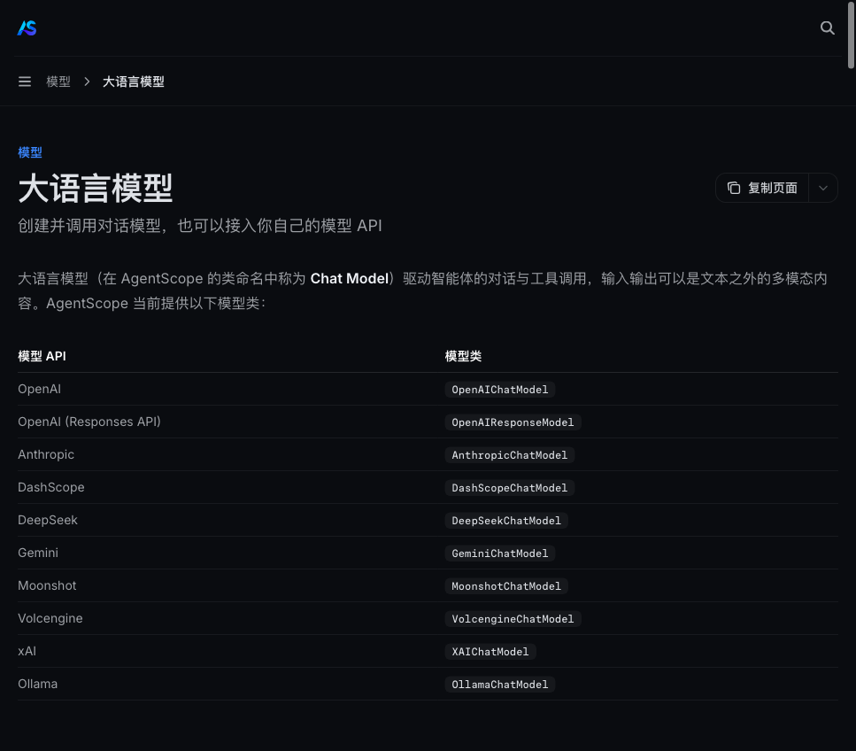
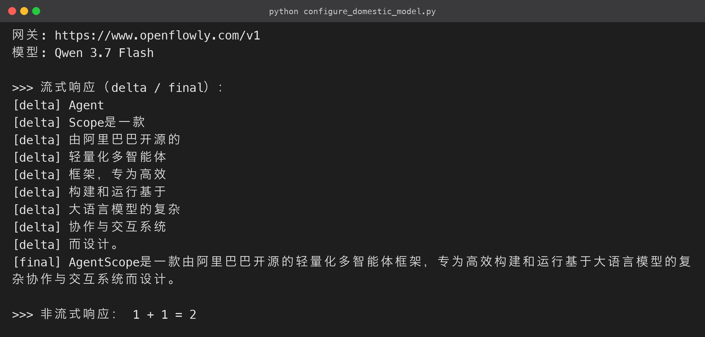
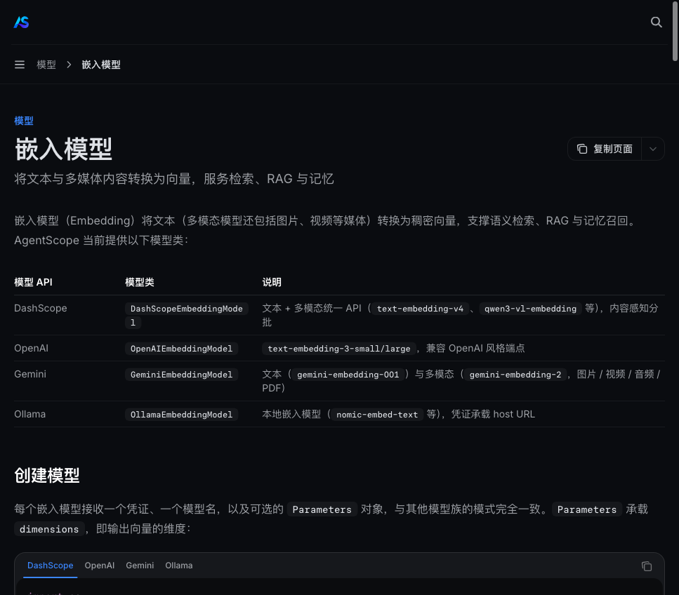

# 《AgentScope 2.0实战指南》03 - 切换国内模型（配置 URL 和密钥）

### 3.1 为什么需要这一步

AgentScope 默认按海外接口配置，国内开发者改用**国内兼容网关**即可，业务代码一行不动——更省心、也更合规。好在国内主流模型网关（APIMart、OpenFlowly、DeepSeek、通义 DashScope、Moonshot 等）基本都提供 **OpenAI 兼容协议**。切换时只需要改两样东西：

- `base_url`：网关地址；
- `api_key`：你的密钥。

业务代码一行不动。

**为什么改个地址就行？** AgentScope 把「模型」拆成了两个概念：

- **Credential（凭证）**：管「怎么认证」，保存 `api_key` 和 `base_url`；
- **Model（模型）**：管「怎么调用」，按 Chat Completions 协议发请求。

两者解耦后，切换服务商只改配置、不改业务代码。`base_url` 指向的就是一个兼容 Chat Completions 的网关地址，背后具体是哪个模型并不重要——这套协议已是事实标准，国产网关普遍做了兼容。

> 本文实测使用 **OpenFlowly 网关 + Qwen 3.7 Flash 模型**（国内可直连、OpenAI 兼容），你可以换成自己的网关。

### 3.2 核心概念：Credential + Model

AgentScope 的模型接入是「凭证 + 模型」两层结构：

- **OpenAICredential**：只负责保存 `api_key` 与 `base_url`，是「连接信息」；
- **OpenAIChatModel**：负责按 OpenAI Chat Completions 协议发请求、解析流式/非流式响应，是「执行者」；
- 两者组装后交给 `Agent`，Agent 内部所有对模型的调用都走这一层抽象。

官方文档对模型接入的示意（红色为必填、灰色为可选）：



以后换模型只改两个地方：凭证的 `base_url` / `api_key`，模型的 `model` 名称。中间件、工具、记忆这些上层逻辑完全不用动——这也是框架把「模型接入」独立成层的原因。

### 3.3 完整可运行源码

下面这段代码（源码包 `configure_domestic_model.py`）演示了完整的「国内模型切换 + 流式/非流式两种调用」：

```python
# configure_domestic_model.py

"""第 3 节 · 切换国内模型：用 OpenAI 兼容接口接入 AgentScope 2.0"""
import asyncio

from agentscope.credential import OpenAICredential
from agentscope.message import UserMsg
from agentscope.model import OpenAIChatModel

# 密钥统一放在 config.py 中管理（见源码包），这里从环境变量读取

from config import API_KEY, BASE_URL, CHAT_MODEL

def build_credential() -> OpenAICredential:
    """步骤 1：创建凭证 —— 填入你的密钥与网关地址。"""
    return OpenAICredential(
        api_key=API_KEY,              # 例如 sk-xxxx（你的网关密钥）

        base_url=BASE_URL,            # 例如 https://www.openflowly.com/v1

    )

def build_chat_model(credential, stream: bool = True) -> OpenAIChatModel:
    """步骤 2：创建聊天模型。stream 默认 True，便于展示增量输出。"""
    return OpenAIChatModel(
        credential=credential,
        model=CHAT_MODEL,             # 例如 "Qwen 3.7 Flash"

        stream=stream,
        context_size=128000,          # 上下文窗口大小（第 7 节压缩会用到）

    )

async def demo_stream(credential) -> None:
    """流式调用：逐块观察模型的增量输出，最后一帧为完整内容。"""
    model = build_chat_model(credential, stream=True)
    msgs = [UserMsg(name="user", content="请用一句话介绍 AgentScope。")]

    print(">>> 流式响应（delta / final）：")
    async for chunk in await model(msgs):
        if chunk.is_last:
            text = "".join(b.text for b in chunk.content if b.type == "text")
            print(f"[final] {text}")
        else:
            deltas = "".join(b.text for b in chunk.content if b.type == "text")
            if deltas:
                print(f"[delta] {deltas}")

async def demo_non_stream(credential) -> None:
    """非流式调用：一次拿到完整响应（部分网关可能不支持，视服务而定）。"""
    model = build_chat_model(credential, stream=False)
    msgs = [UserMsg(name="user", content="1 + 1 = ?")]
    response = await model(msgs)
    text = "".join(b.text for b in response.content if b.type == "text")
    print(">>> 非流式响应：", text)

async def main() -> None:
    credential = build_credential()
    print(f"网关: {BASE_URL}\n模型: {CHAT_MODEL}\n")
    await demo_stream(credential)
    print()
    try:
        await demo_non_stream(credential)
    except Exception as exc:
        print(f"非流式调用失败（部分网关仅支持流式）：{exc}")

if __name__ == "__main__":
    asyncio.run(main())

```

**运行结果（终端实跑输出）：**



配套的 `config.py`（密钥统一管理，发布前请把密钥改为环境变量）：

```python
# config.py

import os

BASE_URL = os.getenv("OPENFLOWLY_BASE_URL", "https://www.openflowly.com/v1")
API_KEY = os.getenv("OPENFLOWLY_API_KEY", "sk-你的密钥")   # 请替换

CHAT_MODEL = os.getenv("OPENFLOWLY_CHAT_MODEL", "Qwen 3.7 Flash")
EMBED_MODEL = os.getenv("OPENFLOWLY_EMBED_MODEL", "Bge-m3")
EMBED_DIM = int(os.getenv("OPENFLOWLY_EMBED_DIM", "1024"))
ANYSEARCH_URL = "https://api.anysearch.com/v1/search"
ANYSEARCH_KEY = os.getenv("ANYSEARCH_API_KEY", "as_sk_你的密钥")  # 请替换

```

### 3.4 实测输出

用国内网关 + Qwen 3.7 Flash 实测（本文全部示例均基于该配置跑通）：

```text
网关: https://www.openflowly.com/v1
模型: Qwen 3.7 Flash

> 流式响应（delta / final）：
[delta] AgentScope
[delta] 是由阿里云
[delta] 通义实验室开源
[delta] 的多智能体开发
[delta] 框架……
[final] AgentScope是由阿里云通义实验室开源的多智能体开发框架，旨在提供完整工具链以帮助用户高效构建、协同管理与部署基于大语言模型的AI智能体应用。

> 非流式响应： 1 + 1 = 2

```

### 3.5 关键点与避坑

1. **`stream` 参数**：AgentScope 默认 `stream=True`，返回的是异步生成器，需要 `async for` 迭代并取 `is_last` 的帧；部分国产网关**只支持流式**（非流式会 500），统一用流式最稳妥。代码里的 `try/except` 就是为这种网关准备的降级路径。
2. **模型名要写网关的 ID**：如 `Qwen 3.7 Flash`，以你网关的 `/v1/models` 返回为准，别照抄别人的——不同网关对同一模型的命名可能不同。
3. **`context_size` 一定要设**：它决定第 7 节上下文压缩的触发阈值，不设的话压缩机制无法正确工作。设置成模型真实窗口即可（如 128000）。
4. **密钥管理**：千万别把真实密钥写进公开仓库/文章，一律走环境变量；本文源码包内为便于本地复现保留了占位，发布前请替换。
5. **嵌入模型**：RAG / ReMe 还需要一个嵌入模型，国内网关一般都有 OpenAI 兼容的 `/v1/embeddings`（本文用 `Bge-m3`，1024 维，见下图文档中的 Embedding 配置说明）。嵌入模型与对话模型可以在同一个凭证下共存，因为它们都走同一个 base_url。



### 3.6 主流国内网关怎么选

既然切换只是改 `base_url`，那选哪家网关就变成纯粹的「模型 + 成本 + 稳定性」问题。常见选择（都兼容 OpenAI 协议）：

| 网关/平台 | 典型模型 | 特点 |
|---|---|---|
| 通义 DashScope | qwen 系列（qwen3、qwen-plus 等） | 官方渠道，AgentScope 原生集成（DashScopeCredential） |
| DeepSeek | deepseek-chat / deepseek-reasoner | 推理强、价格低，OpenAI 兼容 |
| Moonshot | kimi 系列 | 长上下文见长 |
| OpenFlowly | Qwen 3.7 Flash、Bge-m3 等聚合 | 国内可直连，模型聚合，本文实测所用 |
| APIMart | 多模型聚合 | 统一计费与密钥管理 |

选择建议，按优先级：

- **团队已经在用的平台优先**，省去重新采购和计费的成本；
- 从零开始时，先确认有没有你要的模型——尤其 **embedding 模型**，很多网关只有对话模型、没有 embedding；
- 再横向对比价格与限流。

> 实测注意：部分网关的非流式接口有兼容性问题，统一 `stream=True` 最省心。

### 3.7 从对话到智能体：模型层还有哪些参数

`OpenAIChatModel` 除了 `model` / `stream` / `context_size`，还有几个生产常用参数值得了解：

- **`max_tokens`**：限制单次输出长度，防止模型话痨烧 token；
- **`temperature`**：控制随机性，检索问答用低值（0.2 左右），创意生成用高值；
- **`formatter`**：自定义消息与响应的序列化格式，对接特殊协议时用；
- **`retry` 相关**：框架层内置重试与降级策略，网络抖动时自动重试。

这些参数在后面的示例里没全用到，但它们是「从能跑通到能上线」的必经之路。先把第 3 节的模型调用跑通，后面每一节都建立在这个地基上。

### 3.8 流式与非流式：什么时候用哪个

再展开说说流式这个看似不起眼的开关，它影响面比想象中大：

- **流式（stream=True）**：逐 token 返回，首字快、体验好，还能做「边生成边渲染」；AgentScope 默认值。代价是代码要处理异步生成器——但这也让 Agent 循环里「工具结果边出边看」成为可能；
- **非流式（stream=False）**：一次性返回完整结果，代码更简单，适合「结果整体可用」的场景（如批量离线处理）。

生产建议：**面向用户的一律流式，批处理可以非流式**。另外很多国产网关对流式兼容性更好（部分只支持流式），所以本文所有示例统一流式，你也少踩一个坑。

### 3.9 换协议怎么办：接入其他模型

如果要接的不是 OpenAI 兼容接口（比如接入 Anthropic、Gemini 等其他厂商），AgentScope 同样提供了对称的凭证与模型类：

| 厂商 | 凭证类 | 模型类 |
|---|---|---|
| Anthropic | `AnthropicCredential` | `AnthropicChatModel` |
| Gemini | `GeminiCredential` | `GeminiChatModel` |
| 通义系 | `DashScopeCredential` | `DashScopeChatModel` |

用法和 `OpenAICredential` 完全对称——**换模型不换上层代码**。

两点补充：

- 本文选 OpenAI 兼容网关，是因为它覆盖了国内绝大多数模型渠道，一套代码走天下；
- OpenAI 兼容网关几乎都是 `Bearer Token` 认证，个别平台的差异（如额外加组织 ID）通过 `OpenAICredential` 的扩展字段解决即可。

到这里，「模型能通」这个地基就打好了。第 4 节开始，我们给这个只会聊天的模型装上工具。

源码地址：[https://github.com/LarryLi93/agentscope2](https://github.com/LarryLi93/agentscope2)
